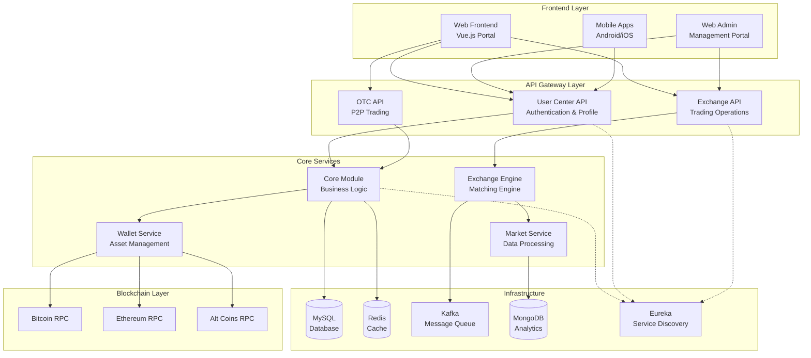

# Bizzan Cryptocurrency Exchange Platform

<p align="center">
  
  
  
  
</p>

## Overview

Welcome to the comprehensive documentation for the **Bizzan Cryptocurrency Exchange Platform** (币严), a complete Java-based digital asset trading system that provides enterprise-grade cryptocurrency exchange capabilities. This platform offers a full-featured trading ecosystem including spot trading, OTC (Over-The-Counter) trading, wallet management, and comprehensive administrative tools.

### 🌟 Key Features

- **Multi-Currency Trading**: Support for Bitcoin, Ethereum, and 50+ cryptocurrencies
- **Advanced Trading Engine**: High-performance matching engine with real-time order processing
- **OTC Marketplace**: Peer-to-peer trading with fiat currencies
- **Multi-Platform**: Web portals, mobile apps (Android/iOS), and admin interfaces
- **Security**: Multi-factor authentication, KYC/AML compliance, and advanced security measures
- **Scalability**: Microservices architecture with horizontal scaling capabilities
- **Internationalization**: Multi-language support (English/Chinese) and global deployment ready

## Platform Architecture



## Quick Start

### 📋 Prerequisites

- **Java Development Kit**: JDK 8 or higher
- **Database Systems**: MySQL 8.0+, Redis 6.0+, MongoDB 4.4+
- **Message Queue**: Apache Kafka 2.8+
- **Node.js**: 14.x+ (for frontend development)
- **Build Tools**: Maven 3.6+, npm

### 🚀 Getting Started

1. **Clone the Repository**
   ```bash
   git clone <repository-url>
   cd CoinExchange_CryptoExchange_Java
   ```

2. **Database Setup**
   ```bash
   # Create MySQL database
   mysql -u root -p
   CREATE DATABASE bizzan CHARACTER SET utf8 COLLATE utf8_general_ci;
   
   # Import schema (check 00_framework/sql/ for scripts)
   mysql -u root -p bizzan < 00_framework/sql/db_patch.sql
   ```

3. **Start Infrastructure Services**
   ```bash
   # Start Redis
   redis-server
   
   # Start MongoDB
   mongod --config /path/to/mongod.conf
   
   # Start Kafka
   kafka-server-start.sh config/server.properties
   ```

4. **Build and Run Core Services**
   ```bash
   # Build framework modules
   cd 00_framework
   mvn clean install
   
   # Start core services
   java -jar admin/target/admin.jar
   java -jar ucenter-api/target/ucenter-api.jar
   java -jar exchange/target/exchange.jar
   java -jar market/target/market.jar
   ```

5. **Start Frontend Applications**
   ```bash
   # Web Admin Portal
   cd 04_Web_Admin
   npm install && npm run dev
   
   # Web Frontend Portal  
   cd 05_Web_Front
   npm install && npm run dev
   ```

## Platform Components

### Core Infrastructure

| Component | Purpose | Technology Stack |
|-----------|---------|------------------|
| **[Core Module](core/technical-overview.md)** | Shared business logic and data models | Spring Boot, JPA, MySQL |
| **[Exchange Engine](exchange/technical-overview.md)** | Real-time trading matching engine | Spring Boot, Kafka, In-Memory |
| **[Market Service](market/technical-overview.md)** | Market data processing and K-line generation | Spring Boot, MongoDB, WebSocket |

### API Services

| Service | Purpose | Key Features |
|---------|---------|--------------|
| **[User Center API](ucenter-api/technical-overview.md)** | User management and authentication | Registration, KYC, 2FA, Wallet operations |
| **[Exchange API](ex-api/technical-overview.md)** | Trading operations interface | Order placement, Portfolio management |
| **[OTC API](otc-api/technical-overview.md)** | Over-the-counter trading | P2P marketplace, Advertisement system |

### Wallet Services

| Service | Purpose | Supported Assets |
|---------|---------|------------------|
| **[Wallet RPC](wallets/technical-overview.md)** | Blockchain integration | BTC, ETH, LTC, BCH, EOS, ERC-20 tokens |
| **[Wallet Management](wallet/technical-overview.md)** | Asset custody and operations | Multi-signature, Cold storage, Auto-withdrawal |

### Frontend Applications

| Application | Target Users | Technology |
|-------------|--------------|------------|
| **[Web Admin Portal](web-admin/admin-portal-technical-overview.md)** | Exchange administrators | Vue.js, iView UI |
| **[Web Frontend Portal](web-front/technical-overview.md)** | Retail traders and investors | Vue.js, TradingView charts |
| **Mobile Apps** | Mobile users | Native Android/iOS |

## Documentation Structure

This documentation is organized into the following sections:

### 📚 **Platform Overview**
- [Technical Overview](technical-overview.md) - Complete technical architecture
- [Business Overview](business-overview.md) - Business model and domain concepts
- [Architecture Guide](architecture-guide.md) - System design and patterns

### 🏗️ **Core Infrastructure**
Deep dive into the foundational services that power the exchange platform.

### 🔌 **API Services** 
Comprehensive guides for all REST APIs and microservices.

### 💰 **Wallet Services**
Blockchain integration and cryptocurrency wallet management.

### 🎨 **Frontend Applications**
User interfaces for traders, administrators, and mobile users.

### 🚀 **Development & Deployment**
Guides for developers and DevOps teams.

## Key Technologies

### Backend Technologies
- **Framework**: Spring Boot 2.x with Spring Cloud microservices
- **Database**: MySQL 8.0 (primary), MongoDB (analytics), Redis (cache)
- **Messaging**: Apache Kafka for event-driven architecture
- **Security**: Spring Security, JWT tokens, multi-factor authentication
- **Blockchain**: Native RPC clients for multiple cryptocurrencies

### Frontend Technologies
- **Framework**: Vue.js 2.x with Vuex state management
- **UI Libraries**: iView (admin), custom components (trading)
- **Charts**: TradingView Charting Library, ECharts
- **Build**: Webpack with optimization for production deployment

### Infrastructure
- **Service Discovery**: Netflix Eureka
- **Monitoring**: Spring Boot Actuator, custom metrics
- **Deployment**: Docker containers, cloud-native architecture
- **CDN**: Alibaba Cloud OSS for static assets

## Security & Compliance

- **Multi-Factor Authentication**: SMS, Email, Google Authenticator
- **KYC/AML Compliance**: Identity verification workflows
- **Fund Security**: Multi-signature wallets, cold storage integration  
- **API Security**: Rate limiting, IP whitelisting, encrypted communications
- **Audit Trail**: Complete transaction logging and compliance reporting

## Performance & Scalability

- **High Availability**: Distributed architecture with failover capabilities
- **Horizontal Scaling**: Stateless services with load balancing
- **Performance**: Optimized matching engine handling 100,000+ orders/second
- **Caching**: Multi-layer caching strategy for improved response times
- **Real-time**: WebSocket connections for live market data streaming

## Community & Support

- **Issue Tracking**: GitHub Issues for bug reports and feature requests
- **Discussions**: Community forums for development discussions
- **Contributing**: Guidelines for contributing to the project
- **License**: MIT License for open-source usage

## Getting Help

- 📖 **Documentation**: Start with the [Technical Overview](technical-overview.md)
- 🐛 **Bug Reports**: Use GitHub Issues with detailed reproduction steps
- 💡 **Feature Requests**: Discuss new features in GitHub Discussions
- 🤝 **Contributing**: See [Development Environment](development-environment.md) setup

---

*Last updated: December 2024*

**Built with ❤️ by the Bizzan development team**
