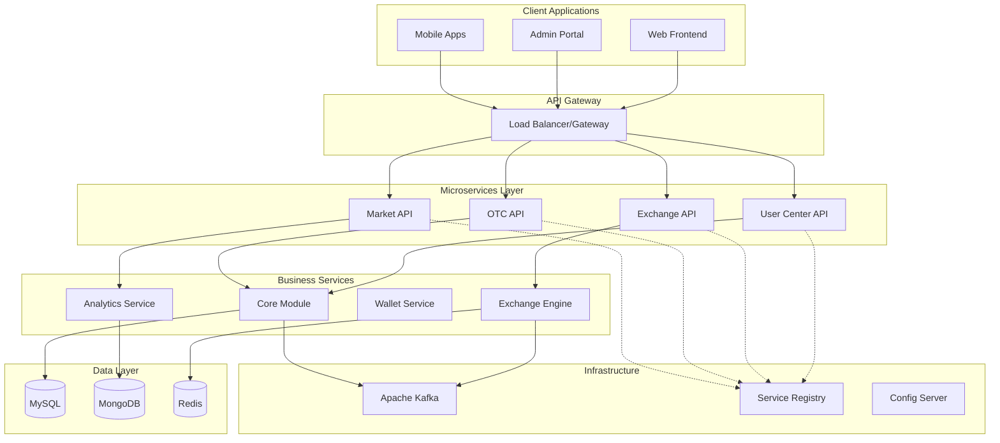
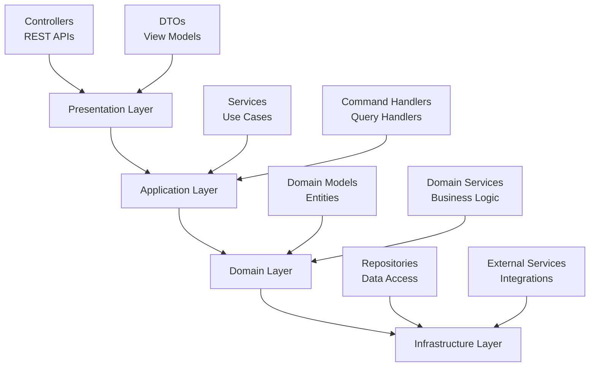
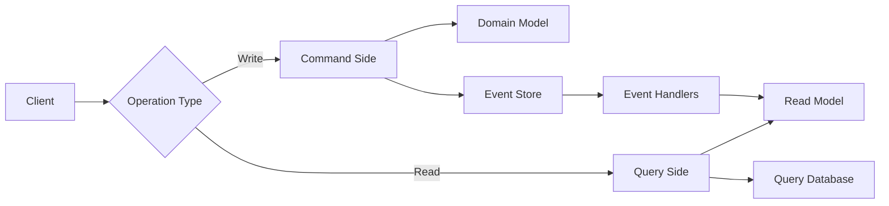
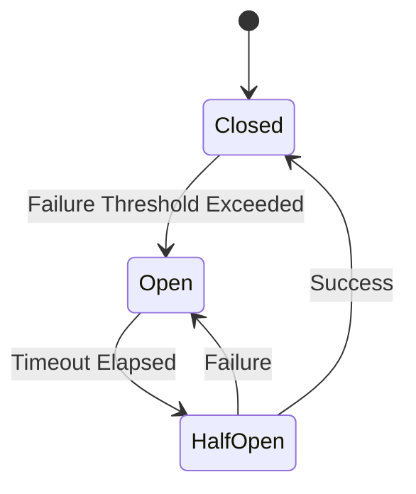
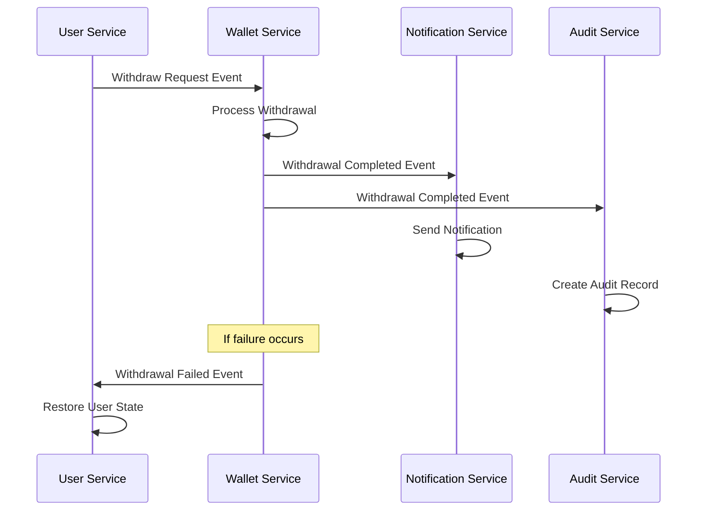
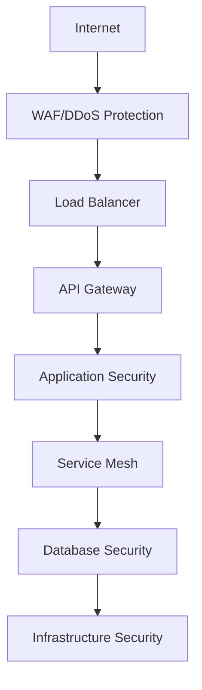
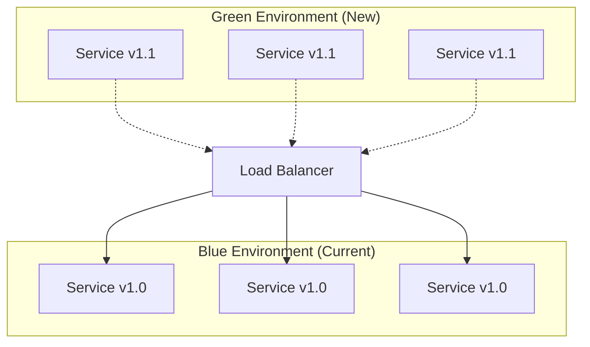

# Architecture Guide

## Overview

The Bizzan Cryptocurrency Exchange Platform follows a modern microservices architecture designed for high availability, scalability, and maintainability. This guide provides architectural principles, design patterns, and best practices that guide the platform's development and deployment.

## Architectural Principles

### 1. Domain-Driven Design (DDD)
**Principle**: Organize the system around business domains rather than technical layers.

**Implementation**:
- Core Module: Shared business logic and data models
- User Center: User management and authentication domain
- Exchange Engine: Trading and order management domain
- Market Service: Market data and analytics domain
- Wallet Service: Asset management and blockchain integration domain

**Benefits**:
- Clear business context boundaries
- Reduced coupling between domains
- Easier to reason about and maintain
- Aligned with business organization

### 2. Microservices Architecture
**Principle**: Decompose the system into small, independently deployable services.



**Service Characteristics**:
- Single responsibility and bounded context
- Independent data storage (database per service)
- Stateless design for horizontal scaling
- API-first communication contracts

### 3. Event-Driven Architecture
**Principle**: Use events to communicate between services and maintain loose coupling.

**Event Categories**:
- **Command Events**: Trigger actions (place-order, withdraw-funds)
- **Domain Events**: Business state changes (order-filled, user-verified)
- **Integration Events**: Cross-boundary notifications (deposit-confirmed)

**Implementation Patterns**:
- Event Sourcing for critical business events
- CQRS (Command Query Responsibility Segregation)
- Saga pattern for distributed transactions
- Event streaming with Apache Kafka

### 4. Layered Architecture
**Principle**: Organize code into well-defined layers with clear dependencies.



**Layer Responsibilities**:
- **Presentation**: User interface and API endpoints
- **Application**: Use case orchestration and workflow
- **Domain**: Core business logic and rules
- **Infrastructure**: Data persistence and external integrations

## Design Patterns

### 1. Repository Pattern
**Purpose**: Abstract data access logic and provide a uniform interface to data operations.

**Implementation**:
```java
// Domain interface
public interface MemberRepository {
    Optional<Member> findById(Long id);
    List<Member> findByStatus(MemberStatus status);
    Member save(Member member);
    void delete(Member member);
}

// Infrastructure implementation
@Repository
public class JpaMemberRepository implements MemberRepository {
    @Autowired
    private MemberDao memberDao;
    
    @Override
    public Optional<Member> findById(Long id) {
        return memberDao.findById(id);
    }
    
    // Other implementations...
}
```

**Benefits**:
- Testability through mocking
- Database technology independence
- Centralized query logic
- Domain model protection

### 2. Service Layer Pattern
**Purpose**: Encapsulate business logic and coordinate between domain objects.

**Implementation**:
```java
@Service
@Transactional
public class MemberService {
    
    @Autowired
    private MemberRepository memberRepository;
    
    @Autowired
    private WalletService walletService;
    
    public MessageResult registerMember(RegisterRequest request) {
        // Validation
        validateRegistrationRequest(request);
        
        // Business logic
        Member member = createMember(request);
        member = memberRepository.save(member);
        
        // Coordinate with other services
        walletService.createInitialWallets(member.getId());
        
        // Return result
        return MessageResult.success("Registration successful");
    }
}
```

**Benefits**:
- Transaction boundary management
- Business rule encapsulation
- Cross-cutting concern implementation
- Service composition

### 3. Factory Pattern
**Purpose**: Create complex objects with varying configurations.

**Implementation**:
```java
@Component
public class CoinTraderFactory {
    
    public CoinTrader createTrader(String symbol) {
        ExchangeCoin exchangeCoin = findExchangeCoin(symbol);
        
        CoinTrader trader = new CoinTrader(symbol);
        trader.setScale(exchangeCoin.getCoinScale(), exchangeCoin.getBaseCoinScale());
        trader.setFeeRate(exchangeCoin.getFee());
        
        return trader;
    }
}
```

### 4. Observer Pattern
**Purpose**: Notify multiple handlers about state changes and events.

**Implementation**:
```java
public interface TradeHandler {
    void handleTrade(ExchangeTrade trade);
}

@Component
public class TradeNotificationService {
    
    private List<TradeHandler> handlers = Arrays.asList(
        new MarketDataHandler(),
        new WalletUpdateHandler(), 
        new NotificationHandler()
    );
    
    public void processTrade(ExchangeTrade trade) {
        handlers.forEach(handler -> handler.handleTrade(trade));
    }
}
```

### 5. Strategy Pattern
**Purpose**: Implement varying algorithms or behaviors that can be selected at runtime.

**Use Cases**:
- Different fee calculation strategies based on user tier
- Various order matching algorithms (FIFO, Pro-rata, etc.)
- Multiple withdrawal processing strategies
- Different KYC verification approaches

### 6. Command Query Responsibility Segregation (CQRS)
**Purpose**: Separate read and write operations for optimal performance and scalability.

**Implementation**:


**Benefits**:
- Optimized read and write models
- Scalability through separate scaling
- Complex query optimization
- Event sourcing compatibility

## Service Integration Patterns

### 1. API Gateway Pattern
**Purpose**: Provide a single entry point for client requests and handle cross-cutting concerns.

**Responsibilities**:
- Request routing and load balancing
- Authentication and authorization
- Rate limiting and throttling
- Request/response transformation
- Monitoring and logging

**Implementation Considerations**:
- Use Nginx or dedicated API Gateway solutions
- Implement circuit breaker patterns
- Cache frequently accessed data
- Provide API versioning support

### 2. Service Discovery Pattern
**Purpose**: Enable services to find and communicate with each other dynamically.

**Implementation with Eureka**:
```java
@SpringBootApplication
@EnableEurekaServer  // For registry server
@EnableEurekaClient  // For service clients
public class ServiceApplication {
    public static void main(String[] args) {
        SpringApplication.run(ServiceApplication.class, args);
    }
}
```

**Benefits**:
- Dynamic service registration and deregistration
- Health checking and failure detection
- Load balancing and failover
- Environment-specific service discovery

### 3. Circuit Breaker Pattern
**Purpose**: Prevent cascading failures by monitoring service health and failing fast when needed.

**States**:
- **Closed**: Normal operation, calls pass through
- **Open**: Failures detected, calls fail immediately
- **Half-Open**: Testing if service has recovered



**Implementation**:
- Use Hystrix or Resilience4j
- Configure failure thresholds and timeouts
- Provide fallback mechanisms
- Monitor circuit breaker metrics

## Data Architecture Patterns

### 1. Database Per Service
**Principle**: Each microservice owns its data and database schema.

**Implementation**:
- User Center API → MySQL (user data, authentication)
- Exchange Engine → Redis (in-memory order books)
- Market Service → MongoDB (time-series market data)
- Core Module → MySQL (shared business entities)

**Benefits**:
- Service independence and autonomy
- Technology diversity and optimization
- Reduced coupling and dependencies
- Simplified service boundaries

### 2. Event Sourcing
**Purpose**: Store business events as immutable log instead of current state.

**Implementation**:
```java
@Entity
public class MemberEvent {
    private Long id;
    private Long memberId;
    private String eventType;  // REGISTERED, VERIFIED, SUSPENDED
    private String eventData;  // JSON payload
    private LocalDateTime timestamp;
    
    // getters and setters
}

@Service
public class MemberEventStore {
    
    public void appendEvent(MemberEvent event) {
        // Store event in append-only log
        eventRepository.save(event);
        
        // Publish event for processing
        eventPublisher.publish(event);
    }
    
    public List<MemberEvent> getEvents(Long memberId) {
        return eventRepository.findByMemberIdOrderByTimestamp(memberId);
    }
}
```

**Benefits**:
- Complete audit trail
- Temporal queries and historical analysis
- Event replay and system recovery
- Integration with event-driven architecture

### 3. SAGA Pattern
**Purpose**: Manage distributed transactions across multiple services.

**Choreography-based SAGA**:


**Orchestration-based SAGA**:
- Central orchestrator manages the workflow
- Explicit compensation actions for rollback
- Better control over complex workflows
- Easier monitoring and error handling

### 4. Read Replica Pattern
**Purpose**: Scale read operations by distributing queries across multiple database copies.

**Implementation**:
- Master database handles all write operations
- Read replicas handle query operations
- Application layer routes queries to appropriate instances
- Async replication maintains data consistency

## Security Architecture

### 1. Defense in Depth
**Principle**: Implement multiple layers of security controls.



**Security Layers**:
- **Network**: Firewalls, VPC, network segmentation
- **Application**: Input validation, authentication, authorization
- **Data**: Encryption at rest and in transit
- **Infrastructure**: OS hardening, container security

### 2. Zero Trust Architecture
**Principle**: Never trust, always verify access to resources.

**Implementation**:
- Mutual TLS (mTLS) for service-to-service communication
- Identity-based access control for all resources
- Continuous monitoring and verification
- Least privilege access principles

### 3. Secrets Management
**Purpose**: Centralize and secure sensitive configuration data.

**Best Practices**:
- Use dedicated secret management solutions (HashiCorp Vault, AWS Secrets Manager)
- Rotate secrets regularly and automatically
- Audit access to sensitive data
- Implement separation of duties

## Performance & Scalability Patterns

### 1. Caching Strategies

#### Cache-Aside Pattern
```java
@Service
public class MarketDataService {
    
    @Autowired
    private RedisTemplate<String, Object> redisTemplate;
    
    @Autowired
    private MarketDataRepository repository;
    
    public MarketData getMarketData(String symbol) {
        // Try cache first
        MarketData cached = (MarketData) redisTemplate.opsForValue()
            .get("market:" + symbol);
            
        if (cached != null) {
            return cached;
        }
        
        // Load from database
        MarketData data = repository.findBySymbol(symbol);
        
        // Store in cache
        redisTemplate.opsForValue()
            .set("market:" + symbol, data, Duration.ofMinutes(5));
            
        return data;
    }
}
```

#### Write-Through Pattern
- Data written to cache and database simultaneously
- Ensures cache consistency
- Higher write latency but consistent reads

#### Write-Behind Pattern
- Data written to cache immediately
- Asynchronous write to database
- Better write performance but risk of data loss

### 2. Database Optimization

#### Connection Pooling
```java
@Configuration
public class DatabaseConfig {
    
    @Bean
    @Primary
    public DataSource dataSource() {
        DruidDataSource datasource = new DruidDataSource();
        datasource.setUrl(databaseUrl);
        datasource.setUsername(username);
        datasource.setPassword(password);
        
        // Connection pool settings
        datasource.setInitialSize(10);
        datasource.setMaxActive(50);
        datasource.setMinIdle(5);
        datasource.setMaxWait(60000);
        
        return datasource;
    }
}
```

#### Query Optimization
- Use QueryDSL for type-safe queries
- Implement proper indexing strategies
- Optimize JPA entity relationships
- Use pagination for large result sets

### 3. Horizontal Scaling
**Strategies**:
- Stateless application design
- Load balancing with session affinity
- Database sharding and partitioning
- Asynchronous processing with message queues

**Auto-Scaling**:
- Container orchestration (Kubernetes)
- Metrics-based scaling (CPU, memory, custom metrics)
- Predictive scaling based on historical patterns
- Circuit breakers for graceful degradation

## Monitoring & Observability

### 1. Three Pillars of Observability

#### Metrics
```java
@Component
public class TradingMetrics {
    
    private final Counter orderCounter = Counter.builder("exchange.orders.total")
        .description("Total number of orders processed")
        .register(Metrics.globalRegistry);
        
    private final Timer orderProcessingTime = Timer.builder("exchange.orders.processing.time")
        .description("Order processing time")
        .register(Metrics.globalRegistry);
    
    public void recordOrder(String orderType) {
        orderCounter.increment(Tags.of("type", orderType));
    }
    
    public void recordProcessingTime(Duration duration) {
        orderProcessingTime.record(duration);
    }
}
```

#### Logs
```java
@Service
public class OrderService {
    
    private static final Logger logger = LoggerFactory.getLogger(OrderService.class);
    
    public MessageResult placeOrder(OrderRequest request) {
        MDC.put("userId", request.getUserId().toString());
        MDC.put("symbol", request.getSymbol());
        
        logger.info("Processing order placement: {}", request);
        
        try {
            // Process order
            Order order = processOrder(request);
            
            logger.info("Order placed successfully: orderId={}", order.getId());
            return MessageResult.success("Order placed", order);
            
        } catch (Exception e) {
            logger.error("Order placement failed", e);
            return MessageResult.error("Order placement failed");
        } finally {
            MDC.clear();
        }
    }
}
```

#### Traces
- Distributed tracing with Zipkin or Jaeger
- Correlation IDs for request tracking
- Performance bottleneck identification
- Service dependency mapping

### 2. Health Checks
**Implementation**:
```java
@Component
public class DatabaseHealthIndicator implements HealthIndicator {
    
    @Autowired
    private DataSource dataSource;
    
    @Override
    public Health health() {
        try (Connection connection = dataSource.getConnection()) {
            if (connection.isValid(1000)) {
                return Health.up()
                    .withDetail("database", "Available")
                    .build();
            }
        } catch (Exception e) {
            return Health.down(e)
                .withDetail("database", "Unavailable")
                .build();
        }
        
        return Health.down()
            .withDetail("database", "Connection invalid")
            .build();
    }
}
```

## Deployment Architecture

### 1. Container Strategy
**Docker Implementation**:
```dockerfile
FROM openjdk:8-jdk-alpine

# Add application user
RUN addgroup -g 1001 -S appuser && \
    adduser -u 1001 -S appuser -G appuser

# Copy application
COPY --chown=appuser:appuser target/app.jar /app/app.jar

# Switch to non-root user
USER appuser

# Health check
HEALTHCHECK --interval=30s --timeout=3s --start-period=60s --retries=3 \
    CMD curl -f http://localhost:8080/actuator/health || exit 1

# Run application
ENTRYPOINT ["java", "-jar", "/app/app.jar"]
```

### 2. Orchestration with Kubernetes
**Deployment Configuration**:
```yaml
apiVersion: apps/v1
kind: Deployment
metadata:
  name: exchange-api
spec:
  replicas: 3
  selector:
    matchLabels:
      app: exchange-api
  template:
    metadata:
      labels:
        app: exchange-api
    spec:
      containers:
      - name: exchange-api
        image: exchange-api:latest
        ports:
        - containerPort: 8080
        env:
        - name: SPRING_PROFILES_ACTIVE
          value: production
        resources:
          requests:
            memory: "512Mi"
            cpu: "250m"
          limits:
            memory: "1Gi"
            cpu: "500m"
        livenessProbe:
          httpGet:
            path: /actuator/health
            port: 8080
          initialDelaySeconds: 60
          periodSeconds: 30
        readinessProbe:
          httpGet:
            path: /actuator/health
            port: 8080
          initialDelaySeconds: 30
          periodSeconds: 10
```

### 3. Blue-Green Deployment
**Process**:
1. Deploy new version to green environment
2. Run health checks and integration tests
3. Switch load balancer to green environment
4. Monitor for issues and rollback if needed
5. Decommission blue environment



## Best Practices & Guidelines

### 1. API Design
**RESTful Principles**:
- Use HTTP methods appropriately (GET, POST, PUT, DELETE)
- Implement proper HTTP status codes
- Use meaningful resource URIs
- Support content negotiation
- Implement proper error handling

**API Versioning**:
- URL path versioning: `/api/v1/users`
- Header versioning: `Accept: application/vnd.api.v1+json`
- Maintain backward compatibility
- Document breaking changes clearly

### 2. Error Handling
**Consistent Error Response**:
```java
public class ApiError {
    private int code;
    private String message;
    private String details;
    private LocalDateTime timestamp;
    
    // constructors, getters, setters
}

@ControllerAdvice
public class GlobalExceptionHandler {
    
    @ExceptionHandler(ValidationException.class)
    public ResponseEntity<ApiError> handleValidationError(ValidationException e) {
        ApiError error = new ApiError(
            400, 
            "Validation failed", 
            e.getMessage(), 
            LocalDateTime.now()
        );
        return ResponseEntity.badRequest().body(error);
    }
}
```

### 3. Configuration Management
**External Configuration**:
- Use environment variables for deployment-specific settings
- Implement configuration validation on startup
- Support configuration hot reload where appropriate
- Document all configuration options

### 4. Testing Strategy
**Test Pyramid**:
- **Unit Tests**: Fast, isolated, comprehensive coverage
- **Integration Tests**: Component interactions, database operations
- **Contract Tests**: API compatibility between services
- **End-to-End Tests**: Complete user workflows

**Test Categories**:
- **Business Logic Tests**: Domain model and service layer
- **API Tests**: Controller behavior and serialization
- **Repository Tests**: Data access layer functionality
- **Security Tests**: Authentication and authorization

### 5. Documentation
**Code Documentation**:
- JavaDoc for public APIs
- Architecture decision records (ADRs)
- Code comments for complex business logic
- README files for each module

**API Documentation**:
- OpenAPI/Swagger specifications
- Interactive API explorers
- Code examples and tutorials
- Version-specific documentation

This architecture guide provides the foundational patterns and principles that guide the Bizzan Cryptocurrency Exchange Platform's design and implementation. Following these patterns ensures consistency, maintainability, and scalability across the entire system.
