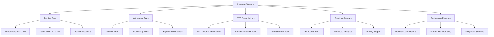
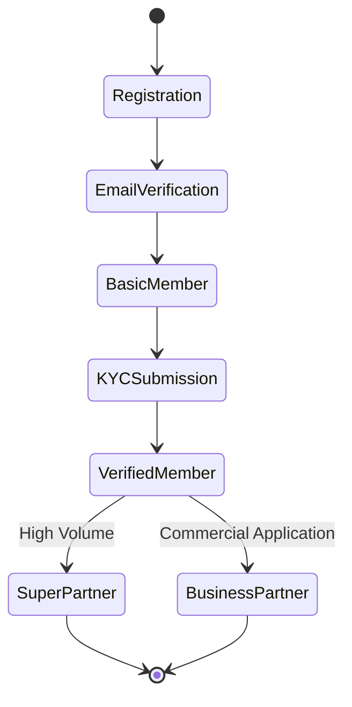
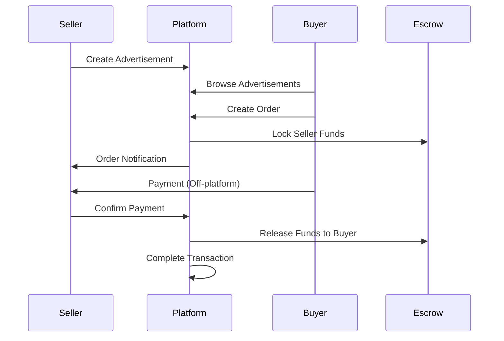

# Platform Business Overview

## Executive Summary

The **Bizzan Cryptocurrency Exchange Platform** (币严) is a comprehensive digital asset trading ecosystem that enables secure, scalable, and feature-rich cryptocurrency exchange operations. The platform serves multiple market segments through various trading models, providing both retail and institutional-grade services for digital asset trading, asset management, and financial services in the cryptocurrency space.

Designed as a complete business solution, the platform combines spot trading, peer-to-peer (OTC) trading, advanced wallet management, and comprehensive administrative tools to create a full-spectrum cryptocurrency exchange business. The platform supports global operations with multi-language capabilities and regulatory compliance frameworks.

## Business Model & Value Proposition

### Core Value Propositions

#### For Retail Traders
- **Accessibility**: User-friendly interfaces with comprehensive educational resources
- **Security**: Multi-layer security with institutional-grade fund protection
- **Variety**: Support for 50+ cryptocurrencies and multiple trading pairs
- **Tools**: Professional trading interfaces with advanced charting and analysis

#### For Institutional Clients  
- **Liquidity**: High-performance matching engine with deep order books
- **API Access**: Comprehensive REST and WebSocket APIs for algorithmic trading
- **Security**: Multi-signature wallets and cold storage solutions
- **Compliance**: KYC/AML frameworks and regulatory reporting capabilities

#### For OTC Traders
- **Privacy**: Peer-to-peer trading with enhanced privacy protection
- **Flexibility**: Customizable trading terms and payment methods
- **Scale**: Support for large-volume transactions with competitive rates
- **Trust**: Escrow-based security and dispute resolution mechanisms

#### For Business Partners
- **Revenue Sharing**: Multi-level referral and commission programs
- **White Label**: Customizable exchange solutions for partner deployment
- **Support**: Dedicated business development and technical support
- **Analytics**: Comprehensive reporting and business intelligence tools

### Revenue Streams

### Market Positioning

#### Target Markets

**Primary Markets**:
- **Asia-Pacific**: Focus on Chinese and Southeast Asian markets
- **Emerging Markets**: Countries with growing cryptocurrency adoption  
- **Regulatory-Friendly Jurisdictions**: Markets with clear crypto regulations

**Secondary Markets**:
- **European Union**: Compliance with MiCA regulations
- **North America**: Institutional and accredited investor segments
- **Middle East**: Growing interest in digital asset trading

#### Competitive Differentiation

**Technical Advantages**:
- High-performance matching engine (100,000+ orders/second)
- Multi-chain wallet integration with 50+ supported cryptocurrencies
- Real-time market data processing and distribution
- Advanced risk management and fraud detection systems

**Business Advantages**:
- Comprehensive OTC trading platform for large transactions
- Flexible partnership and white-label solutions
- Strong focus on compliance and regulatory alignment
- Multi-language and multi-currency support

**User Experience**:
- Professional trading interfaces with TradingView integration
- Mobile-first design for retail users
- Comprehensive educational resources and support
- Advanced order types and trading features

## Domain Model & Business Concepts

### Core Business Entities

#### Members (Users)
**Definition**: Registered users of the platform who can trade cryptocurrencies and access platform features.

**Types**:
- **Regular Members**: Standard retail users with basic trading capabilities
- **Super Partners**: High-volume traders with enhanced features and reduced fees
- **Business Partners**: Commercial entities with special trading privileges
- **Institutional Members**: Corporate accounts with advanced compliance requirements

**Lifecycle**:

**Key Attributes**:
- Identity verification status (KYC/AML compliance)
- Trading tier and fee structure
- Referral relationships and commission eligibility
- Account security settings and preferences

#### Digital Assets (Coins)
**Definition**: Supported cryptocurrencies and tokens available for trading on the platform.

**Categories**:
- **Major Cryptocurrencies**: BTC, ETH, LTC, BCH
- **Stablecoins**: USDT, USDC (Tether and ERC-20 variants)  
- **Alternative Coins**: EOS, XMR, BSV, BTM
- **Platform Tokens**: Exchange-native tokens for fee discounts

**Asset Properties**:
- Trading status (enabled/disabled)
- Minimum/maximum deposit and withdrawal amounts
- Network confirmation requirements
- Fee structures and processing policies

#### Wallets & Balances
**Definition**: Digital asset storage and balance management system for user funds.

**Balance Types**:
- **Available Balance**: Funds available for trading and withdrawal
- **Frozen Balance**: Funds locked in pending orders or withdrawal requests
- **Total Balance**: Combined available and frozen amounts

**Security Features**:
- Multi-signature address generation
- Hot wallet for immediate liquidity
- Cold storage for security reserves
- Automatic risk-based fund allocation

#### Trading Pairs
**Definition**: Cryptocurrency pairs available for spot trading on the exchange.

**Common Pairs**:
- **Fiat Pairs**: BTC/USD, ETH/USD, LTC/USD
- **Crypto Pairs**: ETH/BTC, LTC/BTC, BCH/BTC
- **Stablecoin Pairs**: BTC/USDT, ETH/USDT

**Configuration**:
- Minimum order sizes and price increments
- Trading fees and discount structures
- Order types supported (limit, market, stop)
- Market data distribution settings

### Trading Models

#### Spot Trading (币币交易)
**Business Model**: Traditional order book-based cryptocurrency trading

**Features**:
- Real-time order matching with price-time priority
- Multiple order types: limit, market, stop-loss, take-profit
- Advanced trading interface with depth charts and order book
- Professional trading tools and technical analysis

**Revenue Model**:
- Maker/taker fee structure typically 0.1-0.2%
- Volume-based discount tiers
- Platform token discounts for fee reductions

**User Journey**:
1. Account registration and verification
2. Cryptocurrency deposit to platform wallet
3. Order placement through trading interface
4. Automatic order matching and execution
5. Balance updates and trade confirmation
6. Withdrawal of funds to external wallets

#### OTC Trading (场外交易)
**Business Model**: Peer-to-peer advertisement-based trading system

**Key Components**:
- **Advertisements**: User-created buy/sell offers with terms and conditions
- **Order Matching**: System-facilitated connection between buyers and sellers
- **Escrow System**: Platform-managed fund security during transactions
- **Dispute Resolution**: Mediation system for transaction conflicts

**Business Partner Program**:
- Enhanced verification process with asset proof requirements
- Preferential matching and reduced fees
- Dedicated customer support and account management
- Advanced analytics and trading tools

**Transaction Flow**:

**Revenue Sources**:
- Commission fees on completed transactions
- Advertisement placement fees for premium visibility
- Business partner membership fees
- Enhanced feature subscriptions

### Financial Operations

#### Deposit Management
**Process**: Users transfer cryptocurrencies to platform-generated addresses

**Business Logic**:
- Automatic address generation for each user per cryptocurrency
- Real-time blockchain monitoring for incoming transactions
- Configurable confirmation requirements based on security policies
- Automatic balance updates upon confirmation

**Risk Management**:
- Address validation and blacklist checking
- Large deposit notifications and manual review processes
- Suspicious activity detection and fraud prevention
- Compliance screening for regulatory requirements

#### Withdrawal Processing
**Process**: Users request to send cryptocurrencies to external addresses

**Approval Workflow**:
1. **User Request**: Withdrawal amount, destination address, security verification
2. **Validation**: Balance check, address validation, fee calculation
3. **Security Review**: Multi-factor authentication, risk assessment
4. **Processing**: Automatic or manual approval based on amount thresholds
5. **Blockchain Submission**: Transaction broadcasting and confirmation tracking
6. **Completion**: Balance update and user notification

**Fee Structure**:
- Network fees for blockchain transactions
- Platform processing fees for service costs
- Express processing options for urgent withdrawals
- Volume-based fee discounts for high-value users

#### Risk Management Framework
**Objective**: Protect platform and user funds while maintaining operational efficiency

**Components**:
- **Real-time Monitoring**: Automated detection of unusual activities
- **Transaction Limits**: Daily/monthly withdrawal limits per user tier
- **Manual Review**: Human oversight for high-value transactions
- **Compliance Integration**: AML screening and regulatory reporting

### Promotional & Loyalty Programs

#### Referral System
**Mechanism**: Multi-level referral program encouraging user acquisition

**Structure**:
- **Level 1**: Direct referrals earn X% commission on trading fees
- **Level 2**: Second-level referrals earn Y% commission (typically lower)
- **Level 3**: Third-level referrals earn Z% commission (optional)

**Commission Calculation**:
- Based on referred user's actual trading fees paid
- Real-time calculation and distribution
- Monthly summaries and detailed reporting
- Tax reporting support for high-earning referrers

#### Promotional Activities
**Types**:
- **New User Bonuses**: Welcome rewards for registration and first trade
- **Trading Competitions**: Volume-based contests with prize pools
- **Staking Rewards**: Earn interest on platform token holdings
- **Seasonal Promotions**: Holiday and special event campaigns

**Red Envelope System**: 
Digital gift distribution mechanism for special events and promotions
- Random amount allocation within defined ranges
- Time-limited availability and usage
- Social sharing features for viral marketing
- Gamification elements to increase engagement

### Compliance & Regulatory Framework

#### KYC/AML Program
**Objective**: Verify user identities and prevent money laundering

**Verification Levels**:
- **Basic**: Email and phone verification (limited functionality)
- **Intermediate**: Government ID verification (standard trading limits)
- **Advanced**: Enhanced due diligence (institutional limits)

**Documentation Requirements**:
- Government-issued photo identification
- Proof of residence (utility bills, bank statements)
- Source of funds documentation for large accounts
- Enhanced screening for high-risk jurisdictions

**Ongoing Monitoring**:
- Transaction pattern analysis
- Suspicious activity reporting (SAR)
- Periodic review of high-value accounts
- Regulatory reporting and compliance audits

#### Data Protection & Privacy
**Framework**: Compliance with global privacy regulations (GDPR, CCPA)

**Data Handling**:
- Explicit consent for data collection and processing
- Right to data portability and deletion
- Secure data storage with encryption at rest and in transit
- Regular security audits and penetration testing

**User Rights**:
- Access to personal data and processing activities
- Correction of inaccurate information
- Deletion of accounts and associated data
- Opt-out mechanisms for marketing communications

## Market Analysis & Competitive Landscape

### Target Market Segmentation

#### Retail Cryptocurrency Traders
**Demographics**: 
- Age: 25-45, tech-savvy individuals
- Geography: Asia-Pacific, emerging markets
- Experience: Novice to intermediate traders
- Investment Size: $100 - $50,000 per transaction

**Needs**:
- Easy-to-use trading interfaces
- Educational resources and market analysis
- Security and fund protection
- Mobile accessibility

**Pain Points**:
- Complex trading platforms
- High fees on small transactions
- Limited customer support
- Security concerns about fund storage

#### Professional & Institutional Traders
**Demographics**:
- Trading firms, hedge funds, family offices
- Geographic focus on major financial centers
- High-volume, algorithm-driven trading
- Investment Size: $50,000+ per transaction

**Needs**:
- High-performance trading APIs
- Deep liquidity and tight spreads
- Advanced order types and execution
- Institutional-grade security and compliance

**Pain Points**:
- Lack of professional trading features
- Insufficient liquidity for large orders
- Poor API performance and reliability
- Regulatory uncertainty and compliance burden

#### OTC & High-Net-Worth Traders
**Demographics**:
- Ultra-high-net-worth individuals
- Corporate treasury departments
- Mining companies and exchanges
- Investment Size: $100,000+ per transaction

**Needs**:
- Privacy and discretion in trading
- Flexible payment methods and terms
- Competitive pricing for large volumes
- Dedicated relationship management

**Pain Points**:
- Limited access to OTC trading platforms
- Counterparty risk in peer-to-peer transactions
- Complex settlement and escrow processes
- Lack of regulatory clarity for large transactions

### Competitive Analysis

#### Direct Competitors

**Major Global Exchanges**:
- Binance: Market leader with comprehensive feature set
- Coinbase: Strong regulatory compliance and institutional services
- Kraken: Focus on security and professional trading
- Huobi: Strong Asia-Pacific presence with OTC services

**Competitive Advantages**:
- **Technology**: High-performance matching engine and real-time processing
- **Features**: Comprehensive OTC platform integrated with spot trading
- **Compliance**: Strong KYC/AML framework and regulatory alignment
- **Localization**: Multi-language support and regional customization

**Areas for Improvement**:
- **Liquidity**: Building deep order books across all trading pairs
- **Brand Recognition**: Establishing market presence against established players
- **Regulatory Licenses**: Obtaining authorizations in key jurisdictions
- **Ecosystem**: Developing DeFi and additional financial services

#### Indirect Competitors

**Traditional Financial Services**:
- Banks offering cryptocurrency services
- Payment processors with crypto capabilities
- Wealth management platforms with digital assets

**Emerging Technologies**:
- Decentralized exchanges (DEXs)
- DeFi protocols for trading and lending
- Cross-chain bridges and aggregators

### Market Opportunities

#### Geographic Expansion
**High-Potential Markets**:
- **Southeast Asia**: Growing crypto adoption and favorable regulations
- **Latin America**: High inflation driving crypto interest
- **Africa**: Mobile-first populations seeking financial inclusion
- **Eastern Europe**: Tech-savvy populations with crypto interest

**Market Entry Strategies**:
- Local partnership and white-label solutions
- Regulatory compliance and licensing
- Localized marketing and community building
- Payment method integration for local currencies

#### Product Innovation
**DeFi Integration**:
- Yield farming and liquidity mining programs
- Cross-chain trading and bridge services
- NFT marketplace and trading capabilities
- Staking and governance token services

**Institutional Services**:
- Custody solutions for large funds
- Index and derivative products
- Prime brokerage services
- Regulatory reporting and compliance tools

## Business Operations

### Customer Acquisition Strategy

#### Digital Marketing
**Channels**:
- Search engine optimization (SEO) for crypto-related keywords
- Paid advertising on crypto news sites and forums
- Social media engagement on Twitter, Reddit, Telegram
- Influencer partnerships and sponsored content

**Content Strategy**:
- Educational articles about cryptocurrency trading
- Market analysis and trading insights
- Platform tutorials and user guides
- Regular webinars and community events

#### Referral & Partnership Programs
**Individual Referrals**:
- Competitive commission rates for successful referrals
- Multi-tier structure encouraging network building
- Social sharing tools and personalized referral codes
- Regular promotions and bonus opportunities

**Strategic Partnerships**:
- Integration with wallet providers and DeFi protocols
- Collaboration with crypto media and educational platforms
- White-label solutions for regional exchanges
- Corporate partnership programs for businesses

### Customer Support Framework

#### Support Channels
- **24/7 Live Chat**: Real-time assistance for urgent issues
- **Email Support**: Detailed responses for complex inquiries
- **Help Center**: Comprehensive FAQ and self-service resources
- **Community Forums**: Peer-to-peer support and discussion

#### Specialized Support Teams
- **Technical Support**: Platform issues and API assistance
- **Account Management**: KYC, verification, and account recovery
- **Trading Support**: Order issues and market-related questions
- **Business Development**: Partnership and institutional support

#### Response Time Commitments
- **Critical Issues**: < 1 hour (trading, security, fund access)
- **Standard Issues**: < 24 hours (general inquiries, account questions)
- **Complex Issues**: < 72 hours (investigations, compliance matters)

### Business Intelligence & Analytics

#### Key Performance Indicators (KPIs)

**User Metrics**:
- New user registrations per month
- User verification completion rates
- Active trader ratios and retention
- Customer lifetime value (CLV)

**Financial Metrics**:
- Daily/monthly trading volumes
- Revenue per user and per transaction
- Fee income by trading pair and user segment
- Cost of customer acquisition (CAC)

**Operational Metrics**:
- Platform uptime and performance
- Order execution speeds and success rates
- Customer support response times
- Security incident frequency and resolution

**Market Metrics**:
- Market share by trading pair and region
- Competitive pricing analysis
- Liquidity depth and spread analysis
- User satisfaction and Net Promoter Score (NPS)

#### Data-Driven Decision Making
**Analytics Infrastructure**:
- Real-time dashboards for operational monitoring
- Business intelligence tools for trend analysis
- A/B testing framework for feature optimization
- Predictive analytics for demand forecasting

**Regular Reporting**:
- Daily operational reports for management
- Weekly business performance summaries
- Monthly strategic reviews and planning
- Quarterly board and investor reporting

## Risk Management & Governance

### Operational Risk Management

#### Technology Risks
**Mitigation Strategies**:
- Redundant systems and failover capabilities
- Regular security audits and penetration testing
- Code review processes and quality assurance
- Disaster recovery and business continuity planning

#### Financial Risks
**Controls**:
- Hot/cold wallet fund allocation policies
- Daily reconciliation of all user balances
- Insurance coverage for operational losses
- Stress testing for extreme market conditions

#### Compliance Risks
**Framework**:
- Regular legal and regulatory review
- Compliance monitoring and reporting systems
- Staff training on regulatory requirements
- Proactive engagement with regulatory authorities

### Corporate Governance

#### Management Structure
**Executive Team**:
- Chief Executive Officer (CEO): Overall strategy and vision
- Chief Technology Officer (CTO): Technical leadership and product development
- Chief Financial Officer (CFO): Financial management and investor relations
- Chief Compliance Officer (CCO): Regulatory compliance and risk management

**Advisory Structure**:
- Technical advisory board with industry experts
- Regulatory advisory panel with legal specialists
- Business advisory group with strategic partners
- User advisory committee for product feedback

#### Ethical Standards
**Code of Conduct**:
- Prohibition on insider trading and market manipulation
- Conflict of interest policies for employees
- Fair dealing principles for all users
- Transparency in fee structures and policies

**Regulatory Compliance**:
- Regular compliance audits and assessments
- Staff training on legal and ethical requirements
- Clear escalation procedures for compliance issues
- Proactive regulatory reporting and communication

## Future Business Strategy

### Short-term Objectives (6-12 months)

**Product Development**:
- Enhanced mobile applications with full feature parity
- Advanced order types and professional trading tools
- Improved OTC platform with better user matching
- Integration with major DeFi protocols

**Market Expansion**:
- Launch in 2-3 additional regulatory-friendly jurisdictions
- Establish local partnerships for payment processing
- Implement localized customer support in key markets
- Develop region-specific marketing campaigns

**Operational Excellence**:
- Achieve 99.9% platform uptime
- Reduce average customer support response time by 50%
- Implement advanced fraud detection and prevention
- Enhance KYC/AML processes for faster verification

### Medium-term Vision (1-3 years)

**Platform Evolution**:
- Launch of proprietary blockchain for faster and cheaper transactions
- Development of comprehensive DeFi ecosystem
- Introduction of derivative products (futures, options)
- Launch of institutional custody and prime brokerage services

**Market Leadership**:
- Achieve top 10 global ranking by trading volume
- Establish presence in 10+ countries with proper licensing
- Build strategic partnerships with traditional financial institutions
- Develop white-label solutions for regional exchanges

**Innovation Focus**:
- Integration of artificial intelligence for trading insights
- Development of social trading and copy trading features
- Launch of NFT marketplace and digital collectibles
- Implementation of carbon-neutral trading initiatives

### Long-term Goals (3-5 years)

**Ecosystem Development**:
- Comprehensive financial services platform beyond trading
- Integration with traditional banking and payment systems
- Development of business banking services for crypto companies
- Launch of educational platform and certification programs

**Global Leadership**:
- Recognition as a leading global cryptocurrency exchange
- Regulatory compliance in all major jurisdictions
- Strategic acquisitions to expand capabilities and market reach
- IPO or public listing consideration for growth capital

**Technology Innovation**:
- Leadership in blockchain technology and protocol development
- Advanced AI and machine learning implementations
- Quantum-resistant security implementations
- Sustainable and energy-efficient platform operations

---

This business overview provides a comprehensive understanding of the Bizzan Cryptocurrency Exchange Platform's business model, market positioning, operational framework, and strategic direction. The platform is positioned to serve the growing global demand for secure, feature-rich cryptocurrency trading services while maintaining the highest standards of security, compliance, and user experience.
