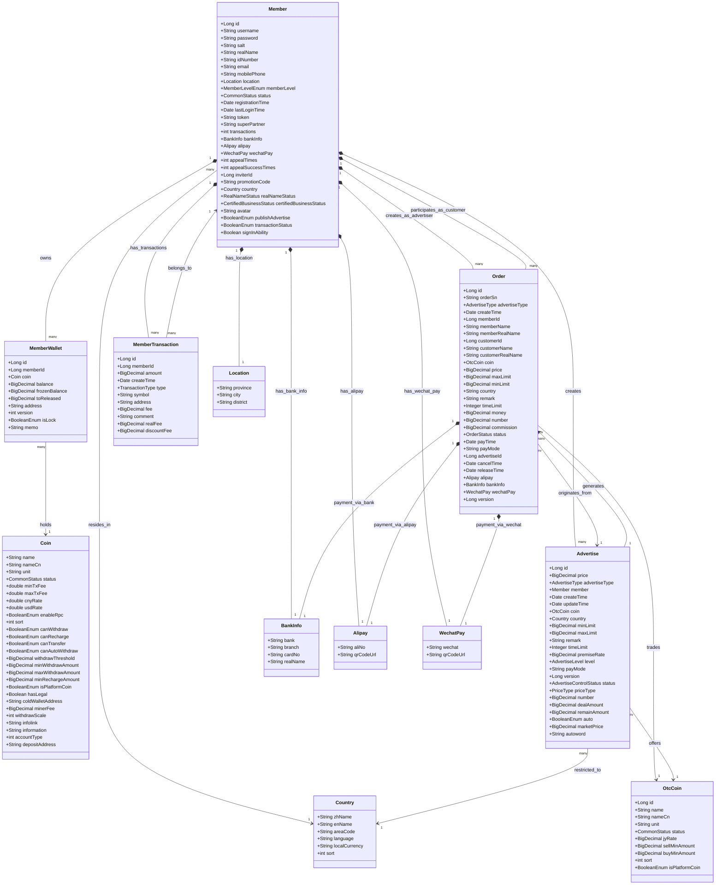

# Cryptocurrency Exchange Core - Entity Relationship Diagram

## Entity Relationship Description

This class diagram illustrates the key entities in the Cryptocurrency Exchange Core module and their relationships:

### 1. Core Entities

- **Member**: Central user entity representing exchange participants with comprehensive profile information, KYC status, and trading capabilities
- **MemberWallet**: Digital asset storage containers tracking available and frozen balances for each cryptocurrency per member
- **Coin**: Master configuration for supported cryptocurrencies including rates, fees, and operational parameters
- **Order**: OTC trading records representing peer-to-peer cryptocurrency transactions with fiat payment settlement
- **Advertise**: Member-created trading offers specifying terms, prices, and conditions for buying or selling cryptocurrency
- **OtcCoin**: OTC-specific cryptocurrency configuration extending base coin functionality with P2P trading parameters
- **MemberTransaction**: Comprehensive audit trail of all member financial activities across the platform
- **Country**: Geographic region configuration supporting localization and payment method restrictions

### 2. Key Relationships

- **Member to MemberWallet (1:many)**: Each member can hold multiple cryptocurrency wallets with unique constraint per coin type
- **Member to Order (1:many, dual role)**: Members participate as both advertisers (creators) and customers (takers) in OTC orders
- **Member to Advertise (1:many)**: Members can create multiple trading advertisements with different terms and cryptocurrencies
- **Member to MemberTransaction (1:many)**: Complete financial audit trail linking all member activities
- **Advertise to Order (1:many)**: Each advertisement can spawn multiple orders as customers respond to offers
- **Order to OtcCoin (many:1)**: Orders trade specific OTC-enabled cryptocurrencies with associated fee structures
- **MemberWallet to Coin (many:1)**: Wallets hold balances of specific cryptocurrencies based on platform coin configuration
- **Country relationships**: Members and advertisements are associated with countries for regulatory compliance and payment method restrictions

### 3. Embedded Objects

- **Location**: Geographic details embedded within Member for address information
- **BankInfo**: Traditional banking details embedded in Member and Order for fiat payment processing
- **Alipay**: Alipay payment account information embedded for Chinese market payment processing
- **WechatPay**: WeChat Pay account details embedded for mobile payment processing in Chinese market

### 4. Status Enumerations

- **OrderStatus**: CANCELLED, NONPAYMENT, PAID, COMPLETED, APPEAL - tracking OTC order processing workflow
- **TransactionType**: RECHARGE, WITHDRAW, EXCHANGE, OTC_BUY, OTC_SELL, ACTIVITY_AWARD, PROMOTION_AWARD, etc. - categorizing all financial activities
- **AdvertiseType**: BUY, SELL - distinguishing between purchase and sale advertisements
- **RealNameStatus**: NOT_CERTIFIED, VERIFIED, FAILED, PENDING - tracking KYC verification progress
- **CommonStatus**: NORMAL, ILLEGAL, LOCKED - standard status enumeration for operational entities
- **CertifiedBusinessStatus**: Business verification status for professional traders
- **BooleanEnum**: IS_TRUE, IS_FALSE - standardized boolean representation with explicit ordinal mapping

### 5. Data Integrity Features

- **Optimistic Locking**: Version fields in MemberWallet, Order, and Advertise entities prevent concurrent modification conflicts
- **Unique Constraints**: Username, email, and mobile phone uniqueness enforced at database level
- **Cascade Relationships**: Proper JPA cascade configurations ensure referential integrity
- **Audit Trails**: MemberTransaction provides complete financial audit capability with immutable records
- **Balance Consistency**: Dual balance tracking (available/frozen) with atomic operations prevents financial inconsistencies

This diagram provides a visual representation of the actual data model relationships in the codebase, showing how the cryptocurrency exchange platform maintains data integrity while supporting complex trading workflows and regulatory compliance requirements.
