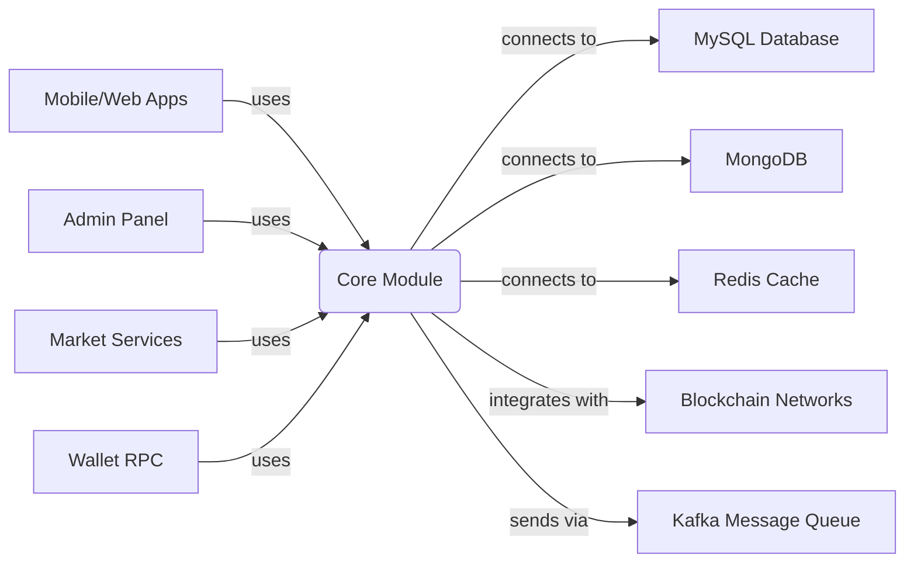
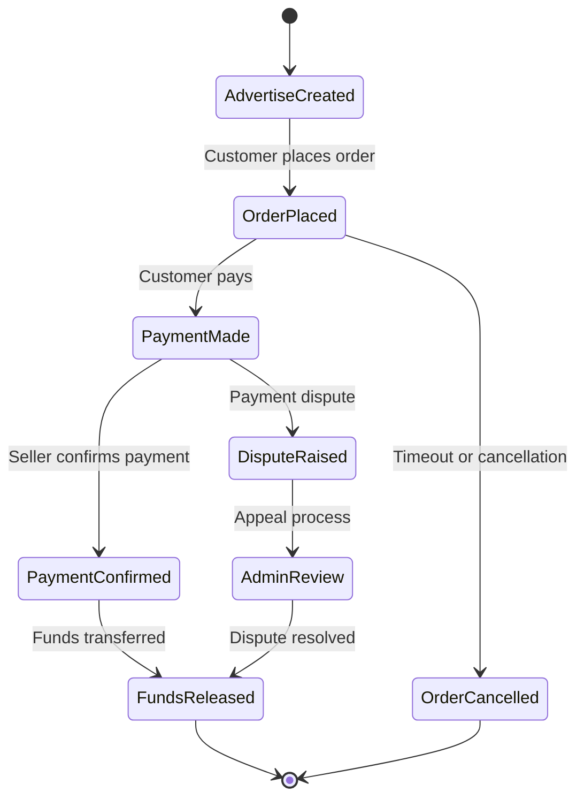

# Cryptocurrency Exchange Core Module - Technical Overview

# Business Overview

## What It Is

This is the **Core Module** of the Bizzan cryptocurrency exchange platform, a comprehensive Java-based trading system that provides the foundational business logic and data models for cryptocurrency exchange operations. The core module serves as the central shared library used by all other modules in the exchange ecosystem including the admin panel, API services, market data services, and wallet RPC services.

The core module implements the essential business entities, services, and infrastructure needed to operate a full-featured cryptocurrency exchange with support for:
- Digital asset trading (coin-to-coin exchanges)
- OTC (Over-The-Counter) peer-to-peer trading with fiat currencies
- Member management and KYC (Know Your Customer) processes
- Multi-cryptocurrency wallet management
- Promotional and reward systems
- Administrative and compliance features

## Domain Concepts

The core module models several key domain concepts central to cryptocurrency exchange operations:

1. **Members**: Registered users who can trade cryptocurrencies, complete KYC verification, and participate in various exchange features
2. **Wallets**: Digital asset storage containers that track available and frozen balances for each cryptocurrency per member
3. **Coins**: Supported cryptocurrencies with their properties, conversion rates, and operational settings
4. **OTC Trading**: Peer-to-peer advertisement-based trading system allowing members to buy/sell crypto with fiat currencies
5. **Orders**: Trade execution records for OTC transactions with status tracking and dispute handling
6. **Transactions**: Comprehensive record of all member financial activities including deposits, withdrawals, trades, and rewards
7. **Advertisements**: Member-created offers to buy or sell cryptocurrency at specified prices and conditions
8. **Promotions & Rewards**: Referral programs, activity rewards, and promotional campaigns to incentivize user engagement

## Component Boundaries

This core module serves as the foundational data access and business logic layer for the entire Bizzan cryptocurrency exchange platform. It provides shared entities, services, and infrastructure components that are consumed by multiple applications within the exchange ecosystem.

**External Boundaries**: The core module integrates with external systems including cryptocurrency blockchain networks via RPC services, external payment processors, SMS providers, cloud storage services, and monitoring/analytics platforms.

**Internal Boundaries**: Within the exchange platform, this core module provides shared business logic consumed by:
- Admin web application for exchange management
- Public APIs for mobile/web applications
- Market data services for price feeds and trading engine integration
- Wallet RPC services for blockchain interactions
- OTC API services for peer-to-peer trading

> **Pointers for Functional Testing:**
> 
> - **OTC Trading Flow**: Create advertisement → Place order → Payment → Confirmation → Release funds
> - **Member Registration**: Account creation → Email/phone verification → KYC submission → Approval process
> - **Wallet Operations**: Deposit confirmation → Balance updates → Withdrawal requests → Blockchain transactions



### Contract Interfaces Provided

The core module primarily provides **internal interfaces** to other components within the exchange platform rather than external APIs. However, it does expose some interfaces that cross component boundaries:

#### Data Access Layer (DAO)
- **Business Functions:** Provides data persistence and retrieval operations for all exchange entities
- **Audience:** Internal services across all exchange modules (admin, APIs, market services)
- **Role:** Centralizes database access patterns and query logic using Spring Data JPA and QueryDSL

#### Business Service Layer
- **Business Functions:** Encapsulates core business logic for member management, wallet operations, OTC trading, and promotional systems
- **Audience:** Controllers and other service layers in exchange applications
- **Role:** Orchestrates complex business workflows and enforces business rules

#### Entity Models & DTOs
- **Business Functions:** Provides standardized data models and transfer objects for exchange operations
- **Audience:** All exchange applications and external integrations
- **Role:** Ensures consistent data structure across the platform

### Contract Dependencies

The core module depends on several external systems and services:

#### External Databases
- **MySQL Database**: Primary relational database storing member accounts, wallets, orders, transactions, and system configuration
- **MongoDB**: Document store for analytics data, logs, and flexible schema requirements  
- **Redis**: Caching layer for session management, frequently accessed data, and temporary locks

#### Messaging Infrastructure
- **Apache Kafka**: Message queue for asynchronous processing, event publishing, and cross-service communication
- **Topics**: Real-time price updates, transaction notifications, system events

#### Blockchain Integration
- **Cryptocurrency RPC Services**: Direct integration with blockchain networks for wallet address generation, balance queries, and transaction broadcasting
- **Supported Networks**: Bitcoin, Ethereum, Litecoin, BCH, EOS, and various ERC-20 tokens

#### External APIs
- **SMS Providers**: Third-party SMS services for member verification and notifications
- **Cloud Storage (Aliyun OSS)**: File storage for KYC documents, avatars, and system assets
- **Elasticsearch**: Search and analytics engine for transaction mining and data analysis

#### Configuration & Monitoring
- **Spring Cloud Eureka**: Service discovery for microservices architecture
- **Application Properties**: Environment-specific configuration for database connections, external service credentials, and operational parameters

## Algorithms / Business Processes

### OTC Trading Workflow
The core module implements a comprehensive peer-to-peer trading system with the following process:



### Member Wallet Balance Management
- **Double-Entry Accounting**: All balance changes create corresponding transaction records
- **Balance Types**: Available balance (tradeable) and frozen balance (locked in orders)
- **Atomic Operations**: Database versioning and optimistic locking prevent balance inconsistencies
- **Transaction Categories**: Deposits, withdrawals, trades, fees, promotions, and administrative adjustments

### Promotional & Reward System
- **Referral Hierarchy**: Multi-level invitation system with commission calculations
- **Activity Rewards**: Time-based promotions with eligibility criteria and payout scheduling
- **Red Envelope System**: Digital gift distribution with random amount allocation

### Fee Calculation Logic
- **Trading Fees**: Percentage-based fees on transaction amounts with member level adjustments
- **Withdrawal Fees**: Tiered fee structure based on cryptocurrency type and withdrawal amount
- **Promotional Discounts**: Dynamic fee reductions based on member status and activity levels

---

# Technical Overview

## Implementation Summary

This is a Spring Boot application using Java 8, implementing the core business logic for a cryptocurrency exchange platform. The module uses Spring Data JPA for database operations, QueryDSL for type-safe queries, and integrates with multiple external systems including cryptocurrency blockchain networks, messaging queues, and cloud services. The architecture follows a multi-layered approach with clear separation between data access, business logic, and integration layers.

## Implementation Technologies

- **Java 8**: Primary programming language with lambda expressions and stream API
- **Spring Boot 2.x**: Main framework providing dependency injection, auto-configuration, and embedded server capabilities
- **Spring Data JPA**: Object-relational mapping and database abstraction layer
- **QueryDSL 4.1.3**: Type-safe SQL query builder for complex database operations
- **Hibernate**: JPA implementation with optimistic locking and auditing support
- **MySQL 8.0**: Primary relational database for transactional data
- **MongoDB**: NoSQL database for analytics and flexible schema data
- **Redis**: In-memory data structure store for caching and session management
- **Apache Kafka**: Distributed streaming platform for message processing
- **Elasticsearch 5.3**: Search and analytics engine for transaction mining
- **Druid**: High-performance database connection pooling
- **Lombok**: Code generation library reducing boilerplate code
- **EasyPOI**: Excel import/export functionality for administrative features
- **Apache Shiro**: Security framework for authentication and authorization
- **FastJSON**: High-performance JSON processing library
- **Spring Cloud Eureka**: Service discovery for microservices architecture
- **JUnit**: Unit testing framework with Spring Test support

## Local Runtime Environment

### Environment Setup
1. **Java 8+**: Install JDK 8 or higher with JAVA_HOME configured
2. **Maven 3.6+**: Dependency management and build tool
3. **MySQL 8.0**: Database server with timezone support
4. **Redis 6.0+**: Cache server with persistence enabled
5. **MongoDB 4.4+**: Document database with authentication
6. **Apache Kafka 2.8+**: Message broker with Zookeeper

### Commands/Scripts
```bash
# Build the project
mvn clean compile

# Run tests
mvn test

# Generate QueryDSL Q-classes
mvn clean compile -Dgenerating-sources

# Package the JAR
mvn clean package
```

### Dependencies Configuration
- **Database Setup**: Create MySQL database `bitrade` with UTF-8 encoding
- **Configuration Files**: Update `application.properties` with environment-specific database URLs, credentials, and service endpoints
- **External Services**: Configure Kafka broker addresses, Redis connection, MongoDB URI, and Elasticsearch cluster settings
- **Test Environment**: Uses embedded H2 database and mock services for unit testing

## Deployment

### Deployment Targets
- **Standalone JAR**: Packaged as Spring Boot executable JAR for deployment flexibility
- **Docker Containers**: Containerized deployment with multi-stage builds
- **Cloud Platforms**: Compatible with AWS ECS, Alibaba Cloud, and Kubernetes orchestration

### CI/CD Pipelines
- **Build Process**: Maven-based compilation with QueryDSL code generation
- **Testing Stage**: Automated unit and integration tests with coverage reporting
- **Artifact Generation**: JAR packaging with all dependencies included
- **Deployment Automation**: Environment-specific property injection and service registration

### Build Artifacts
- **Core Library JAR**: Contains all business entities, services, and utilities
- **QueryDSL Generated Sources**: Type-safe query classes generated during compilation
- **Test Reports**: JUnit test results and code coverage metrics

## Operability

### Logging
- **Framework**: SLF4J with Logback implementation
- **Log Levels**: DEBUG, INFO, WARN, ERROR with environment-specific configuration
- **Log Destinations**: Console output for development, file appenders for production
- **Structure**: Structured logging with correlation IDs for transaction tracing

### Monitoring & Metrics
- **Application Metrics**: JVM metrics, database connection pool statistics, and custom business metrics
- **Health Checks**: Spring Boot Actuator endpoints for application health monitoring
- **Performance Tracking**: Transaction processing times, database query performance, and external service response times

### Configuration Management
- **Spring Profiles**: Environment-specific configurations (dev, staging, production)
- **External Configuration**: Properties files and environment variables for sensitive settings
- **Configuration Server**: Spring Cloud Config integration for centralized configuration management

### Secrets Management
- **Database Credentials**: Encrypted properties files and environment variable injection
- **API Keys**: External service credentials managed through secure configuration
- **Blockchain Keys**: Cryptocurrency wallet private keys stored in secure hardware modules

### Failure Handling
- **Database Transactions**: ACID compliance with rollback mechanisms for data consistency
- **Retry Logic**: Exponential backoff for external service calls with circuit breaker patterns
- **Graceful Degradation**: Fallback mechanisms when external dependencies are unavailable
- **Dead Letter Queues**: Failed message processing with manual intervention capabilities

## Repository Structure

### Folder Responsibilities
- **`src/main/java/com/bizzan/bitrade/`**: Main source code root package
  - **`entity/`**: JPA entity classes representing database tables and business objects (76 files)
  - **`dao/`**: Data access objects providing database operations and custom queries (60 files)  
  - **`service/`**: Business service layer implementing core business logic (64 files)
  - **`constant/`**: Enumerations and constants for business rules and status values (36 files)
  - **`util/`**: Utility classes for common operations like encryption, ID generation, and mathematical calculations (25 files)
  - **`vo/`**: Value objects for data transfer between layers (15 files)
  - **`dto/`**: Data transfer objects for API communication and query results (8 files)
  - **`config/`**: Spring configuration classes for database, caching, and external services (6 files)
  - **`controller/`**: Base controller classes and CAPTCHA functionality (2 files)
  - **`core/`**: Core infrastructure classes including pagination and menu systems (3 files)

### Key Packages/Classes
- **`Member`**: Central user entity with KYC information, wallet relationships, and trading statistics
- **`MemberWallet`**: Digital asset wallet with balance tracking and transaction history
- **`Order`**: OTC trading order with payment details, status tracking, and dispute handling
- **`Advertise`**: Trading advertisement entity with pricing, limits, and member relationships
- **`Coin`**: Cryptocurrency configuration with rates, fees, and operational settings
- **`MemberService`**: Core member management including authentication, registration, and profile operations
- **`MemberWalletService`**: Wallet balance management with atomic operations and transaction recording
- **`OrderService`**: OTC order processing with workflow management and dispute resolution

### Testing Organization  
- **`src/test/java/`**: Unit test classes following package structure of main source
- **`src/test/resources/`**: Test-specific configuration files and data fixtures
- **Test Naming**: Test classes follow `*ServiceTest` and `*DaoTest` naming conventions
- **Test Categories**: Unit tests for service logic, integration tests for database operations

### Utility Code
- **`BaseService`**: Abstract service class providing QueryDSL factory and common query operations
- **`MessageResult`**: Standardized response wrapper for service operations
- **`IdWorkByTwitter`**: Distributed unique ID generator using Twitter Snowflake algorithm
- **`BigDecimalUtils`**: Mathematical utilities for precision financial calculations
- **`Md5`**: Password hashing and security utilities

---
