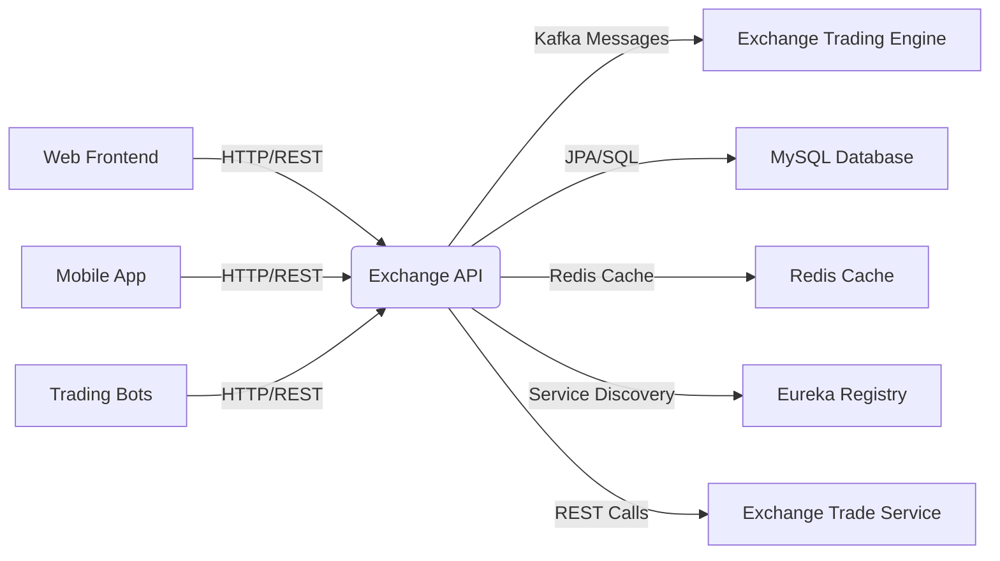
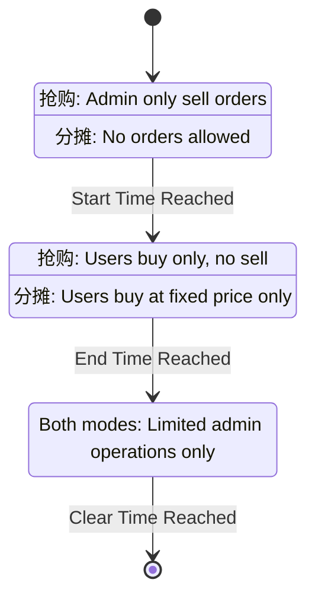
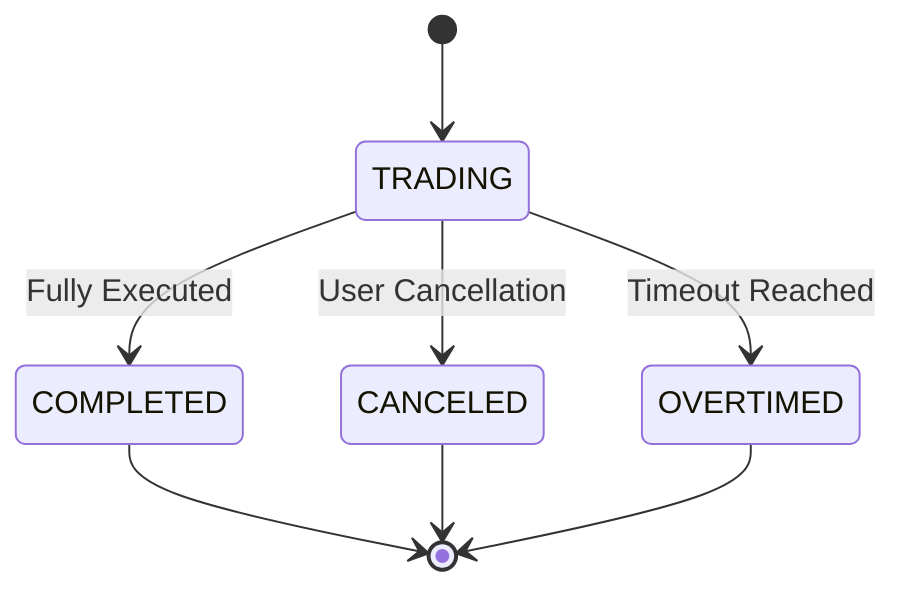

# Business Overview

## What It Is

The **Exchange API** is a Spring Boot-based REST API service that provides external interfaces for cryptocurrency exchange operations. It serves as the primary interface for trading activities including order management, favorite symbol management, and market data access. The service operates within a distributed cryptocurrency exchange system architecture, integrating with core trading engines, data persistence layers, and real-time messaging systems.

## Domain Concepts

The Exchange API manages several key domain concepts:

- **Trading Orders**: Buy/sell orders with support for both market and limit price types
- **Trading Pairs (Exchange Coins)**: Configuration of supported cryptocurrency trading pairs with their trading rules and restrictions  
- **Favorite Symbols**: User-specific watchlists of preferred trading pairs
- **Order Books**: Real-time market depth and pricing information
- **Special Trading Modes**: Support for special trading events like flash sales (抢购) and proportional distribution (分摊)

## Component Boundaries

The Exchange API acts as a gateway service that exposes trading functionality to external clients while coordinating with backend trading engines and data services.

> **Pointers for Functional Testing:**
> 
> - Test order placement with various parameter combinations (market/limit, buy/sell, different amounts)
> - Validate order cancellation functionality and timeout behavior
> - Test favorite symbol management (add/remove/list operations)
> - Verify trading restrictions and validation rules enforcement
> - Test special trading mode behaviors (抢购/分摊 modes)



### Contract Interfaces Provided

#### APIs

- **Business Functions:** The API exposes cryptocurrency trading operations including order placement, order management (cancel, query), and user preference management (favorites).

- **Endpoint Behavior:** Mixed endpoints - order placement and cancellation are state-changing operations while order queries and favorite management are primarily read operations with some state changes.

- **Audience:** The API serves multiple consumer types including web frontends, mobile applications, and automated trading bots (with special authenticated endpoints).

- **Role:** The API acts primarily as an orchestrator, validating business rules, coordinating with trading engines via Kafka, and managing data persistence.

### Contract Dependencies

#### API Clients

- **Consumed APIs:** 
  - Exchange Trade Service: Monitors order existence in trading engines for cancellation validation
  - Eureka Service Discovery: Service registration and discovery

- **Role & Considerations:** The Exchange Trade Service is used for order state validation before cancellation. Service discovery enables microservice communication in the distributed architecture.

- **Failure Handling:** Service calls include try-catch blocks with fallback behaviors for trading engine communication failures.

#### External Databases

- **Data Interaction:** 
  - MySQL: Primary data store for orders, trading pairs, user favorites with JPA-based access
  - MongoDB: Additional data persistence (configured but usage not evident in provided code)
  - Redis: Session management and caching layer

- **Ownership & Consistency:** The service owns trading order data and user preferences, with coordination required for order state consistency with trading engines.

#### Messaging Subscriptions

- **Topics/Queues:** 
  - Produces to: `exchange-order` (new orders), `exchange-order-cancel` (order cancellations)
  - Consumer patterns not evident in exchange-api codebase (likely handled by separate consumers)

- **Message Schemas:** JSON serialization of ExchangeOrder objects for order operations

- **Reliability Concerns:** Kafka producer configured with retry and batching settings for reliable message delivery

#### Other Systems

- **Additional Dependencies:**
  - Druid Connection Pool: Database connection management
  - Spring Session: Distributed session management
  - Logback: Logging framework with environment-specific configurations

## Algorithms / Business Processes

### Order Validation and Processing Logic

The service implements comprehensive order validation including:

#### Price and Volume Validation
- Minimum/maximum price constraints based on trading pair configuration
- Volume limits and precision scaling according to coin specifications
- Market order vs limit order specific validation rules

#### Trading Restrictions
- Maximum concurrent orders per user per trading pair
- Daily cancellation limits per user
- Trading time windows and order timeout mechanisms

#### Special Trading Mode Logic

The system supports two special trading modes with complex state-based validation:



#### State Machines for Order Processing



---

# Technical Overview

## Implementation Summary

This is a Spring Boot 2.x project using Java 8, deployed as a microservice within a distributed cryptocurrency exchange system. The service uses JPA for data persistence, Kafka for asynchronous messaging, Redis for caching and session management, and integrates with service discovery via Eureka.

## Implementation Technologies

- **Spring Boot 2.x**: Web framework and application container with embedded Tomcat
- **Spring Data JPA**: Object-relational mapping for MySQL database interactions
- **Spring Kafka**: Message producer for trading engine communication
- **Spring Data Redis**: Caching layer and session management  
- **Spring Session**: Distributed session management across microservices
- **Druid Connection Pool**: High-performance database connection pooling
- **Lombok**: Code generation for boilerplate reduction
- **FastJSON**: JSON serialization/deserialization library
- **Logback**: Logging framework with structured output capabilities
- **Maven**: Build automation and dependency management

## Local Runtime Environment

### Environment Setup

1. **Prerequisites:**
   - Java 8 JDK
   - Maven 3.x
   - MySQL 5.7+ database
   - Redis server
   - Apache Kafka cluster
   - MongoDB (optional, for extended data storage)

2. **Configuration:**
   - Copy appropriate properties file from `src/main/resources/dev/` 
   - Update database connection strings, Redis configuration, and Kafka bootstrap servers
   - Configure Eureka registry URL for service discovery

### Commands/Scripts

```bash
# Build the application
mvn clean compile

# Run with development profile
mvn spring-boot:run -Dspring.profiles.active=dev

# Run as packaged JAR
mvn clean package
java -jar target/exchange-api.jar --spring.profiles.active=dev
```

### Dependencies

- **Database Setup:** MySQL with `bizzan` database schema
- **External Services:**
  - Redis server running on configured port (default 6379)
  - Kafka cluster accessible via configured bootstrap servers
  - Eureka registry service for microservice discovery
- **Development Mode:** Spring DevTools enabled for hot reloading during development

## Deployment

### Deployment Targets

- **Spring Boot JAR**: Packaged as executable JAR with embedded Tomcat server
- **Microservice Architecture**: Deployed as part of distributed exchange system
- **Service Registry**: Auto-registers with Eureka for service discovery

### Build Artifacts

- **JAR Packaging**: Maven builds executable JAR with all dependencies included
- **Profile Support**: Multiple build profiles for dev/test/prod environments with environment-specific configurations
- **System Dependencies**: Custom JAR dependency (spark-core) included via system scope

### CI/CD Pipelines

The project includes Maven configuration for automated builds with profile-specific resource filtering and Spring Boot repackaging plugin for deployment-ready artifacts.

## Operability

### Logging

- **Framework:** Logback with environment-specific configuration files
- **Log Levels & Routing:** Configurable via `logback-spring.xml` for each environment (dev/test/prod)
- **Structure:** Supports structured logging with correlation capabilities for distributed tracing

### Monitoring & Metrics

- **Metrics:** Spring Boot Actuator endpoints available for health monitoring
- **Custom Metrics:** Order processing metrics logged via SLF4J
- **Service Health:** Integration with service registry for availability monitoring

### Configuration Management

- **Settings:** Profile-based configuration with separate properties files for each environment
- **Environment Separation:** Maven profiles handle environment-specific builds with resource filtering
- **External Configuration:** Support for external configuration via Spring Boot's configuration precedence

### Secrets Management

- **Database Credentials:** Managed through environment-specific property files
- **Redis Authentication:** Password-based authentication configured per environment
- **Kafka Security:** Connection security handled through bootstrap server configuration

### Failure Handling

- **Dependency Outages:** 
  - Database connection pool with retry and timeout configurations
  - Trading engine communication includes fallback to forced order cancellation
  - Redis caching failures gracefully degrade to database-only operations

- **Resilience:** 
  - Kafka producer retries configured for message delivery reliability
  - Order validation prevents invalid state transitions
  - Comprehensive input validation prevents malformed data processing

## Repository Structure

### Folder Responsibilities

- **`src/main/java/`**: Main application source code organized by functional layers
  - `controller/`: REST endpoint implementations (ExchangeCoinController, OrderController, FavorController)
  - `config/`: Spring configuration classes for application, Kafka, session management
  - `job/`: Scheduled tasks (OrderUpdateJob for timeout processing)
  - Root package contains main application class with Spring Boot annotations

- **`src/main/resources/`**: Environment-specific configurations
  - `dev/`, `test/`, `prod/`: Environment-specific property files and logging configurations
  - `i18n/`: Internationalization message bundles for multiple locales

### Key Packages/Classes

- **`OrderController`**: Core trading operations API with order placement, cancellation, and query endpoints
- **`ExchangeCoinController`**: Trading pair configuration and metadata API
- **`FavorController`**: User preference management for watchlists
- **`OrderUpdateJob`**: Background job for order timeout processing and automatic cancellation
- **`ApplicationConfig`**: Web MVC configuration including CORS, internationalization, and interceptors

### Testing Organization

- **Test Structure:** Maven standard test directory structure
- **Integration Points:** Test configurations include separate property files for testing environment
- **Mocking Support:** Test-specific application properties for external service mocking

### Utility Code

- **Environment Profiles:** Multi-environment build support with Maven profiles
- **Development Tools:** Spring DevTools integration for development productivity  
- **Configuration Utilities:** Custom converter factory for enum handling in REST endpoints
