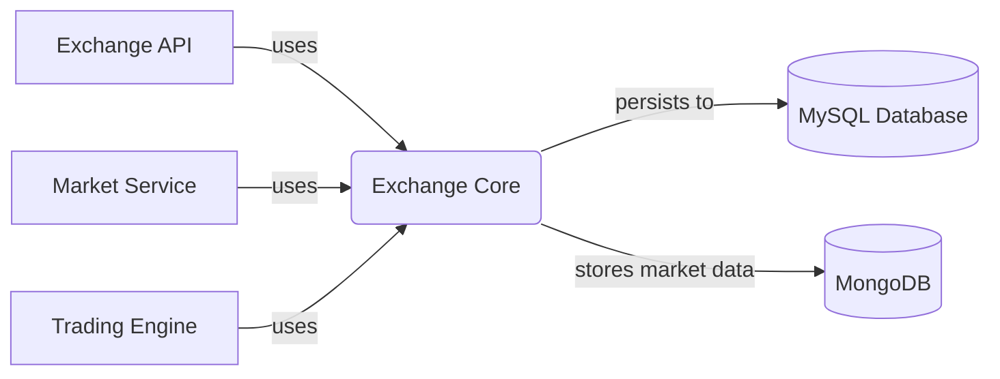
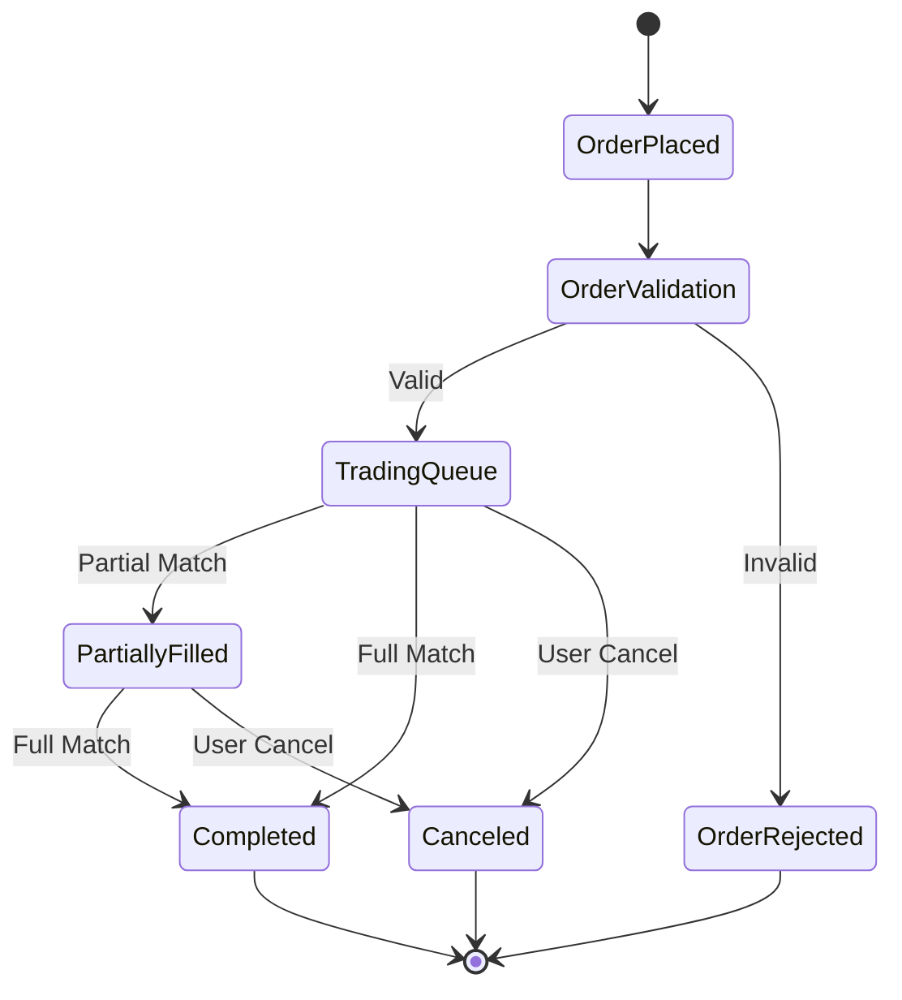

# Exchange Core - Technical Overview

# Business Overview

## What It Is

The Exchange Core module is the fundamental data access and business logic library for cryptocurrency exchange trading operations within the CoinExchange platform. This component encapsulates all core domain entities, data access objects (DAOs), and business services required for managing cryptocurrency trading pairs, processing buy/sell orders, tracking trade executions, and maintaining market data.

As a core library component, it provides essential foundation services to other modules in the system including the exchange API, market services, and trading engines.

## Domain Concepts

The Exchange Core models several key domain concepts fundamental to cryptocurrency exchange operations:

- **Trading Pairs (ExchangeCoin)**: Configuration and metadata for cryptocurrency trading pairs (e.g., BTC/USDT), including trading rules, fees, limits, and market status
- **Exchange Orders**: Buy and sell orders placed by users, supporting both limit price and market price order types with comprehensive lifecycle management
- **Trade Execution**: Completed trades resulting from order matching, including detailed transaction records and settlement information
- **Market Data**: Real-time and historical market information including price tickers, candlestick charts (K-line data), and order book depth
- **User Preferences**: Personal trading preferences such as favorite trading symbols for enhanced user experience

## Component Boundaries

The Exchange Core serves as a foundational data access layer and does not expose external APIs directly. Instead, it provides internal Java interfaces consumed by other components within the exchange system.

> **Pointers for Functional Testing:**
> 
> - **Order Processing Testing**: Validate order creation, status transitions (TRADING → COMPLETED/CANCELED), and wallet balance updates
> - **Trade Execution Testing**: Verify trade matching logic, fee calculations, and settlement accuracy
> - **Market Data Testing**: Ensure K-line generation, order book updates, and price ticker calculations
> - **Data Consistency Testing**: Validate referential integrity between orders, trades, and wallet transactions



### Contract Interfaces Provided

#### Internal Java APIs

- **Business Functions:** The module exposes Spring-managed service beans for order management, trade processing, market data access, and configuration management
    
- **Endpoint Behavior:** Services are transactional and state-changing, handling complex business logic for order lifecycle management and trade settlement
    
- **Audience:** Internal consumption by other exchange platform modules including APIs, trading engines, and market data services
    
- **Role:** Acts as the authoritative data access layer and business logic orchestrator for all exchange trading operations

### Contract Dependencies

#### External Databases

- **Data Interaction:** Read/write access to MySQL database for persistent storage of orders, trades, trading pairs, and user preferences. Tightly coupled to specific schema design
    
- **Ownership & Consistency:** Owns the exchange domain schema with strong consistency requirements for financial transactions
    
- **MongoDB Integration:** Stores time-series market data including trade details, K-line data, and order aggregations for analytics

#### External Services Dependencies

- **Member Wallet Service:** Critical dependency for balance validation, freezing/unfreezing funds, and settlement operations during trade execution
    
- **Member Service:** Required for user validation, referral reward processing, and account status checks
    
- **Transaction Service:** Handles creation of financial transaction records for audit trails and reporting

#### Configuration Dependencies

- **Trading Configuration:** Relies on trading pair configurations for fee rates, trading limits, and market rules
    
- **Promotion Settings:** Integrates with referral reward configuration for commission calculations

## Algorithms / Business Processes

### Order Matching and Execution Logic

The module implements sophisticated order processing algorithms:

#### Order Placement Validation
- **Balance Verification**: For buy orders, validates sufficient base currency; for sell orders, validates sufficient trading currency
- **Trading Limits**: Enforces minimum/maximum order amounts and daily trading limits per trading pair
- **Market Hours**: Respects trading pair availability and market status

#### Trade Settlement Processing
- **Dual-Currency Settlement**: Handles simultaneous settlement of both trading currencies in a matched trade
- **Fee Calculation**: Applies configurable trading fees with special handling for market makers and system accounts
- **Wallet Operations**: Atomic balance updates including unfreezing placed orders and crediting received currencies



#### Referral Reward Distribution
- **Commission Calculation**: Multi-level referral rewards based on trading fees with configurable rates
- **Eligibility Verification**: Time-based eligibility checks and user relationship validation
- **Automated Distribution**: Real-time distribution of referral commissions to qualifying accounts

### Market Data Aggregation

#### Order Book Management (TradePlate)
- **Price Level Aggregation**: Maintains ordered lists of buy/sell orders by price level
- **Depth Calculation**: Real-time computation of market depth and liquidity metrics
- **Order Book Updates**: Efficient insertion, removal, and modification of order book entries

#### K-Line Generation
- **OHLCV Data**: Calculation of Open, High, Low, Close, Volume data for various time periods
- **Volume Aggregation**: Accurate tracking of trading volumes and turnover amounts
- **Time Period Management**: Support for multiple timeframes (1m, 5m, 1h, 1d, etc.)

---

# Technical Overview

## Implementation Summary

Exchange Core is a Spring Boot library module built with Java, utilizing JPA for relational data persistence and MongoDB for time-series market data storage. The module employs QueryDSL for type-safe database queries and Lombok for reducing boilerplate code. It follows a layered architecture with separate entity, repository, service, and utility layers.

## Implementation Technologies

- **Spring Boot**: Core application framework providing dependency injection, transaction management, and configuration management
- **Spring Data JPA**: Object-relational mapping and repository pattern implementation for MySQL database operations
- **Spring Data MongoDB**: Document-based data access for time-series market data storage and retrieval
- **QueryDSL**: Type-safe query construction library enabling complex database queries with compile-time validation
- **Lombok**: Code generation library reducing boilerplate for entity classes, getters, setters, and constructors
- **FastJSON**: High-performance JSON serialization library for API responses and message processing
- **Maven**: Dependency management and build automation with QueryDSL code generation integration

**Architectural Patterns:**
- Repository pattern for data access abstraction
- Service layer pattern for business logic encapsulation
- Domain-driven design with rich entity models

## Local Runtime Environment

### Environment Setup

1. **Java Development Kit**: Requires Java 8 or higher
2. **Database Setup**: 
   - MySQL 5.7+ for relational data storage
   - MongoDB 3.6+ for time-series market data
3. **Maven Dependencies**: All dependencies are managed through Maven POM configuration

### Commands/Scripts

```bash
# Build the module
mvn clean compile

# Run tests
mvn test

# Generate QueryDSL query classes
mvn compile
```

### Dependencies

**Database Configuration**: The module requires connection to:
- MySQL database with the exchange schema pre-initialized
- MongoDB instance for market data collections

**External Service Dependencies**: 
- Member wallet service must be available for balance operations
- Member service for user validation
- Transaction service for financial record keeping

**Test Environment**: Uses in-memory H2 database for unit testing with test data fixtures provided in the test resources.

## Deployment

### Deployment Targets

Exchange Core is deployed as a JAR library artifact rather than a standalone service. It is included as a dependency in other exchange platform modules.

### Build Artifacts

- **JAR Library**: Maven produces a standard JAR file containing compiled classes and resources
- **QueryDSL Generated Classes**: Build process generates Q-classes for type-safe queries in `target/generated-sources`

### CI/CD Pipelines

The module follows standard Maven build lifecycle:
1. **Compilation**: Source code compilation with QueryDSL query class generation
2. **Testing**: Unit and integration test execution
3. **Packaging**: JAR artifact creation
4. **Repository Publication**: Artifact deployment to Maven repository for consumption by dependent modules

### Gating Processes

- **Unit Test Coverage**: All services require minimum test coverage
- **Integration Testing**: Database integration tests must pass
- **Code Quality**: Static analysis and code review requirements

## Operability

### Logging

- **Framework**: Uses SLF4J with Logback for structured logging
- **Log Levels & Routing**: 
  - DEBUG: Database query logging and detailed transaction flows
  - INFO: Business operation logging (order placement, trade execution)
  - WARN: Business rule violations and retry operations
  - ERROR: System errors and transaction failures
- **Structure**: Structured JSON logging with correlation IDs for distributed tracing

### Monitoring & Metrics

- **Metrics**: Custom metrics for:
  - Order processing rates and latencies
  - Trade execution success rates
  - Database connection pool utilization
  - Cache hit ratios
- **Tools**: Integration with Micrometer for metrics collection and export to monitoring systems

### Configuration Management

- **Settings**: Configuration through Spring Boot properties files and environment variables
- **Database Configuration**: Connection strings, pool sizes, and timeout settings
- **Business Rules**: Trading limits, fee rates, and market parameters configurable per environment

### Secrets Management

- **Storage**: Database credentials managed through environment variables or external configuration
- **Injection**: Sensitive configuration injected at runtime through deployment infrastructure

### Failure Handling

- **Database Outages**: Connection pooling with retry logic and circuit breaker patterns
- **Transaction Failures**: Automatic rollback with transaction isolation guarantees
- **Resilience**: Comprehensive error handling with graceful degradation for non-critical operations

## Repository Structure

### Folder Responsibilities

- **`src/main/java/com/bizzan/bitrade/`**: Root package containing all source code
  - **`entity/`**: JPA entity classes representing domain models and database tables
  - **`dao/`**: Spring Data repository interfaces for data access operations
  - **`service/`**: Business logic service classes with transactional operations
  - **`util/`**: Utility classes for common operations (ID generation, pagination)
  - **`vo/`**: Value objects for data transfer between layers
  - **`pagenation/`**: Custom pagination utilities and criteria builders

### Key Packages/Classes

- **`ExchangeOrder`**: Core entity representing trading orders with complete lifecycle management
- **`ExchangeOrderService`**: Central business service handling order processing, matching, and settlement
- **`ExchangeTrade`**: Entity representing completed trade transactions
- **`TradePlate`**: Complex data structure managing order book depth and price levels
- **`ExchangeCoin`**: Trading pair configuration entity with market rules and parameters

### Testing Organization

- **Unit Tests**: Located in `src/test/java` mirroring the main package structure
- **Integration Tests**: Service layer tests with database integration
- **Test Utilities**: Mock data generators and test fixtures for consistent testing

### Utility Code

- **`GeneratorUtil`**: Unique identifier generation for orders and transactions
- **`PageUtil`**: Pagination and sorting utilities for query results
- **`EntityPage`**: Custom pagination wrapper for repository queries
- **Test Fixtures**: Comprehensive test data setup for various trading scenarios

---
