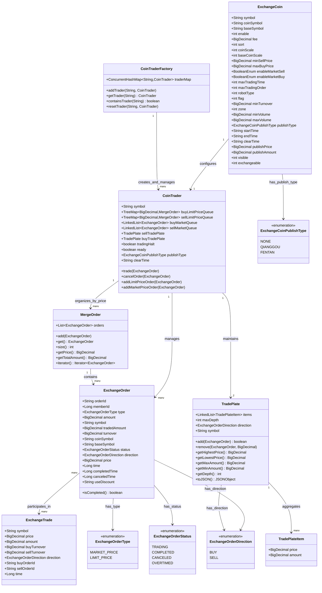

# Exchange Service Entity Relationship Diagram

## Entity Relationship Description

This class diagram illustrates the key entities in the Exchange Service and their relationships:

### 1. Core Entities

- **ExchangeOrder**: The fundamental unit representing a user's buy or sell request with price, quantity, and execution details
- **ExchangeTrade**: A completed transaction record created when two compatible orders are matched and executed
- **ExchangeCoin**: Configuration entity defining trading rules, limits, and behaviors for each trading pair
- **CoinTrader**: The core trading engine that processes orders and maintains order books for a single trading pair
- **TradePlate**: Real-time market depth representation showing aggregated order volumes at different price levels

### 2. Key Relationships

- **ExchangeCoin ↔ CoinTrader (1:1)**: Each trading pair has exactly one dedicated trading engine configured with its specific rules
- **CoinTrader ↔ ExchangeOrder (1:Many)**: Each engine manages all active orders for its trading pair, organizing them in price-time priority queues
- **CoinTrader ↔ TradePlate (1:2)**: Each engine maintains separate buy and sell order book depth representations
- **ExchangeOrder ↔ ExchangeTrade (Many:Many)**: Orders can participate in multiple trades during partial execution, and each trade involves exactly two orders
- **MergeOrder ↔ ExchangeOrder (1:Many)**: Orders at identical price levels are grouped together and processed in FIFO order

### 3. Embedded Objects

- **TradePlateItem**: Price-volume pairs that make up the order book depth display
- **MergeOrder**: Container grouping orders at the same price level within the trading engine's order queues
- **CoinTraderFactory**: Singleton factory managing multiple trading engines across different trading pairs

### 4. Status Enumerations

- **ExchangeOrderType**: MARKET_PRICE (immediate execution), LIMIT_PRICE (specific price execution)
- **ExchangeOrderDirection**: BUY (purchase orders), SELL (sale orders)  
- **ExchangeOrderStatus**: TRADING (active), COMPLETED (fully executed), CANCELED (user cancelled), OVERTIMED (expired)
- **ExchangeCoinPublishType**: NONE (normal trading), QIANGGOU (flash sale), FENTAN (proportional distribution)

### 5. Data Flow and Processing

The relationships support the following data flow:
1. **Configuration Loading**: ExchangeCoin configurations initialize CoinTrader engines
2. **Order Processing**: Incoming ExchangeOrders are assigned to appropriate CoinTrader engines
3. **Order Organization**: Orders are grouped by price level (MergeOrder) and maintained in priority queues
4. **Trade Matching**: Compatible orders are matched and ExchangeTrade records are created
5. **Market Data**: TradePlate structures are updated to reflect current market depth
6. **State Management**: Order statuses are updated and completion notifications are sent

This diagram provides a visual representation of the actual data model relationships in the codebase, emphasizing the central role of the CoinTrader as the orchestrator of all trading activity for a specific trading pair.
