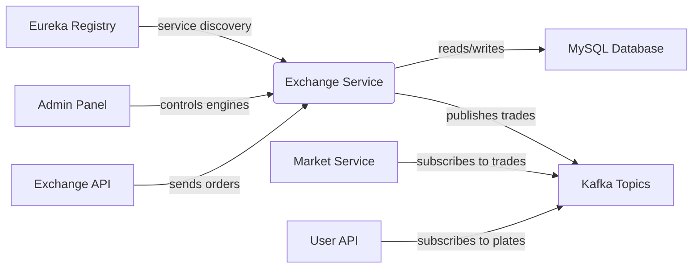
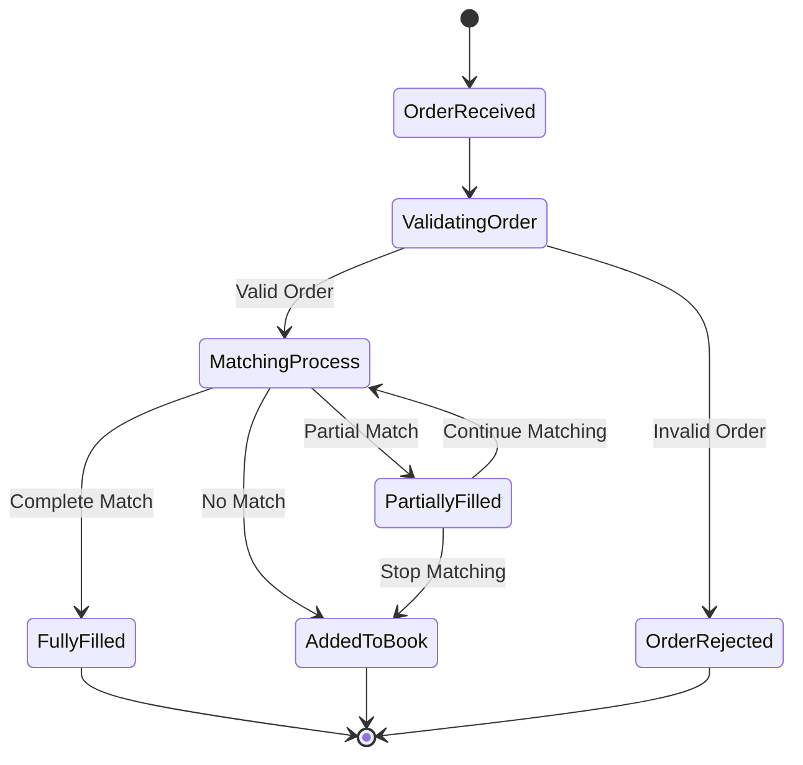

# Exchange Service Technical Overview

# Business Overview

## What It Is

The Exchange service is a real-time cryptocurrency trading matching engine that processes buy and sell orders for digital currency pairs. It serves as the core trading component of the broader cryptocurrency exchange platform, handling order matching, trade execution, and market depth management. This service operates as an independent microservice within the larger exchange ecosystem, providing high-performance order processing capabilities.

## Domain Concepts

The Exchange service models several key domain concepts:

- **Trading Pairs (ExchangeCoin)**: Cryptocurrency trading pairs (e.g., BTC/USDT) with associated trading rules and configurations
- **Orders (ExchangeOrder)**: Buy/sell orders from users, supporting both limit orders (specific price) and market orders (best available price)
- **Trades (ExchangeTrade)**: Executed transactions resulting from successful order matching
- **Order Books**: Real-time collections of pending buy and sell orders organized by price levels
- **Trade Plates**: Market depth information showing the current bid/ask spreads and volumes
- **Order Matching**: The core algorithmic process that matches compatible buy and sell orders

## Component Boundaries

The Exchange service operates as a centralized matching engine that receives order requests, processes them against existing order books, executes trades, and broadcasts results. It maintains strict boundaries around order processing logic while integrating with external systems for data persistence and messaging.

> **Pointers for Functional Testing:**
> 
> - Test order matching accuracy across different price levels and order types
> - Verify proper handling of partial fills and order cancellations
> - Validate trade plate accuracy and real-time updates



### Contract Interfaces Provided

#### APIs

- **Business Functions:** The Exchange service exposes monitoring and control endpoints for trading engine management
- **Endpoint Behavior:** Endpoints are primarily read-only monitoring interfaces with some state-changing admin controls
- **Audience:** Internal services and admin dashboards consume these APIs
- **Role:** The service acts as a data provider for monitoring and admin control operations

Key API endpoints include:
- `/monitor/overview`: Trading engine status and statistics
- `/monitor/plate`: Real-time market depth information
- `/monitor/engines`: Status of all trading engines
- `/monitor/start-trader`, `/monitor/stop-trader`: Engine lifecycle management

#### Messaging (Kafka Topics)

- **Topics Produced:**
  - `exchange-trade`: Completed trade information for market data processing
  - `exchange-order-completed`: Notifications for fully executed orders
  - `exchange-trade-plate`: Real-time order book depth updates
  - `exchange-order-cancel-success`: Successful order cancellation notifications

- **Message Specifications:** JSON-serialized domain objects (ExchangeTrade, ExchangeOrder, TradePlate)
- **Delivery Guarantees:** At-least-once delivery with Kafka's built-in reliability

### Contract Dependencies

#### API Clients

- **Eureka Service Registry:** Used for service discovery and registration within the microservices ecosystem
- **Role & Considerations:** Critical for service-to-service communication; handles service availability and load balancing
- **Failure Handling:** Service continues operating but becomes undiscoverable if Eureka is unavailable

#### External Databases

- **MySQL Database:** Persistent storage for order data, trade history, and exchange configuration
- **Data Interaction:** Reads exchange coin configurations and order details; writes completed order states
- **Ownership & Consistency:** Shared database with other exchange services; uses JPA for data access

#### Messaging Subscriptions

- **Topics Consumed:**
  - `exchange-order`: Incoming orders to be processed by the matching engine
  - `exchange-order-cancel`: Order cancellation requests

- **Message Schemas:** JSON-serialized ExchangeOrder objects
- **Reliability Concerns:** Batch processing with manual acknowledgment; handles message replay and duplicate detection

## Algorithms / Business Processes

The Exchange service implements sophisticated order matching algorithms and trading processes:

### Order Matching Logic

The core matching algorithm processes incoming orders against existing order books:

1. **Limit Order Matching**: Matches orders based on price-time priority
   - Buy orders matched against lowest-priced sell orders
   - Sell orders matched against highest-priced buy orders
   - Orders at same price level processed in FIFO order

2. **Market Order Processing**: Executes immediately at best available prices
   - Market buy orders consume sell order book from lowest price upward
   - Market sell orders consume buy order book from highest price downward

3. **Special FENTAN Distribution Mode**: Proportional allocation for token distribution events
   - Calculates proportional shares based on total participating volume
   - Ensures fair distribution during limited token sales

### Order Book Management

The service maintains real-time order books using efficient data structures:



### Trade Execution and Settlement

When orders are matched, the system:
1. Calculates trade amounts and prices
2. Updates order states (traded amounts, turnover)
3. Creates ExchangeTrade records
4. Updates trade plates (market depth)
5. Publishes trade and order completion messages

---

# Technical Overview

## Implementation Summary

The Exchange service is a Spring Boot application built with Java 8, deployed as a microservice within a Kafka-based event-driven architecture. It uses Spring Cloud Eureka for service discovery and maintains high-performance in-memory order books with MySQL for persistent storage. The service is designed for high-throughput order processing with concurrent order matching capabilities.

## Implementation Technologies

- **Java 8**: Primary programming language with BigDecimal for financial calculations
- **Spring Boot 2.x**: Web framework providing REST endpoints and dependency injection
- **Spring Cloud Eureka**: Service discovery and registration for microservices communication
- **Spring Kafka**: Messaging framework for order processing and trade broadcasting
- **Spring Data JPA**: Object-relational mapping for MySQL database access
- **MySQL**: Relational database for persistent data storage
- **Druid**: High-performance database connection pooling
- **FastJSON**: JSON serialization/deserialization for message payloads
- **Lombok**: Code generation for reducing boilerplate code
- **Maven**: Build tool and dependency management

## Local Runtime Environment

### Environment Setup

1. **Java Development Kit 8** or higher
2. **Maven 3.6+** for dependency management
3. **MySQL 8.0** database server
4. **Apache Kafka 2.8** message broker
5. **Eureka Server** for service registry

### Commands/Scripts

```bash
# Build the application
mvn clean package

# Run with development profile
java -Dspring.profiles.active=dev -jar target/exchange.jar

# Alternative: Use Maven Spring Boot plugin
mvn spring-boot:run -Dspring-boot.run.profiles=dev
```

### Dependencies

- **MySQL Database**: Configure connection in `application.properties`
  - Create database schema `bizzan`
  - Tables are auto-created via JPA DDL
- **Kafka Broker**: Configure bootstrap servers and topic creation
  - Required topics: `exchange-order`, `exchange-order-cancel`
- **Eureka Server**: Configure registry URL for service discovery
- **External Services**: Exchange-core and core modules must be available

## Deployment

### Deployment Targets

The service is packaged as an executable JAR file suitable for:
- **Docker containers** for containerized deployments
- **Traditional application servers** 
- **Cloud platforms** (AWS, Azure, GCP)

### CI/CD Pipelines

Build process uses Maven with Spring Boot plugin:
- Compiles Java sources with target compatibility Java 8
- Packages dependencies into executable JAR
- Supports multiple environment profiles (dev, test, prod)
- Test execution is currently disabled (`<skip>true</skip>`)

### Build Artifacts

- **Primary Artifact**: `exchange.jar` executable JAR file
- **Configuration**: Environment-specific properties in `src/main/resources/{env}/`
- **Dependencies**: All dependencies packaged within the JAR file

## Operability

### Logging

- **Framework**: SLF4J with Logback
- **Log Levels**: Configurable via environment-specific `logback-spring.xml`
- **Key Log Points**: Order processing, trade execution, error conditions, performance metrics

### Monitoring & Metrics

- **Health Endpoints**: Spring Boot Actuator endpoints for service health
- **Custom Metrics**: Trading engine status, order counts, queue depths
- **Monitoring API**: Dedicated `/monitor/*` endpoints for operational visibility
  - Engine status and statistics
  - Order book depths and counts
  - Individual order lookup capabilities

### Configuration Management

- **Profile-based Configuration**: Separate property files for dev/test/prod environments
- **Key Settings**: Database connections, Kafka brokers, Eureka registry, trade engine parameters
- **Runtime Configuration**: Engine scaling parameters, precision settings, trading limits

### Secrets Management

- **Database Credentials**: Stored in environment-specific property files
- **Kafka Configuration**: Bootstrap servers and authentication in properties
- **Service Discovery**: Eureka client configuration for secure service communication

### Failure Handling

- **Order Processing Errors**: Failed orders are automatically cancelled and returned to originating system
- **Database Outages**: Service continues processing with in-memory state; synchronizes on reconnection
- **Kafka Outages**: Orders queue in memory until message broker recovers
- **Resilience**: Concurrent processing with isolated trading engines per trading pair

## Repository Structure

### Folder Responsibilities

- **`src/main/java/`**: Primary source code
  - `com.bizzan.bitrade.Trader/`: Core trading engine implementation
  - `com.bizzan.bitrade.consumer/`: Kafka message consumers
  - `com.bizzan.bitrade.controller/`: REST API endpoints
  - `com.bizzan.bitrade.config/`: Spring configuration classes
- **`src/main/resources/`**: Configuration files
  - `{env}/`: Environment-specific configurations
- **`src/test/java/`**: Test classes (currently minimal)
- **`target/`**: Compiled artifacts and generated classes
- **`pom.xml`**: Maven project configuration with multi-profile support

### Key Packages/Classes

- **`CoinTrader`**: Core trading engine managing order books for a single trading pair
- **`CoinTraderFactory`**: Factory managing multiple trading engines across trading pairs
- **`ExchangeOrderConsumer`**: Kafka consumer processing incoming orders and cancellations
- **`MonitorController`**: REST controller providing operational monitoring endpoints

### Testing Organization

- **Unit Tests**: Located in `src/test/java/` with basic algorithm and concurrency tests
- **Test Categories**: BigDecimal precision tests, thread safety tests, order matching logic tests
- **Test Execution**: Currently disabled in Maven configuration

---
