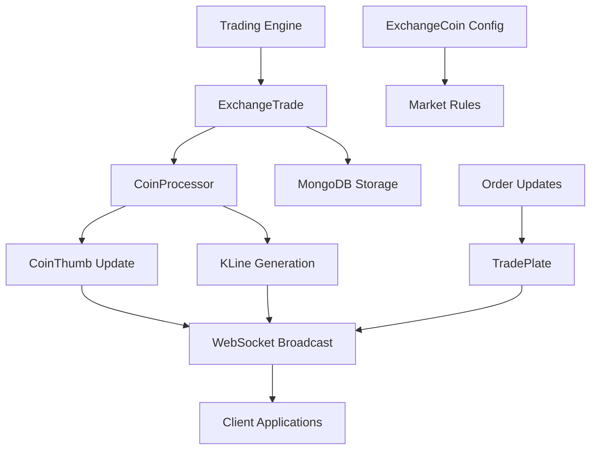

# Market Service Data Models

This document describes the core data models of the Market Service and their relationships.

## Core Entities

### 1. ExchangeTrade

Represents individual trade execution records from the matching engine.

```java
public class ExchangeTrade {
    private String symbol;                    // Trading pair symbol (e.g., "BTC/USDT")
    private BigDecimal price;                 // Trade execution price
    private BigDecimal amount;                // Trade amount/volume
    private BigDecimal buyTurnover;           // Buy side turnover value
    private BigDecimal sellTurnover;          // Sell side turnover value
    private ExchangeOrderDirection direction; // Trade direction (BUY/SELL)
    private String buyOrderId;                // Buy order identifier
    private String sellOrderId;               // Sell order identifier
    private Long time;                        // Trade execution timestamp
}
```

### 2. KLine

Candlestick chart data for various time periods.

```java
public class KLine {
    private BigDecimal openPrice;             // Opening price for the period
    private BigDecimal highestPrice;          // Highest price in the period
    private BigDecimal lowestPrice;           // Lowest price in the period
    private BigDecimal closePrice;            // Closing price for the period
    private long time;                        // Timestamp of the K-line period
    private String period;                    // Period type (1min, 5min, 1hour, etc.)
    private int count;                        // Number of trades in the period
    private BigDecimal volume;                // Total volume for the period
    private BigDecimal turnover;              // Total turnover for the period
}
```

### 3. CoinThumb

Real-time market data summary for trading pairs.

```java
public class CoinThumb {
    private String symbol;                    // Trading pair symbol
    private BigDecimal open;                  // 24h opening price
    private BigDecimal high;                  // 24h highest price
    private BigDecimal low;                   // 24h lowest price
    private BigDecimal close;                 // Current/latest price
    private BigDecimal chg;                   // Price change percentage
    private BigDecimal change;                // Absolute price change
    private BigDecimal volume;                // 24h trading volume
    private BigDecimal turnover;              // 24h trading turnover
    private BigDecimal lastDayClose;          // Previous day's closing price
    private BigDecimal usdRate;               // USD exchange rate for trading coin
    private BigDecimal baseUsdRate;           // USD exchange rate for base coin
    private int zone;                         // Trading zone identifier
}
```

### 4. ExchangeCoin

Trading pair configuration and metadata.

```java
public class ExchangeCoin {
    private String symbol;                    // Primary key - trading pair symbol
    private String coinSymbol;                // Trading coin symbol (e.g., "BTC")
    private String baseSymbol;                // Base coin symbol (e.g., "USDT")
    private int enable;                       // Enable status (1=enabled, 2=disabled)
    private BigDecimal fee;                   // Trading fee percentage
    private int sort;                         // Display sort order
    private int coinScale;                    // Trading coin decimal precision
    private int baseCoinScale;               // Base coin decimal precision
    private BigDecimal minSellPrice;          // Minimum sell price limit
    private BigDecimal maxBuyPrice;           // Maximum buy price limit
    private BooleanEnum enableMarketSell;     // Market sell order enabled
    private BooleanEnum enableMarketBuy;      // Market buy order enabled
    private int maxTradingTime;               // Order timeout in seconds
    private int maxTradingOrder;              // Max concurrent orders
    private int robotType;                    // Trading robot type
    private int flag;                         // Recommendation flag
    private BigDecimal minTurnover;           // Minimum trade turnover
    private int zone;                         // Trading zone
    private BigDecimal minVolume;             // Minimum order volume
    private BigDecimal maxVolume;             // Maximum order volume
    private ExchangeCoinPublishType publishType; // Publish activity type
    private String startTime;                 // Activity start time
    private String endTime;                   // Activity end time
    private String clearTime;                 // Activity clear time
    private BigDecimal publishPrice;          // Activity publish price
    private BigDecimal publishAmount;         // Activity publish amount
    private int visible;                      // Frontend visibility (1=visible, 2=hidden)
    private int exchangeable;                 // Trading enabled (1=enabled, 2=disabled)
}
```

### 5. TradePlate

Order book depth data for trading pairs.

```java
public class TradePlate {
    private String symbol;                    // Trading pair symbol
    private List<TradePlateItem> items;       // Order book entries
    private ExchangeOrderDirection direction; // Order book side (BUY/SELL)
    private BigDecimal maxAmount;             // Maximum order amount
    private BigDecimal minAmount;             // Minimum order amount
    private BigDecimal highestPrice;          // Highest price in the book
    private BigDecimal lowestPrice;           // Lowest price in the book
    private String symbol;                    // Trading pair symbol
}
```

### 6. TradePlateItem

Individual order book entry.

```java
public class TradePlateItem {
    private BigDecimal price;                 // Order price
    private BigDecimal amount;                // Order amount/volume
}
```

### 7. ExchangeOrder

Order information for tracking and updates.

```java
public class ExchangeOrder {
    private String orderId;                   // Unique order identifier
    private Long memberId;                    // Member/user identifier
    private ExchangeOrderType type;           // Order type (MARKET_ORDER/LIMIT_ORDER)
    private String symbol;                    // Trading pair symbol
    private ExchangeOrderDirection direction; // Order direction (BUY/SELL)
    private BigDecimal price;                 // Order price
    private BigDecimal amount;                // Order amount
    private BigDecimal tradedAmount;          // Amount already traded
    private BigDecimal turnover;              // Total turnover value
    private ExchangeOrderStatus status;       // Order status
    private Long time;                        // Order creation timestamp
    private Long completedTime;               // Order completion timestamp
    private Long canceledTime;                // Order cancellation timestamp
}
```

## Relationships

1. **ExchangeTrade to ExchangeOrder**: Many-to-Many
   - Each ExchangeTrade references a buyOrderId and sellOrderId
   - Multiple trades can execute against the same order (partial fills)

2. **ExchangeTrade to ExchangeCoin**: Many-to-One
   - All trades belong to a specific trading pair (ExchangeCoin)
   - ExchangeCoin defines trading rules and configuration

3. **KLine to ExchangeTrade**: One-to-Many (Aggregated)
   - KLine data is generated by aggregating multiple ExchangeTrade records
   - Time-based grouping creates different period K-lines

4. **CoinThumb to ExchangeCoin**: One-to-One
   - Each trading pair has one current market data summary
   - CoinThumb represents real-time calculated statistics for an ExchangeCoin

5. **TradePlate to ExchangeCoin**: One-to-One per Direction
   - Each trading pair has buy-side and sell-side order books
   - Contains aggregated order book depth data

6. **TradePlateItem to TradePlate**: Many-to-One
   - Multiple price levels make up an order book
   - Ordered by price for display purposes

## Status Enumerations

### ExchangeOrderDirection
- **BUY**: Buy order/trade direction
- **SELL**: Sell order/trade direction

### ExchangeOrderStatus
- **TRADING**: Order is active and can be matched
- **COMPLETED**: Order has been fully executed
- **CANCELED**: Order has been canceled by user or system
- **OVERTIMED**: Order has expired due to timeout

### ExchangeOrderType
- **MARKET_ORDER**: Market price order for immediate execution
- **LIMIT_ORDER**: Limit price order that waits for specific price

### ExchangeCoinPublishType
- **NONE**: No special activity (1)
- **PURCHASE**: Purchase-based issuance activity (2)  
- **DISTRIBUTION**: Distribution-based issuance activity (3)

### BooleanEnum
- **IS_TRUE**: Boolean true value (1)
- **IS_FALSE**: Boolean false value (0)

## Processing Flow

The typical processing flow involving these entities follows this pattern:

1. **Trade Execution**: ExchangeTrade records are generated when orders match in the trading engine

2. **Market Data Update**: ExchangeTrade data is consumed by CoinProcessor to update CoinThumb statistics

3. **K-Line Generation**: Scheduled jobs aggregate ExchangeTrade data into KLine records for various time periods

4. **Order Book Updates**: TradePlate data is updated based on order changes and distributed to clients

5. **Data Distribution**: Updated market data (CoinThumb, KLine) is broadcast via WebSocket and stored in MongoDB

6. **Historical Storage**: All market data is persisted for historical analysis and chart generation



This data model supports real-time market data processing, historical chart generation, and provides the foundation for all market-related operations in the cryptocurrency exchange platform.
