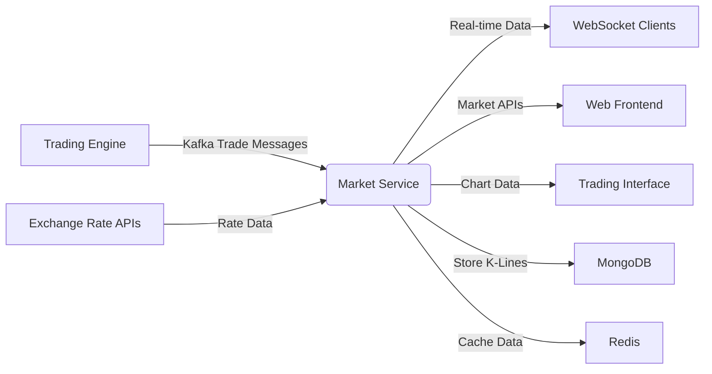
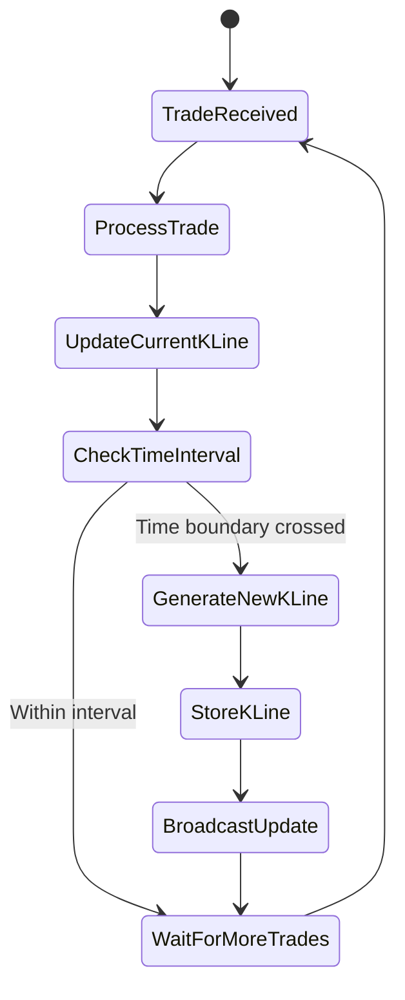
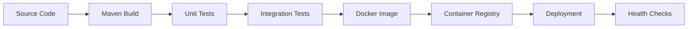

# Market Service Technical Overview

# Business Overview

## What It Is

The Market Service is a core component of the Bizzan cryptocurrency exchange platform that provides real-time market data processing, storage, and distribution capabilities. It serves as the central hub for all market-related information including price feeds, trading pair data, K-line chart generation, and market statistics for cryptocurrency trading pairs.

This service acts as a bridge between the trading engine and client applications, consuming trade execution data and transforming it into consumable market information for traders, charts, and other downstream systems.

## Domain Concepts

The Market Service models several key domain concepts:

- **Trading Pairs (Exchange Coins)**: Cryptocurrency trading pairs like BTC/USDT, ETH/BTC with their trading rules and configurations
- **Market Data (CoinThumb)**: Real-time price information including OHLCV data, price changes, and volume statistics
- **K-Line Charts**: Candlestick chart data across multiple timeframes (1min, 5min, 1hour, 1day, etc.)
- **Trade Execution Data**: Individual trade records consumed from the trading engine
- **Exchange Rates**: Fiat currency conversion rates for displaying prices in different currencies
- **Market Handlers**: Storage and distribution mechanisms for market data

## Component Boundaries

The Market Service operates within well-defined boundaries in the exchange ecosystem:

**External Dependencies:**
- Consumes trade execution data from Kafka topics published by the trading engine
- Queries trading pair configurations from the core database
- Fetches exchange rate data for fiat currency conversions
- Connects to MongoDB for historical market data storage
- Integrates with Redis for caching and real-time data distribution

**Provided Interfaces:**
- REST APIs for market data queries and historical chart data
- WebSocket connections for real-time market data streaming  
- Netty-based TCP connections for high-performance data distribution

> **Pointers for Functional Testing:**
> 
> - Test K-line generation by monitoring scheduled jobs and verifying data in MongoDB collections
> - Validate real-time market data by consuming trade messages and checking WebSocket broadcasts
> - Test exchange rate conversions using different fiat currency endpoints



### Contract Interfaces Provided

#### APIs

- **Business Functions:** The Market Service exposes RESTful APIs for retrieving market data, trading pair information, historical K-line data, recent trades, and exchange rates
- **Endpoint Behavior:** Primarily read-only endpoints for market data retrieval with some administrative endpoints for cache management
- **Audience:** Frontend web applications, mobile apps, trading interfaces, and external API consumers
- **Role:** Acts as a data aggregation and distribution service, not an orchestrator

Key API categories:
- Market data endpoints (`/symbol`, `/symbol-thumb`, `/overview`)
- Historical data endpoints (`/history`, `/latest-trade`) 
- Exchange rate endpoints (`/exchange-rate/*`)
- Trading pair information (`/symbol-info`, `/coin-info`)

#### WebSocket Streaming

- **Real-time Data:** Provides WebSocket connections for streaming live market data including price updates, trade notifications, and order book changes
- **Subscription Model:** Topic-based subscriptions for specific trading pairs and data types
- **Message Format:** JSON-formatted market data messages with timestamp and symbol identification

#### TCP/Netty Connections  

- **High-Performance Streaming:** Custom Netty-based TCP server for low-latency market data distribution
- **Protocol:** Binary protocol using Protocol Buffers for efficient data serialization
- **Target Audience:** High-frequency trading systems and professional trading platforms

### Contract Dependencies

#### Kafka Message Consumers

- **Consumed Topics:** 
  - `exchange-trade`: Individual trade execution records from the matching engine
  - `exchange-trade-mocker`: Simulated trade data for testing
  - `exchange-trade-plate`: Order book depth data
  - `exchange-order-completed`: Order completion notifications
  - `exchange-order-cancel-success`: Order cancellation events

- **Message Processing:** Asynchronous processing with thread pools to handle high-volume trade data
- **Failure Handling:** Uses Spring Kafka retry mechanisms and dead letter queues

#### External Databases

- **MongoDB:** Primary storage for historical K-line data and trade records
  - Collections: `exchange_kline_{symbol}_{period}`, `exchange_trade_{symbol}`
  - Data Interaction: Read/write operations for time-series market data
  - Indexing: Time-based indexes for efficient range queries

- **MySQL:** Configuration data for trading pairs and exchange settings
  - Tables: Exchange coin configurations, trading rules, and metadata
  - Access Pattern: Read-heavy with occasional configuration updates

- **Redis:** Caching layer for real-time data and session management
  - Usage: Market data caching, exchange rate storage, and WebSocket session management
  - Data Types: String values for rates, hash structures for complex market data

#### API Clients

- **Exchange Rate Services:** Consumes external APIs for fiat currency exchange rates
- **Trading Engine Integration:** Makes HTTP calls to trading engine services for order book data
- **Service Discovery:** Uses Eureka for service registration and discovery

## Algorithms / Business Processes

### K-Line Generation Algorithm

The service implements a sophisticated K-line (candlestick) generation process that aggregates trade data into various time intervals:



**Time Interval Processing:**
- 1-minute K-lines generated in real-time as trades occur
- Aggregated K-lines (5min, 15min, 1hour, 1day) created via scheduled jobs
- Historical data backfilling for missing periods

**OHLCV Calculation:**
- Open: First trade price in the time period
- High: Maximum trade price in the period  
- Low: Minimum trade price in the period
- Close: Last trade price in the period
- Volume: Sum of all trade amounts
- Value: Sum of all trade turnovers

### Market Data Processing Flow

Trade data flows through multiple processing stages:

1. **Trade Ingestion:** Kafka consumers receive trade execution data
2. **Market Processing:** CoinProcessor updates real-time market statistics
3. **Data Distribution:** Handlers broadcast updates via WebSocket and Netty
4. **Persistence:** MarketService stores K-line data in MongoDB
5. **Cache Updates:** Redis cache refreshed with latest market data

### Exchange Rate Management

- **Multi-Currency Support:** USD, CNY, JPY, HKD exchange rates
- **Rate Fetching:** Periodic updates from external rate providers
- **Calculation Logic:** Real-time conversion of cryptocurrency prices to fiat currencies
- **Caching Strategy:** Redis-based caching with configurable TTL

---

# Technical Overview

## Implementation Summary

The Market Service is a Spring Boot application built with Java, utilizing reactive programming patterns for high-throughput market data processing. It leverages Kafka for event-driven architecture, MongoDB for time-series data storage, and provides multiple data distribution channels including REST APIs, WebSocket connections, and custom Netty-based TCP servers.

## Implementation Technologies

- **Java 8+** - Primary programming language with Spring Boot framework
- **Spring Boot** - Application framework providing dependency injection, auto-configuration
- **Spring Kafka** - Kafka integration for consuming trade execution events  
- **Spring WebSocket** - WebSocket support for real-time client connections
- **Spring Data MongoDB** - MongoDB integration for time-series data persistence
- **Spring Data Redis** - Redis integration for caching and session management
- **Netflix Eureka** - Service discovery and registration
- **Netty** - Custom TCP server implementation for high-performance data distribution
- **Protocol Buffers** - Binary serialization for efficient data transmission
- **FastJSON** - JSON processing for API responses and message serialization
- **Maven** - Build tool and dependency management
- **Lombok** - Code generation for reducing boilerplate
- **SLF4J/Logback** - Logging framework

**Key Patterns:**
- Factory pattern for coin processors
- Observer pattern for market data handlers
- Template pattern for different market data storage implementations
- Scheduled task pattern for K-line generation jobs

## Local Runtime Environment

### Environment Setup

1. **Prerequisites:**
   ```bash
   # Java 8 or higher
   java -version
   
   # Maven 3.6+
   mvn -version
   ```

2. **External Dependencies:**
   ```bash
   # Start MongoDB (default port 27017)
   mongod --config /usr/local/etc/mongod.conf
   
   # Start Redis (default port 6379)  
   redis-server /usr/local/etc/redis.conf
   
   # Start Kafka (default port 9092)
   kafka-server-start.sh /usr/local/etc/kafka/server.properties
   ```

3. **Database Setup:**
   ```bash
   # Create MongoDB database
   mongo
   > use bitrade
   
   # MySQL database should contain exchange configuration tables
   # Check 00_framework/sql/ for schema definitions
   ```

### Commands/Scripts

```bash
# Development mode with dev profile
mvn spring-boot:run -Dspring.profiles.active=dev

# Production build
mvn clean package -Pprod

# Run with specific configuration
java -jar target/market.jar --spring.profiles.active=prod
```

### Configuration

Environment-specific configurations are located in:
- `src/main/resources/dev/application.properties` - Development
- `src/main/resources/test/application.properties` - Testing  
- `src/main/resources/prod/application.properties` - Production

Key configuration properties:
```properties
# Server configuration
server.port=6004
server.context-path=/market

# Database connections
spring.datasource.url=jdbc:mysql://localhost:3306/bizzan
spring.data.mongodb.uri=mongodb://localhost:27017/bitrade

# Kafka configuration  
spring.kafka.bootstrap-servers=localhost:9092

# Netty TCP server
aqmd.netty.port=28901
aqmd.netty.websocket-port=28985

# Redis configuration
spring.redis.host=localhost
spring.redis.port=6379
```

## Deployment

### Deployment Targets

- **Containerized Deployment:** Docker containers with Spring Boot embedded Tomcat
- **Cloud Platforms:** Supports deployment on AWS, Azure, or private cloud infrastructure
- **Orchestration:** Can be deployed in Kubernetes clusters with service mesh integration

### CI/CD Pipelines



**Build Process:**
1. Maven compilation and packaging
2. Unit test execution with coverage reporting
3. Integration tests against embedded test dependencies
4. Docker image creation with JAR artifact
5. Image push to container registry
6. Deployment to target environment
7. Health check validation

### Build Artifacts

- **JAR File:** Spring Boot executable JAR with embedded dependencies
- **Docker Image:** Multi-stage build with optimized layers
- **Configuration:** Environment-specific property files
- **Dependencies:** All local JAR dependencies included via Maven system scope

## Operability

### Logging

- **Framework:** SLF4J with Logback implementation
- **Log Levels:** Configurable levels (DEBUG, INFO, WARN, ERROR) per package
- **Structure:** Structured logging with MDC for request correlation
- **Destinations:** Console output, file appenders, and optional centralized logging

**Key Log Categories:**
- Market data processing (`com.bizzan.bitrade.processor`)
- Kafka consumer operations (`com.bizzan.bitrade.consumer`) 
- WebSocket connections (`com.bizzan.bitrade.handler`)
- Scheduled jobs (`com.bizzan.bitrade.job`)

### Monitoring & Metrics

- **Application Metrics:** Spring Boot Actuator endpoints for health, metrics, and info
- **Custom Metrics:** K-line generation rates, trade processing throughput, WebSocket connection counts
- **JVM Metrics:** Memory usage, garbage collection, thread pools
- **Database Metrics:** MongoDB operation statistics, Redis cache hit rates

**Health Checks:**
- Database connectivity (MongoDB, MySQL, Redis)
- Kafka consumer group status
- External service dependencies
- WebSocket server status

### Configuration Management

- **Property Sources:** Application properties, environment variables, command-line arguments
- **Profile-Based:** Environment-specific configurations (dev, test, prod)
- **External Configuration:** Support for Spring Cloud Config Server
- **Hot Reload:** Development profile supports configuration refresh

### Secrets Management

- **Database Credentials:** Externalized via environment variables or secret managers
- **API Keys:** Exchange rate service credentials managed securely
- **Certificates:** SSL/TLS certificates for secure communications
- **Kafka Security:** SASL/SSL configuration for secure messaging

### Failure Handling

- **Circuit Breaker:** Hystrix-style circuit breaking for external service calls
- **Retry Logic:** Configurable retry policies for transient failures
- **Graceful Degradation:** Service continues with cached data when dependencies fail
- **Dead Letter Queues:** Failed Kafka messages routed to DLQ for investigation

**Dependency Outage Scenarios:**
- **MongoDB Unavailable:** Service continues with read-only mode using Redis cache
- **Kafka Unavailable:** Cached market data served, new trade processing paused
- **Redis Unavailable:** Direct database queries with performance impact
- **External Rate APIs:** Cached exchange rates used with staleness warnings

## Repository Structure

### Folder Responsibilities

- **`src/main/java/com/bizzan/bitrade/`** - Main application source code
  - **`controller/`** - REST API controllers for market data endpoints
  - **`service/`** - Business logic services for market operations
  - **`consumer/`** - Kafka message consumers for trade data processing
  - **`processor/`** - Core market data processing logic and coin processors
  - **`handler/`** - Data distribution handlers (WebSocket, Netty, MongoDB)
  - **`job/`** - Scheduled tasks for K-line generation and maintenance
  - **`config/`** - Spring configuration classes and bean definitions
  - **`component/`** - Utility components and helper classes
  - **`dao/`** - Data access objects and repositories
  - **`netty/`** - Custom Netty server implementation and message protocols

- **`src/main/resources/`** - Configuration files and static resources
  - **`dev/`, `test/`, `prod/`** - Environment-specific configurations
  - **`*.proto`** - Protocol Buffer definitions for binary messaging

- **`src/test/`** - Test classes and test resources
- **`lib/`** - External JAR dependencies not available in public repositories
- **`target/`** - Maven build output directory

### Key Packages/Classes

- **`MarketApplication`** - Spring Boot main application class
- **`MarketController`** - Primary REST API controller for market data
- **`ExchangeRateController`** - Currency conversion API endpoints  
- **`CoinProcessor`** - Interface for market data processing logic
- **`DefaultCoinProcessor`** - Default implementation of coin processing
- **`ExchangeTradeConsumer`** - Main Kafka consumer for trade data
- **`KLineGeneratorJob`** - Scheduled task for K-line chart generation
- **`MarketService`** - Core business logic for market operations
- **`WebSocketConfig`** - WebSocket server configuration and handlers

### Testing Organization

- **Unit Tests:** Located in `src/test/java` with `*Test.java` naming convention
- **Integration Tests:** Full application context tests with embedded dependencies
- **Test Configuration:** Separate application.properties for test environment
- **Mock Data:** Test fixtures and mock services for external dependencies

### Utility Code

- **Protocol Buffer Generation:** Generated classes from `.proto` files
- **Test Utilities:** Mock market data generators and test fixtures  
- **Development Scripts:** Local development setup and configuration helpers
- **Cache Utilities:** Redis operation helpers and cache warming scripts
