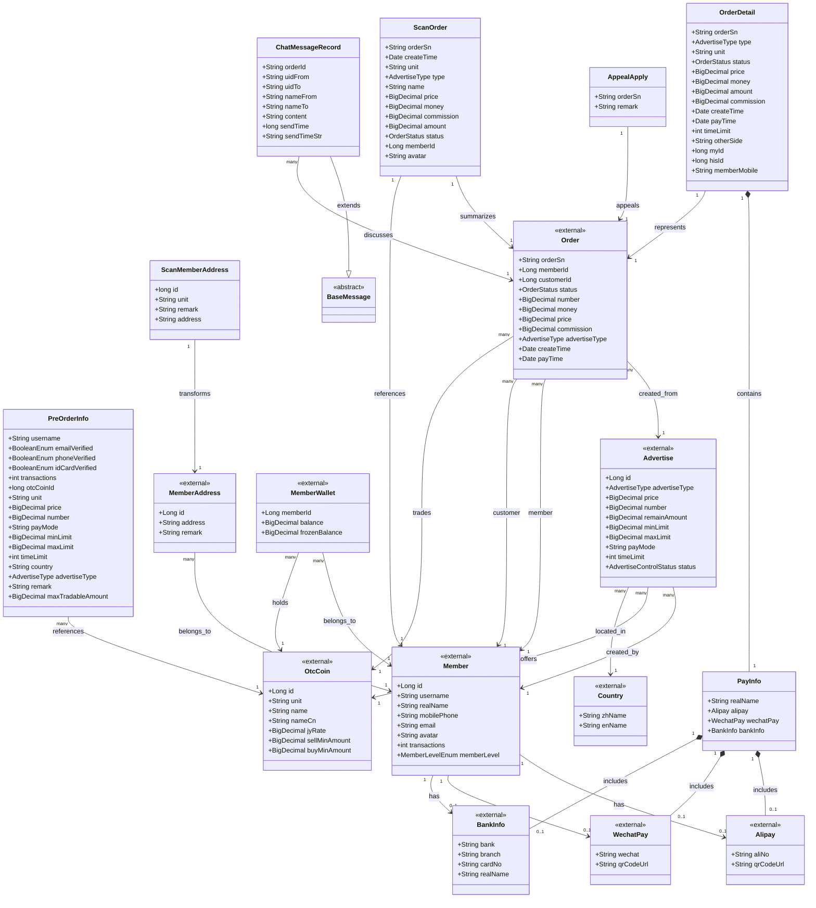

# OTC API Entity Relationship Diagram

## Entity Relationship Description

This class diagram illustrates the key entities in the OTC API service and their relationships:

### 1. Core API Entities

The main entities handled directly by the OTC API:

- **OrderDetail**: Comprehensive order information for API responses, containing all details needed for order management UI
- **PreOrderInfo**: Pre-transaction information displayed to users before order creation, including seller verification status and trading limits  
- **PayInfo**: Aggregates payment method information (Alipay, WeChat Pay, Bank Transfer) used in order transactions
- **ScanOrder**: Lightweight order representation optimized for list views and order history
- **ScanMemberAddress**: Cryptocurrency address information for scanning and validation
- **AppealApply**: Data transfer object for creating order appeals/disputes
- **ChatMessageRecord**: Real-time messaging between trading parties during order execution

### 2. Key Relationships

#### Composition Relationships
- **OrderDetail ↔ PayInfo**: OrderDetail contains PayInfo as a component, providing complete payment method details
- **PayInfo ↔ Payment Methods**: PayInfo aggregates multiple payment options (Alipay, WeChat, Bank) based on what the user supports

#### Transformation Relationships  
- **Order → OrderDetail**: Full Order entity is transformed into OrderDetail for API responses
- **Order → ScanOrder**: Order entities are summarized into ScanOrder for efficient listing views
- **MemberAddress → ScanMemberAddress**: External address entities are transformed for scanning operations

#### Reference Relationships
- **PreOrderInfo → OtcCoin**: References supported cryptocurrency information including trading rates and limits
- **ChatMessageRecord → Order**: Chat messages are linked to specific orders via orderSn for contextual communication
- **AppealApply → Order**: Appeal requests reference specific orders for dispute resolution

### 3. External Entity Integration

The API integrates with several external entities from core services:

#### User Management
- **Member**: Core user entity with verification status, transaction history, and payment method configurations
- **MemberWallet**: User cryptocurrency balances and frozen amounts for escrow functionality
- **MemberAddress**: User's cryptocurrency receiving addresses

#### Trading Core  
- **Order**: Full order entity with complete transaction lifecycle and financial details
- **Advertise**: Trading advertisements with terms, limits, and availability status
- **OtcCoin**: Supported cryptocurrencies with trading rates, minimum amounts, and market information

#### Geographic & Payment
- **Country**: Regional information for localized trading rules
- **Payment Methods**: External payment system integrations (Alipay, WeChat Pay, Banking)

### 4. Status Enumerations

The system uses several enumerations to manage entity states:

#### Trading States
- **AdvertiseType**: BUY (user wants to buy crypto) / SELL (user wants to sell crypto)
- **OrderStatus**: NONPAYMENT → PAID → COMPLETED (successful flow) or CANCELLED/APPEALED (failure flows)
- **AdvertiseControlStatus**: PUT_ON_SHELVES (available) / PUT_OFF_SHELVES (unavailable) / TURNOFF (deleted)

#### Verification States  
- **BooleanEnum**: IS_TRUE / IS_FALSE for user verification status indicators
- **MemberLevelEnum**: User verification levels determining trading privileges

### 5. Data Flow Patterns

#### Order Creation Flow
1. **PreOrderInfo** displays advertisement details and seller verification
2. User creates **Order** which generates **OrderDetail** for tracking
3. **PayInfo** provides payment methods based on **Member** configuration
4. **ChatMessageRecord** entries enable communication during transaction

#### Advertisement Management Flow
1. **Member** creates **Advertise** for **OtcCoin** in specific **Country**
2. **MemberWallet** balance is frozen when advertisement goes on shelves
3. **PreOrderInfo** exposes advertisement details to potential buyers
4. Background jobs monitor and auto-manage advertisement status

#### Appeal and Resolution Flow
1. **AppealApply** creates formal dispute for problematic **Order**
2. **ChatMessageRecord** preserves communication history for dispute resolution
3. System tracks appeal status through **OrderStatus** updates

This diagram provides a comprehensive view of how the OTC API manages the complex relationships between users, trading entities, and external system integrations while maintaining data consistency and transaction integrity across the distributed trading platform.
