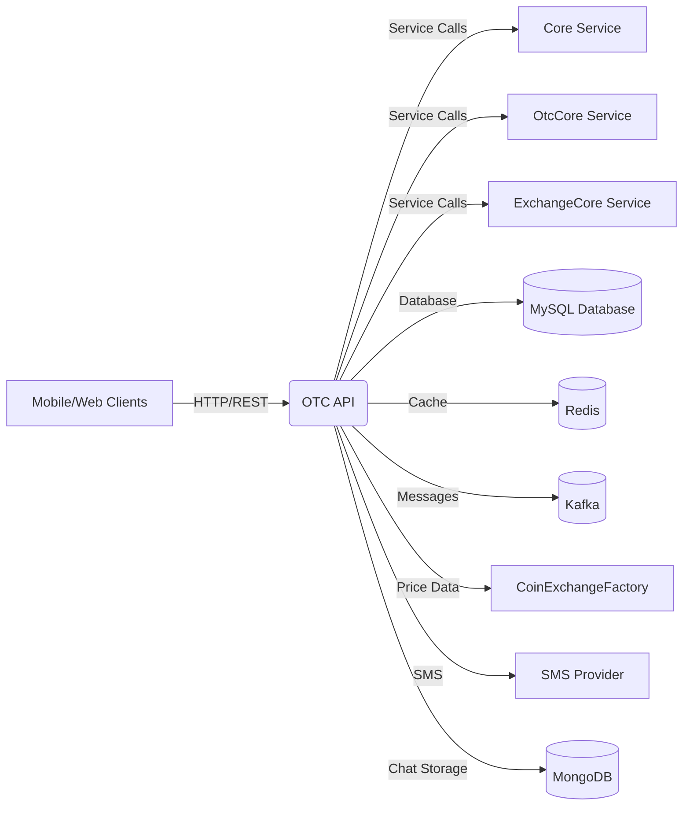
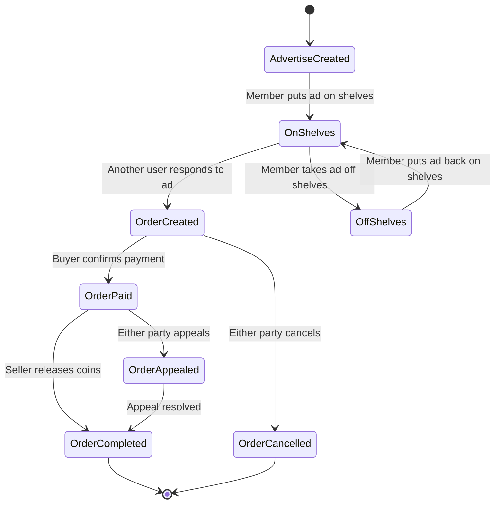

# Business Overview

## What It Is

The OTC (Over-The-Counter) API is a RESTful API service that enables peer-to-peer cryptocurrency trading outside of traditional exchange order books. This component serves as the backend API for OTC trading functionality, allowing users to create advertisements for buying or selling cryptocurrencies and execute trades directly with other users. It integrates with the broader crypto exchange ecosystem by connecting to core services, wallet management, and user management systems.

## Domain Concepts

**OTC Trading**: Direct peer-to-peer cryptocurrency transactions between users without going through exchange order books. Users can create buy/sell advertisements with specific terms and other users can respond to these advertisements to execute trades.

**Key Domain Concepts**:
- **Advertise**: A posted offer from a user to buy or sell cryptocurrency at specific terms (price, limits, payment methods)
- **Order**: An active transaction between two users based on an advertisement
- **OtcCoin**: Cryptocurrencies supported for OTC trading
- **Payment Methods**: Various payment options (Alipay, WeChat Pay, Bank Transfer) for completing fiat currency transactions
- **Member Verification**: User identity verification levels required for different trading privileges
- **Trade Limits**: Minimum and maximum transaction amounts for each advertisement
- **Time Limits**: Maximum duration allowed for completing payment in an order

## Component Boundaries

The OTC API serves as a gateway between mobile/web clients and the core trading infrastructure. It orchestrates OTC transactions while delegating user management, wallet operations, and cryptocurrency price data to specialized services.

> **Pointers for Functional Testing:**
> 
> - **Advertisement Lifecycle Testing**: Create advertisements with various payment methods, verify proper status transitions (on/off shelves), and validate balance freezing/unfreezing
>     
> - **Order Processing Testing**: Execute complete buy/sell flows including order creation, payment confirmation, release processing, and cancellation scenarios
>     
> - **Appeal and Dispute Testing**: Verify appeal creation for disputed orders and proper status handling during disputes
>     



### Contract Interfaces Provided

#### APIs

- **Business Functions:** The API exposes OTC trading operations including advertisement management (create, update, on/off shelves), order lifecycle management (buy, sell, pay, release, cancel, appeal), and coin information retrieval.
    
- **Endpoint Behavior:** Mix of read-only endpoints (advertisement listings, order details, coin information) and state-changing endpoints (order creation, payment confirmation, order release). All state-changing operations include transaction management.
    
- **Audience:** Internal mobile and web applications serving end users of the cryptocurrency exchange platform.
    
- **Role:** Acts as an orchestrator coordinating between user management, wallet services, and core trading logic while maintaining OTC-specific business rules.

### Contract Dependencies

#### API Clients

- **Core Service API**: Consumed for user management, wallet operations, and core trading functionality
    
- **OtcCore Service**: Provides OTC-specific business logic and data models
    
- **ExchangeCore Service**: Integrates with main exchange functionality for pricing and rate information
    
- **Failure Handling**: Service calls include retry logic and graceful degradation. Critical failures result in transaction rollback.

#### External Databases

- **MySQL Database**: Primary transactional data store for orders, advertisements, and user-related OTC data. Tightly coupled to JPA entity schema.
    
- **Redis Cache**: Session storage, caching layer for frequently accessed data like coin prices and user sessions
    
- **MongoDB**: Chat message storage for order-related communications and automated responses
    
- **Ownership & Consistency**: Shares database schema with core services but maintains OTC-specific tables

#### Messaging Subscriptions

- **Kafka Topics**: Consumes and produces messages related to order events, price updates, and system notifications
    
- **Message Schemas**: Uses internal message formats for order completion events and promotional reward processing
    
- **Reliability Concerns**: At-least-once delivery guarantee with idempotent processing for critical financial operations

#### Other Systems

- **SMS Provider**: External SMS gateway for order notifications to users
    
- **Elasticsearch**: Search and indexing service for advertisement and order queries
    
- **Eureka Service Discovery**: Service registration and discovery in microservices architecture

## Algorithms / Business Processes

### OTC Trading Flow



#### Advertisement Management Logic

- **Balance Verification**: For sell advertisements, system freezes the advertised cryptocurrency amount in user's wallet when ad goes on shelves
- **Pricing Logic**: Supports both fixed pricing and market-rate-based pricing with premium/discount percentages
- **Auto-off-shelves**: Background job automatically removes advertisements when market conditions make them unprofitable

#### Order Matching and Execution

- **Order Creation**: Validates price, amounts, and user eligibility. Creates escrow by freezing seller's coins
- **Payment Processing**: Multi-step process requiring buyer payment confirmation followed by seller coin release
- **Commission Calculation**: Applies trading fees based on user verification level (verified business users trade commission-free)
- **Time Limits**: Enforces payment deadlines with automatic order cancellation for expired orders

#### Promotional Reward System

- **Referral Processing**: First-time traders generate referral rewards for their inviters
- **Multi-level Rewards**: Two-tier referral system with different reward rates
- **USD Conversion**: Converts trading amounts to USDT equivalent for standardized reward calculations

---

# Technical Overview

## Implementation Summary

This is a Spring Boot microservice application using Java 8, deployed as part of a microservices architecture. The service uses Spring Data JPA for database operations, Spring Security for authentication, Redis for caching and session management, and Kafka for asynchronous messaging. It follows RESTful API design principles and integrates with Eureka for service discovery.

## Implementation Technologies

- **Spring Boot 2.x**: Core framework providing dependency injection, auto-configuration, and embedded server
- **Spring Data JPA**: Object-relational mapping and database abstraction layer  
- **Spring Security**: Authentication and authorization framework
- **Spring Session**: Distributed session management with Redis backend
- **Spring Cloud Eureka**: Service discovery and registration
- **Spring Cloud Ribbon**: Client-side load balancing
- **Spring Kafka**: Kafka integration for messaging
- **Druid**: High-performance database connection pool
- **MySQL**: Primary relational database
- **Redis**: In-memory data structure store for caching and sessions
- **MongoDB**: Document database for chat messages and aggregated data
- **Lombok**: Reduces boilerplate code with annotations
- **Apache Shiro**: Additional security framework integration
- **Logback**: Logging framework with structured logging support

## Local Runtime Environment

### Environment Setup

1. **Prerequisites**: 
   - Java 8 JDK
   - Maven 3.6+
   - MySQL 5.7+ running on port 3306
   - Redis server running on port 6379
   - MongoDB running on port 27017
   - Kafka broker running on port 9092

2. **Database Setup**:
   ```sql
   CREATE DATABASE bizzan CHARACTER SET utf8mb4 COLLATE utf8mb4_unicode_ci;
   ```

3. **Configuration**:
   - Copy `src/main/resources/dev/application.properties.example` to `application.properties`
   - Update database credentials, Redis password, and external service URLs

### Commands/Scripts

```bash
# Start the application in development mode
mvn spring-boot:run -Pdev

# Build application
mvn clean package -Pdev

# Run with specific profile
mvn spring-boot:run -Dspring.profiles.active=dev
```

### Dependencies

- **Database Dependencies**: MySQL must be running with the `bizzan` database created
- **Cache Dependencies**: Redis server must be available for session storage and caching
- **Messaging Dependencies**: Kafka broker must be running for order event processing
- **External Services**: Core service, OtcCore service, and ExchangeCore service must be available
- **Mocks Available**: Test profile includes mock configurations for external dependencies

## Deployment

### Deployment Targets

- **Container Platform**: Deployed as Spring Boot JAR in Docker containers
- **Orchestration**: Kubernetes deployment with service discovery via Eureka
- **Load Balancing**: Multiple instances behind load balancer with Ribbon client-side balancing

### CI/CD Pipelines

- **Build Process**: Maven-based build creating executable JAR with embedded Tomcat
- **Testing**: Unit tests with Spring Boot Test framework (currently skipped in configuration)
- **Packaging**: Creates Docker images with Java 8 base image and Spring Boot JAR

### Build Artifacts

- **Primary Artifact**: `otc-api.jar` - Executable Spring Boot application
- **Docker Image**: Multi-stage build with optimized Java runtime
- **Configuration**: Environment-specific property files bundled in JAR

### Gating Processes

- **Health Checks**: Spring Boot Actuator endpoints for monitoring application health
- **Readiness Probes**: Database connectivity and external service availability checks
- **Rolling Deployment**: Zero-downtime deployments with gradual instance replacement

## Operability

### Logging

- **Framework**: Logback with Spring Boot integration
- **Log Levels**: Configurable per package with DEBUG, INFO, WARN, ERROR levels  
- **Structure**: Structured logging with JSON format for aggregation
- **Routing**: Console output in development, file output in production with rotation

### Monitoring & Metrics

- **Actuator Endpoints**: Spring Boot Actuator provides health, metrics, and info endpoints
- **Custom Metrics**: Trading volume, order completion rates, and error rates
- **Tools**: Integration ready for Prometheus/Grafana stack
- **Alerting**: JVM metrics, database connection pool monitoring, and business KPIs

### Configuration Management

- **Profile-based**: Separate configurations for dev, test, and prod environments
- **Property Sources**: External configuration via environment variables and property files
- **Hot Reload**: Spring Boot DevTools enables configuration refresh in development

### Secrets Management

- **Database Credentials**: Externalized via environment variables in production
- **API Keys**: SMS provider keys and other sensitive data managed externally
- **Redis Password**: Configurable via secure property injection

### Failure Handling

- **Database Outages**: Connection pool with retry logic and circuit breaker patterns
- **External Service Failures**: Graceful degradation with cached data when possible
- **Order Consistency**: Transactional operations with rollback on failures
- **Resilience**: Background jobs handle cleanup of failed operations

## Repository Structure

### Folder Responsibilities

- **`src/main/java/`**: Main application source code
  - **`controller/`**: REST API controllers (AdvertiseController, OrderController, OtcCoinController)
  - **`entity/`**: JPA entities and data transfer objects
  - **`config/`**: Spring configuration classes and security setup
  - **`job/`**: Scheduled background tasks for order and advertisement maintenance
  - **`event/`**: Event handling for order completion and reward processing
  - **`model/`**: Screen/filter objects and business models

- **`src/main/resources/`**: Configuration and resource files
  - **`dev/`, `test/`, `prod/`**: Environment-specific configurations
  - **`i18n/`**: Internationalization message files (English and Chinese)

- **`src/test/java/`**: Test source code (minimal test coverage currently)

### Key Packages/Classes

- **`ApiApplication`**: Main Spring Boot application class with service discovery
- **`AdvertiseController`**: Handles advertisement CRUD operations and shelves management
- **`OrderController`**: Manages complete order lifecycle from creation to completion
- **`OrderEvent`**: Processes order completion events and referral rewards
- **`CheckOrderTask`**: Background job for automatic order cancellation
- **`CheckAdvertiseTask`**: Background job for automatic advertisement management

### Testing Organization

- **Unit Tests**: Located in `src/test/java/` with Spring Boot Test integration
- **Integration Tests**: Limited coverage currently available
- **Naming Conventions**: Test classes follow `*Tests` naming pattern
- **Test Configuration**: Separate application properties for test environment

### Utility Code

- **Base Controllers**: Common functionality in parent controller classes
- **Message Localization**: Centralized message source for multilingual support
- **Validation**: Custom validation annotations and binding result utilities
- **Data Transfer Objects**: Builder pattern entities for API responses

---
