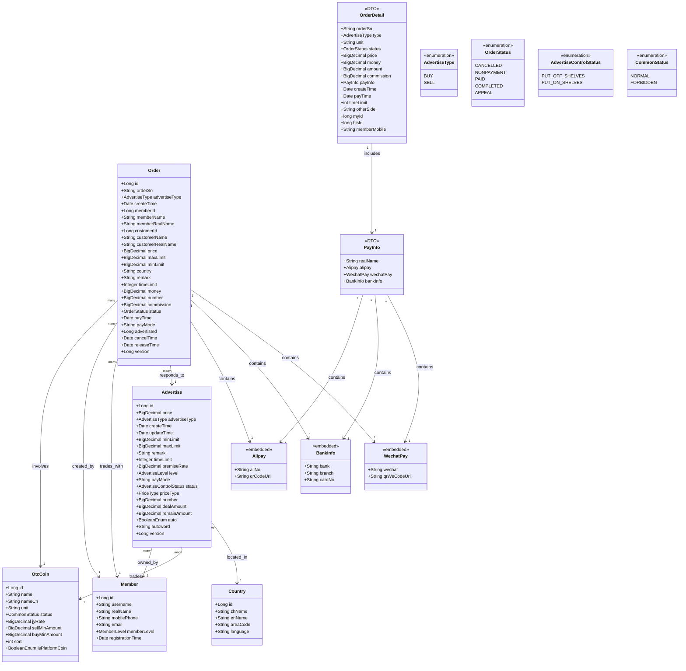

# OTC Core Entity Relationship Diagram

This document provides a visual representation of the data model relationships for OTC (Over-the-Counter) trading entities supported by the OTC Core infrastructure module.

## Entity Relationship Description

This class diagram illustrates the key entities in the OTC Core system and their relationships:

### 1. Core Entities

- **OtcCoin**: Represents cryptocurrencies available for OTC trading with configuration like minimum amounts and fee rates
- **Member**: Users who can create advertisements and place orders in the OTC marketplace  
- **Country**: Geographic regions where OTC trading is supported with localization settings
- **Advertise**: Trading offers created by users to buy or sell cryptocurrency at specified terms
- **Order**: Actual trade transactions between users, created from advertisements

### 2. Key Relationships

- **Member to Advertise (1:many)**: Each member can create multiple trading advertisements
- **Member to Order (1:many, bidirectional)**: Each member can be both order creator and trading partner
- **OtcCoin to Advertise (1:many)**: Each cryptocurrency can have multiple active advertisements
- **OtcCoin to Order (1:many)**: Each cryptocurrency can be involved in multiple trading orders
- **Country to Advertise (1:many)**: Each country/region can host multiple advertisements
- **Advertise to Order (1:many)**: Each advertisement can generate multiple orders from different users

### 3. Embedded Objects

- **Alipay**: Embedded payment information for Alipay transactions with account and QR code details
- **BankInfo**: Embedded bank account information including bank name, branch, and card number
- **WechatPay**: Embedded WeChat Pay information with account ID and QR code URL

### 4. Data Transfer Objects (DTOs)

- **OrderDetail**: Comprehensive order information DTO for API responses with derived fields
- **PayInfo**: Aggregated payment information container combining all payment method details

### 5. Status Enumerations

- **AdvertiseType**: BUY (purchase crypto with fiat) or SELL (sell crypto for fiat)
- **OrderStatus**: Complete order lifecycle from NONPAYMENT through COMPLETED or CANCELLED
- **AdvertiseControlStatus**: Advertisement visibility (PUT_ON_SHELVES/PUT_OFF_SHELVES)
- **CommonStatus**: General entity status (NORMAL/FORBIDDEN)

### 6. Infrastructure Support Features

The OTC Core module provides infrastructure support enabling these relationships through:

- **Session Management**: Secure user authentication for creating advertisements and orders
- **Caching Strategy**: Redis-based caching for frequently accessed advertisement and coin data
- **Message Processing**: Kafka-based event handling for order status changes and notifications
- **Data Serialization**: JSON serialization for complex payment information and order details

### 7. Business Process Flow

The typical entity interaction flow:

1. **Member** creates **Advertise** for specific **OtcCoin** in target **Country**
2. Another **Member** places **Order** against the **Advertise**
3. **Order** contains embedded payment details (**Alipay**, **BankInfo**, **WechatPay**)
4. Order status transitions through **OrderStatus** lifecycle
5. **OrderDetail** and **PayInfo** DTOs provide structured data for API consumers

This diagram provides a visual representation of the actual data model relationships supported by the OTC Core infrastructure in the codebase.
