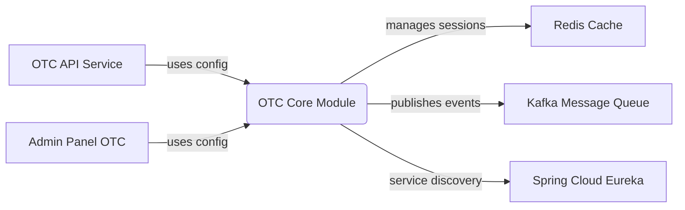
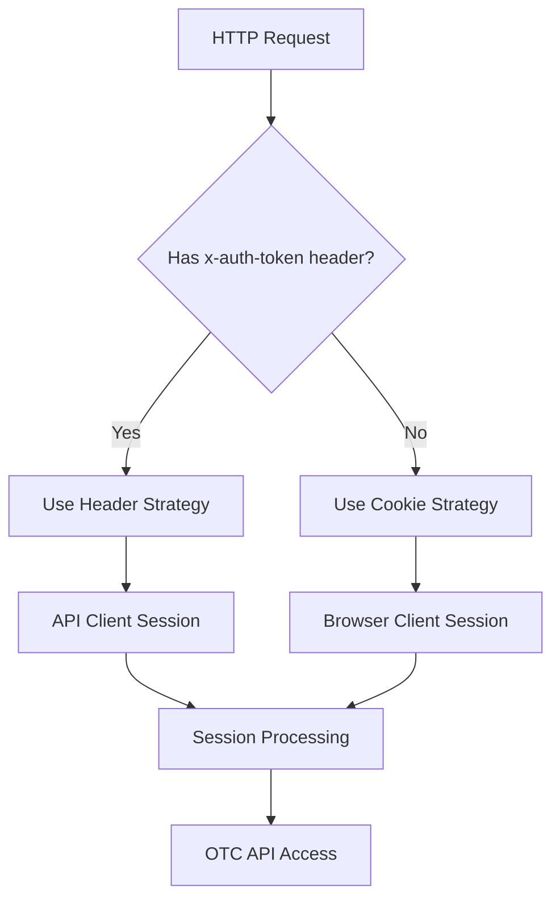
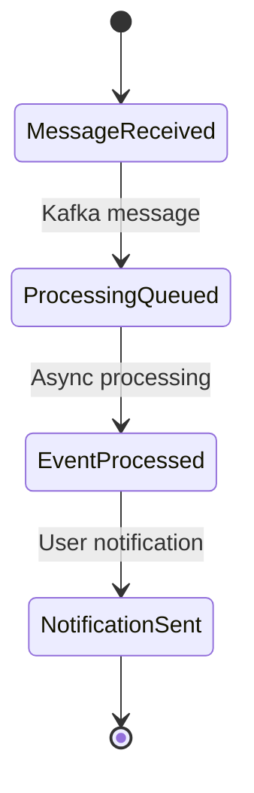

# OTC Core Module - Technical Overview

# Business Overview

## What It Is

The **OTC Core Module** is a foundational infrastructure and configuration library for the Over-the-Counter (OTC) trading system within the Bizzan cryptocurrency exchange platform. This component provides essential configuration services for session management, caching, and messaging infrastructure specifically tailored to support peer-to-peer cryptocurrency trading operations.

As a core infrastructure module, it serves as the foundational layer that enables the OTC API service to handle secure session management, efficient caching, and reliable message processing for OTC trading workflows. The module integrates with Redis for distributed session storage and caching, and configures Kafka for asynchronous message processing.

The OTC trading system enables peer-to-peer cryptocurrency transactions where users can create advertisements to buy or sell cryptocurrencies with fiat currencies, negotiate prices, and complete transactions outside the traditional exchange order book.

## Domain Concepts

The OTC Core module provides infrastructure support for several key OTC trading concepts:

1. **Session Management**: Secure, distributed user session handling supporting both browser-based and API token authentication for OTC trading interfaces
2. **Distributed Caching**: Redis-based caching infrastructure for frequently accessed OTC trading data, market prices, and user preferences
3. **Message Processing**: Kafka-based asynchronous messaging for OTC order notifications, price updates, and system events
4. **Multi-Platform Authentication**: Smart session strategy supporting both traditional web browsers and mobile API clients

## Component Boundaries

The OTC Core module operates as a shared infrastructure library within the OTC trading subsystem of the broader cryptocurrency exchange platform. It provides configuration and infrastructure services consumed by other OTC-related components.

**Internal Boundaries**: Within the OTC subsystem, this core module provides shared infrastructure services consumed by:
- OTC API service for peer-to-peer trading operations
- Admin panel OTC management features
- Real-time messaging systems for order notifications

**External Boundaries**: The OTC Core integrates with external infrastructure systems:
- Redis cluster for distributed session storage and caching
- Apache Kafka message broker for asynchronous processing
- Spring Cloud service discovery for microservices coordination

> **Pointers for Functional Testing:**
> 
> - **Session Management**: Test cross-platform authentication (browser cookies vs API tokens)
> - **Cache Performance**: Validate Redis cache hit rates for frequently accessed OTC data
> - **Message Processing**: Test Kafka message publishing and consumption for OTC events



### Contract Interfaces Provided

The OTC Core module primarily provides **internal configuration services** rather than external APIs. Its interfaces are consumed by other components within the OTC trading subsystem:

#### Configuration Services
- **Business Functions:** Provides standardized configuration for session management, caching, and messaging across OTC services
- **Audience:** OTC API service, admin panel OTC features, and other OTC-related microservices
- **Role:** Centralizes infrastructure configuration and ensures consistency across OTC trading components

#### Session Management Infrastructure
- **Business Functions:** Handles distributed session management with smart authentication strategy supporting both browser and API clients
- **Audience:** Web browsers, mobile applications, and API clients accessing OTC trading features
- **Role:** Provides secure, scalable session handling for multi-platform OTC trading access

### Contract Dependencies

The OTC Core module depends on several external systems and shared components:

#### Infrastructure Dependencies
- **Redis Cache Cluster**: Distributed caching and session storage for OTC trading data and user sessions
- **Apache Kafka**: Message broker for asynchronous processing of OTC order events, notifications, and system communications
- **Spring Cloud Eureka**: Service discovery infrastructure for microservices coordination

#### Shared Business Logic
- **Core Module Dependency**: Relies on the main core module for business entities, data access patterns, and shared OTC trading logic
- **Smart Session Strategy**: Utilizes custom session handling logic from the core module for intelligent browser/API authentication

## Algorithms / Business Processes

### Smart Session Management Strategy

The OTC Core implements an intelligent session management algorithm that automatically detects and handles different types of client authentication:



### Cache Management Strategy

- **Cache Hierarchy**: Implements layered caching with Redis for frequently accessed OTC data
- **TTL Management**: Configures default 30-minute cache expiration for optimal balance between performance and data freshness
- **Serialization Strategy**: Uses Jackson JSON serialization for complex object caching with type safety

### Message Processing Flow



---

# Technical Overview

## Implementation Summary

This is a **Spring Boot configuration module** using Java 8, built with Maven, and designed to provide infrastructure services for the OTC trading subsystem. The module uses Spring Session for distributed session management, Spring Data Redis for caching, and Spring Kafka for message processing. It's deployed as a shared library component consumed by other OTC-related microservices.

## Implementation Technologies

- **Spring Boot 1.5.9**: Core application framework and dependency injection container
- **Spring Session 1.3.1**: Distributed session management with Redis backend integration
- **Spring Data Redis**: Redis integration for caching and session storage with Jackson JSON serialization
- **Spring Kafka**: Apache Kafka integration for asynchronous message processing and event handling
- **Logback**: Logging framework with structured logging support and environment-specific configuration
- **Apache Shiro 1.4.0**: Security framework integration for authentication and authorization
- **Lombok**: Code generation library for reducing boilerplate code in configuration classes
- **Druid**: Database connection pool management for optimal resource utilization

## Local Runtime Environment

### Environment Setup

1. **Prerequisites:**
   - Java 8 or higher
   - Maven 3.6+
   - Redis server (version 3.2+ recommended)
   - Apache Kafka (version 0.10.0.0+ as per dependency)

2. **Infrastructure Dependencies:**
   ```bash
   # Start Redis server
   redis-server --daemonize yes
   
   # Start Kafka server (requires Zookeeper)
   kafka-server-start.sh config/server.properties
   ```

3. **Build and Run:**
   ```bash
   cd 00_framework/otc-core
   mvn clean compile
   # This module is a library dependency - run via otc-api service
   ```

### Configuration

- **Redis Configuration**: Configure Redis connection properties for session storage and caching
- **Kafka Configuration**: Set up Kafka broker connections and topic configurations
- **Session Settings**: Configure session timeout and security settings

## Deployment

### Deployment Targets

The OTC Core module is deployed as a **shared library dependency** rather than a standalone service:

- **Library Dependency**: Packaged as JAR file and included in other OTC services
- **Docker Integration**: Included in Docker images of consuming services (otc-api, admin panel)
- **Kubernetes Deployment**: Deployed as part of OTC service pods in Kubernetes cluster

### Build Artifacts

- **Maven JAR**: Primary build artifact consumed by dependent services
- **Dependencies**: Includes all transitive dependencies for Redis, Kafka, and Spring integrations
- **Configuration Resources**: Environment-specific configuration files packaged in consuming services

### Gating Processes

- **Library Testing**: Integration tests run as part of consuming service builds
- **Dependency Scanning**: Security and vulnerability scanning of library dependencies
- **Configuration Validation**: Automated validation of configuration consistency across environments

## Operability

### Logging

- **Framework**: Logback with Spring Boot integration and structured JSON logging support
- **Log Levels**: Configurable via application properties with environment-specific settings
- **Structure**: JSON-formatted logs with correlation IDs for tracking across distributed OTC services

### Monitoring & Metrics

- **Session Metrics**: Redis-based session storage metrics and connection pool monitoring
- **Cache Performance**: Cache hit/miss rates, expiration tracking, and memory utilization metrics
- **Message Processing**: Kafka consumer lag, message processing rates, and error tracking
- **Spring Boot Actuator**: Health checks, metrics endpoints, and operational visibility

### Configuration Management

- **Settings**: Environment-specific configuration managed through Spring profiles (dev, test, prod)
- **Sources**: Application properties files with externalized configuration for infrastructure connections
- **Redis Configuration**: Connection pool settings, timeout configurations, and failover settings
- **Kafka Configuration**: Broker connections, topic settings, and consumer group configurations

### Secrets Management

- **Infrastructure Credentials**: Redis passwords, Kafka security credentials managed via external configuration
- **Integration**: Secrets injected through environment variables or external secret management systems
- **Security**: Sensitive configuration values externalized from source code

### Failure Handling

- **Redis Outages**: Graceful degradation with fallback to database sessions when Redis unavailable
- **Kafka Outages**: Message buffering and retry mechanisms for temporary broker unavailability
- **Resilience Patterns**: Connection pooling, timeout configurations, and circuit breaker patterns for external dependencies

## Repository Structure

### Folder Responsibilities

- **`src/main/java/com/bizzan/bitrade/config/`**: Core configuration classes
  - `HttpSessionConfig.java`: Smart session management configuration
  - `KafkaConfiguration.java`: Kafka messaging configuration
  - `RedisCacheConfig.java`: Redis caching and serialization configuration
- **`pom.xml`**: Maven project dependencies and build configuration
- **`target/`**: Compiled classes and build artifacts

### Key Configuration Classes

- **`HttpSessionConfig`**: Implements smart session strategy supporting both browser cookies and API token authentication
- **`KafkaConfiguration`**: Enables Kafka messaging support with annotation-driven configuration
- **`RedisCacheConfig`**: Configures Redis cache manager, serialization strategy, and connection handling

### Testing Organization

- **Integration Testing**: Configuration validation through consuming service test suites
- **Mock Infrastructure**: Test configurations for Redis and Kafka using embedded servers
- **Configuration Testing**: Validation of Spring context loading and dependency injection

### Utility Code

- **Smart Session Strategy**: Custom session handling logic from core module for multi-platform authentication
- **Cache Serialization**: Jackson JSON serialization configuration for complex object caching
- **Connection Management**: Database and messaging connection pool configurations
