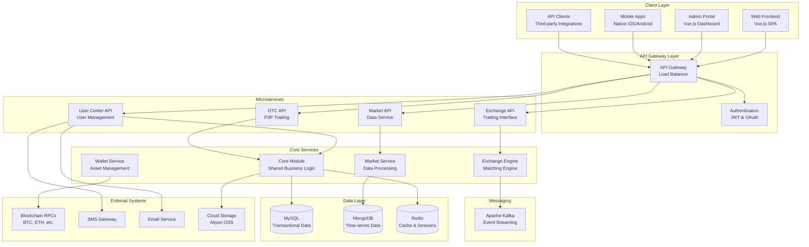
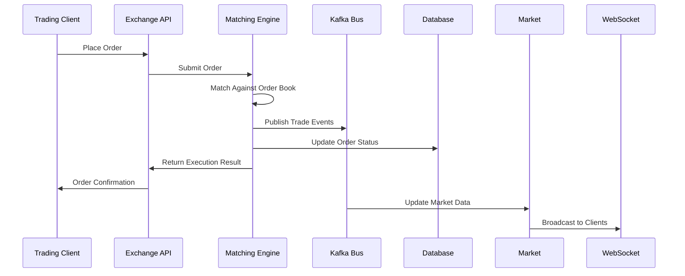
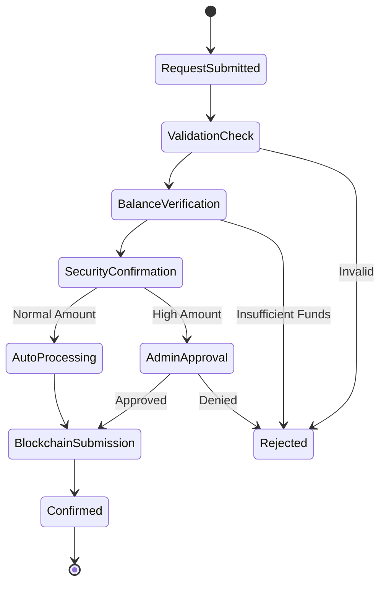
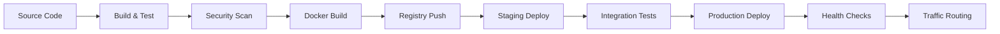

# Platform Technical Overview

## Executive Summary

The Bizzan Cryptocurrency Exchange Platform is a comprehensive, enterprise-grade digital asset trading system built using modern microservices architecture. The platform provides complete cryptocurrency exchange capabilities including spot trading, OTC (Over-The-Counter) trading, multi-currency wallet management, and administrative tools. Built with Java and Spring Boot, the system supports high-frequency trading, real-time market data processing, and secure blockchain integrations.

## System Architecture

### High-Level Architecture

The platform follows a distributed microservices architecture with clear separation of concerns across multiple layers:

### Architectural Patterns

#### 1. Microservices Architecture
- **Service Decomposition**: Domain-driven service boundaries
- **Independence**: Each service deployable and scalable independently  
- **Communication**: RESTful APIs with Kafka for async messaging
- **Data Ownership**: Each service owns its data store

#### 2. Event-Driven Architecture
- **Event Sourcing**: Critical business events stored as immutable log
- **CQRS**: Command Query Responsibility Segregation for read/write optimization
- **Eventual Consistency**: Asynchronous propagation of state changes
- **Event Bus**: Kafka as central event streaming platform

#### 3. Layered Architecture
- **Presentation Layer**: Vue.js frontends with responsive design
- **API Layer**: Spring Boot REST services with OpenAPI documentation
- **Business Layer**: Domain services with transaction management
- **Data Layer**: Multi-database strategy with appropriate persistence

## Core Technology Stack

### Backend Technologies

#### Framework & Runtime
- **Java 8+**: Primary programming language with modern features
- **Spring Boot 2.x**: Core framework providing:
  - Auto-configuration and embedded servers
  - Production-ready metrics and health checks
  - Security framework integration
  - Data access abstraction layers
- **Spring Cloud**: Microservices infrastructure:
  - Eureka for service discovery
  - Config Server for centralized configuration
  - Circuit breakers for resilience

#### Data Persistence
- **MySQL 8.0**: Primary relational database
  - ACID transactions for financial operations
  - Master-slave replication for read scaling
  - InnoDB storage engine with row-level locking
- **MongoDB 4.4+**: Document store for:
  - K-line chart data and market analytics
  - Flexible schema requirements
  - Time-series data with automatic aging
- **Redis 6.0+**: In-memory data structure store:
  - Session management and user state
  - High-performance caching layer
  - Real-time data distribution
  - Rate limiting and temporary locks

#### Message Streaming
- **Apache Kafka 2.8+**: Distributed streaming platform
  - High-throughput event publishing
  - Guaranteed message ordering
  - Horizontal scalability
  - Fault-tolerant distributed logs

#### Additional Technologies
- **Spring Data JPA**: Object-relational mapping with Hibernate
- **QueryDSL**: Type-safe SQL query generation
- **Druid**: High-performance database connection pooling
- **Jackson/FastJSON**: JSON serialization and deserialization
- **Lombok**: Code generation for reducing boilerplate

### Frontend Technologies

#### Core Framework
- **Vue.js 2.x**: Progressive JavaScript framework
  - Component-based architecture
  - Reactive data binding
  - Virtual DOM for performance
- **Vuex**: Centralized state management
- **Vue Router**: Client-side routing with history mode

#### UI Libraries
- **iView UI**: Comprehensive component library
  - Admin portal primary framework
  - Professional business interface components
- **Element UI**: Alternative component suite
- **TradingView**: Advanced financial charting
  - Real-time price charts
  - Technical analysis indicators
  - Professional trading interface

#### Build & Development
- **Webpack 3.x**: Module bundling and optimization
- **Babel**: JavaScript compilation for browser compatibility
- **ESLint**: Code quality and style enforcement
- **Jest**: Unit testing framework

### Infrastructure Technologies

#### Service Discovery & Configuration
- **Netflix Eureka**: Service registry and discovery
- **Spring Cloud Config**: Centralized configuration management
- **Environment-specific**: Property files for different deployment stages

#### Monitoring & Observability
- **Spring Boot Actuator**: Application metrics and health endpoints
- **Custom Metrics**: Business-specific KPIs and performance indicators
- **Logging**: SLF4J with Logback for structured logging

#### Security
- **Spring Security**: Authentication and authorization framework
- **JWT Tokens**: Stateless authentication
- **OAuth 2.0**: Third-party integration support
- **Apache Shiro**: Additional security layer
- **MD5 Hashing**: Password encryption with salting

## System Components Deep Dive

### Core Module
**Purpose**: Foundational shared library providing business entities, services, and infrastructure

**Key Responsibilities**:
- Domain model definitions (Member, Wallet, Order, Advertisement)
- Shared business logic and validation rules
- Data access layer with repositories and custom queries
- Common utilities and infrastructure services

**Architecture**:
- Multi-layered design: Entity → DAO → Service → Controller
- QueryDSL for type-safe complex queries
- JPA/Hibernate for object-relational mapping
- Transaction management with Spring's @Transactional

**Integration Points**:
- Consumed by all other modules as foundational dependency
- Direct database access to MySQL for CRUD operations
- Message publishing to Kafka for cross-service communication

### Exchange Engine
**Purpose**: High-performance real-time trading matching engine

**Key Capabilities**:
- Order matching with price-time priority algorithms
- Support for limit orders, market orders, and stop orders
- Real-time order book management in memory
- Multi-threaded concurrent processing per trading pair

**Performance Characteristics**:
- In-memory order books for microsecond latency
- Separate trading engines per currency pair
- Concurrent processing with thread-safe data structures
- Batch processing optimizations

**Trade Execution Flow**:

### Market Data Service
**Purpose**: Real-time market data processing and distribution

**Data Processing Pipeline**:
1. **Trade Ingestion**: Consume trade events from Kafka
2. **K-line Generation**: Create candlestick data for multiple timeframes
3. **Market Statistics**: Calculate 24h volume, price changes, highs/lows
4. **Data Storage**: Persist historical data to MongoDB
5. **Real-time Distribution**: Broadcast via WebSocket and TCP

**Supported Timeframes**:
- Real-time: Tick data and trade-by-trade updates
- Short-term: 1min, 5min, 15min, 30min, 1hour
- Long-term: 4hour, 1day, 1week, 1month

**Distribution Channels**:
- REST APIs for historical data queries
- WebSocket streams for real-time updates
- Custom TCP/Netty servers for high-frequency clients

### User Center API
**Purpose**: Comprehensive user management and authentication service

**Core Features**:
- **Authentication**: Registration, login, session management
- **Profile Management**: KYC verification, security settings
- **Asset Operations**: Deposits, withdrawals, transaction history
- **Promotional Systems**: Referral programs, reward distribution

**Security Implementation**:
- Multi-factor authentication (SMS, email, TOTP)
- Rate limiting for verification codes
- IP-based access controls
- Audit logging for all user actions

**Withdrawal Processing**:

### OTC Trading System
**Purpose**: Peer-to-peer cryptocurrency trading with fiat currencies

**Trading Model**:
- Advertisement-based marketplace
- Buyer and seller matching system
- Escrow-based fund security
- Dispute resolution mechanisms

**Business Partner System**:
- Enhanced verification for high-volume traders
- Reduced fees and priority matching
- Asset proof requirements
- Performance-based tier system

### Wallet Services
**Purpose**: Multi-cryptocurrency wallet management and blockchain integration

**Supported Cryptocurrencies**:
- **Bitcoin (BTC)**: Native RPC integration
- **Ethereum (ETH)**: Web3 provider with smart contract support
- **ERC-20 Tokens**: USDT, and custom tokens
- **Alternative Coins**: LTC, BCH, EOS, XMR, BTM

**Wallet Architecture**:
- Hot wallets for immediate liquidity
- Cold storage for security reserves  
- Multi-signature addresses for large amounts
- Automatic address generation per user

**Transaction Processing**:
- Real-time blockchain monitoring
- Automatic deposit confirmation
- Batch withdrawal processing
- Fee optimization algorithms

## Data Management Strategy

### Database Selection Rationale

#### MySQL - Transactional Data
**Use Cases**:
- User accounts and authentication data
- Financial transactions and order history
- System configuration and metadata
- Referential integrity critical data

**Optimization Strategies**:
- Read replicas for query load distribution
- Connection pooling with Druid
- Query optimization with proper indexing
- Database sharding for horizontal scaling

#### MongoDB - Analytics Data
**Use Cases**:
- K-line chart data and market history
- User behavior analytics
- Flexible schema application logs
- Time-series data with TTL indexes

**Design Patterns**:
- Time-series collections per trading pair
- Aggregation pipelines for analytics
- Automatic data archival policies
- Horizontal sharding by date ranges

#### Redis - High-Performance Cache
**Use Cases**:
- User session management
- Real-time market data caching
- Rate limiting and throttling
- Temporary locks and semaphores

**Data Structures**:
- Strings for simple key-value pairs
- Hashes for complex object caching
- Sets for membership testing
- Sorted sets for leaderboards and rankings

### Data Consistency Model

#### Strong Consistency
- Financial transactions (account balances)
- Order placements and modifications
- User authentication and authorization
- Critical business rule validations

#### Eventual Consistency  
- Market data propagation
- User profile updates across services
- Analytics and reporting data
- Non-critical user preferences

#### Compensating Transactions
- Failed payment processing
- Blockchain transaction rollbacks
- Cross-service operation failures
- Data synchronization recovery

## Message Architecture

### Kafka Topic Design

#### Core Business Events
- `user-registered`: New user account creation
- `user-verified`: KYC verification completion
- `deposit-confirmed`: Cryptocurrency deposit confirmation
- `withdrawal-requested`: Withdrawal initiation
- `withdrawal-completed`: Successful withdrawal processing

#### Trading Events
- `exchange-order`: New trading order submission
- `exchange-order-cancel`: Order cancellation requests
- `exchange-trade`: Completed trade execution
- `exchange-order-completed`: Fully filled orders
- `exchange-trade-plate`: Order book depth updates

#### Market Data Events
- `market-data-update`: Real-time price updates
- `kline-generated`: New candlestick data
- `market-statistics`: 24h volume and statistics

### Message Processing Patterns

#### Event Sourcing
Critical business events stored as immutable log entries:
- Complete audit trail for regulatory compliance
- Ability to rebuild system state from events
- Temporal queries and historical analysis
- Debugging and system recovery capabilities

#### Saga Pattern
Distributed transaction management across microservices:
- Choreography-based coordination
- Compensating actions for rollback scenarios
- Long-running business processes
- Cross-service data consistency

## Performance & Scalability

### Performance Optimizations

#### Application Level
- **Connection Pooling**: Druid for database connections
- **Query Optimization**: QueryDSL for efficient SQL generation
- **Caching Strategy**: Multi-level caching with Redis
- **Lazy Loading**: JPA entity relationships optimized for queries

#### Matching Engine Optimizations
- **In-Memory Processing**: Order books maintained in memory
- **Lock-Free Algorithms**: High-concurrency data structures  
- **Thread Affinity**: Dedicated threads per trading pair
- **Batch Processing**: Order matching in micro-batches

#### Frontend Optimizations
- **Code Splitting**: Route-based lazy loading
- **Asset Optimization**: Webpack bundling and compression
- **CDN Distribution**: Static assets served from edge locations
- **Virtual DOM**: Vue.js efficient rendering

### Scalability Strategies

#### Horizontal Scaling
- **Stateless Services**: All APIs designed for horizontal scaling
- **Load Balancing**: Nginx/HAProxy for request distribution
- **Database Sharding**: Partition strategies for growth
- **Message Queue Partitioning**: Kafka topic scaling

#### Vertical Scaling
- **Resource Optimization**: JVM tuning for memory efficiency
- **Database Optimization**: Query performance and indexing
- **Cache Sizing**: Redis memory allocation strategies
- **Thread Pool Tuning**: Optimal concurrency settings

#### Auto-Scaling
- **Container Orchestration**: Kubernetes deployment support
- **Metrics-Based Scaling**: CPU, memory, and custom business metrics
- **Predictive Scaling**: Based on trading volume patterns
- **Circuit Breakers**: Automatic failover and recovery

## Security Architecture

### Authentication & Authorization

#### Multi-Factor Authentication
- **Primary**: Username/email and password
- **Secondary**: SMS codes, email verification, TOTP
- **Device**: Device fingerprinting and trusted devices
- **Geographic**: IP-based access controls

#### Role-Based Access Control (RBAC)
- **User Roles**: Member, Super Partner, Business Partner
- **Admin Roles**: Customer Service, Financial Admin, System Admin
- **Permission Matrix**: Fine-grained access controls
- **Dynamic Permissions**: Context-aware authorization

#### Session Management
- **JWT Tokens**: Stateless authentication with refresh tokens
- **Session Storage**: Redis-backed session persistence
- **Timeout Policies**: Configurable session expiration
- **Concurrent Sessions**: Multi-device session management

### Data Protection

#### Encryption
- **In Transit**: HTTPS/TLS 1.3 for all communications
- **At Rest**: Database encryption for sensitive fields
- **Application**: AES encryption for stored private keys
- **Hashing**: Salted MD5 for passwords (upgradable to bcrypt)

#### Privacy & Compliance
- **KYC/AML**: Identity verification workflows
- **Data Retention**: Configurable data lifecycle policies
- **GDPR Compliance**: User data export and deletion
- **Audit Logging**: Comprehensive activity tracking

#### Financial Security
- **Multi-Signature**: Wallet security for large amounts
- **Cold Storage**: Offline key storage for reserves
- **Transaction Limits**: Configurable withdrawal thresholds
- **Fraud Detection**: Pattern recognition and alerts

### Network Security

#### API Security
- **Rate Limiting**: Request throttling per user/IP
- **Input Validation**: Comprehensive parameter sanitization
- **CORS Policies**: Cross-origin request controls
- **API Versioning**: Backward compatibility management

#### Infrastructure Security
- **Firewall Rules**: Network-level access controls
- **VPC Isolation**: Private network segmentation
- **DDoS Protection**: Traffic filtering and mitigation
- **Intrusion Detection**: Automated threat monitoring

## Operational Excellence

### Monitoring & Observability

#### Application Monitoring
- **Health Checks**: Spring Boot Actuator endpoints
- **Custom Metrics**: Business KPIs and performance indicators
- **Real-time Dashboards**: Operational visibility
- **Alerting**: Proactive issue notification

#### Infrastructure Monitoring
- **System Metrics**: CPU, memory, disk, network utilization
- **Database Performance**: Query times, connection pools
- **Message Queue**: Kafka lag and throughput metrics
- **Cache Performance**: Redis hit rates and memory usage

#### Business Intelligence
- **Trading Metrics**: Volume, fees, active traders
- **User Analytics**: Registration, verification, retention rates
- **Financial Metrics**: Balances, deposits, withdrawals
- **Performance Metrics**: Response times, error rates

### DevOps & Deployment

#### CI/CD Pipeline

#### Deployment Strategies
- **Blue-Green Deployment**: Zero-downtime updates
- **Canary Releases**: Gradual rollout with monitoring
- **Feature Flags**: Runtime feature toggling
- **Rollback Procedures**: Automated failure recovery

#### Infrastructure as Code
- **Container Orchestration**: Kubernetes manifests
- **Service Mesh**: Istio for microservice communication
- **Configuration Management**: Helm charts and GitOps
- **Environment Consistency**: Docker for development parity

### Disaster Recovery

#### Backup Strategies
- **Database Backups**: Automated daily snapshots
- **Point-in-Time Recovery**: Transaction log shipping
- **Cross-Region Replication**: Geographic distribution
- **Configuration Backups**: Infrastructure state preservation

#### Recovery Procedures
- **RTO (Recovery Time Objective)**: 15 minutes for critical services
- **RPO (Recovery Point Objective)**: 1 minute data loss maximum
- **Failover Automation**: Health check triggered switching
- **Communication Plans**: User notification procedures

## Integration Architecture

### Blockchain Integration

#### RPC Client Implementation
Each supported cryptocurrency has dedicated RPC integration:
- **Connection Management**: Persistent connections with failover
- **Address Generation**: HD wallet support for user addresses  
- **Transaction Monitoring**: Real-time blockchain scanning
- **Balance Queries**: Efficient UTXO and account-based queries

#### Multi-Chain Support
- **Bitcoin Family**: BTC, LTC, BCH, BSV with UTXO model
- **Ethereum Family**: ETH, ERC-20 tokens with account model
- **Alternative Chains**: EOS, XMR with native implementations
- **Extension Architecture**: Plugin system for new coins

#### Blockchain Monitoring
- **Block Scanning**: Continuous monitoring for deposits
- **Confirmation Tracking**: Configurable confirmation requirements
- **Fork Handling**: Reorganization detection and resolution
- **Mempool Monitoring**: Pending transaction visibility

### External Service Integration

#### Communication Services
- **SMS Gateway**: Multi-provider support with failover
- **Email Service**: SMTP with template management
- **Push Notifications**: Mobile app integration
- **International Support**: Multi-region service providers

#### Cloud Services
- **File Storage**: Aliyun OSS for document management
- **CDN**: Content delivery for static assets
- **DNS**: Domain management and failover
- **Monitoring**: Third-party APM integration

#### Payment Processing
- **Bank Integration**: Wire transfers for fiat operations
- **Payment Gateways**: Credit card processing
- **Regional Providers**: Local payment method support
- **Compliance**: AML/KYC verification services

## Future Architecture Considerations

### Scalability Roadmap
- **Microservice Decomposition**: Further service granularity
- **Event Store Implementation**: Dedicated event sourcing infrastructure
- **Read Replica Strategy**: Geographic data distribution
- **Sharding Strategy**: Database partitioning for massive scale

### Technology Evolution
- **Java Version**: Migration to Java 11+ LTS versions
- **Spring Boot 3.x**: Framework updates with reactive programming
- **Cloud Native**: Kubernetes-first architecture
- **Serverless**: Function-as-a-Service for specific workloads

### Performance Enhancements
- **Reactive Streams**: Non-blocking I/O implementation
- **In-Memory Computing**: Distributed caching solutions
- **Machine Learning**: Fraud detection and trading analytics
- **Real-time Analytics**: Stream processing platforms

---

This technical overview provides a comprehensive understanding of the Bizzan Cryptocurrency Exchange Platform's architecture, implementation details, and operational considerations. Each component is designed for scalability, security, and maintainability while supporting the complex requirements of a modern cryptocurrency exchange.
