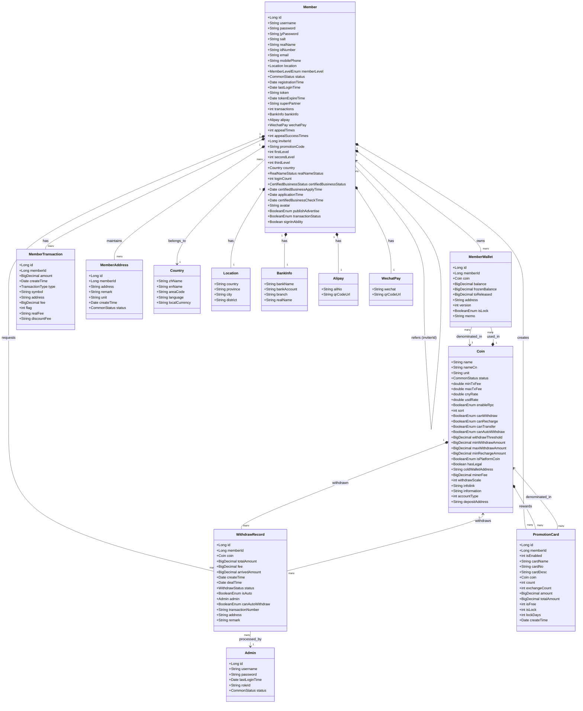

# ucenter-api Entity Relationship Diagram

## Entity Relationship Description

This class diagram illustrates the key entities in the ucenter-api and their relationships:

### 1. Core Entities

- **Member**: Central entity representing registered users with comprehensive profile information, authentication credentials, and account status
- **MemberWallet**: Individual cryptocurrency wallets owned by members, with balance tracking and transaction capabilities
- **Coin**: Cryptocurrency configuration entity defining supported digital assets, withdrawal limits, and operational parameters
- **MemberTransaction**: Financial transaction log recording all user account activities (deposits, withdrawals, transfers)
- **WithdrawRecord**: Withdrawal request tracking with approval workflow and compliance verification
- **PromotionCard**: Promotional campaign management for referral rewards and marketing activities

### 2. Key Relationships

- **Member to MemberWallet** (1:N): Each user can have multiple wallets, one for each supported cryptocurrency
- **Member to MemberTransaction** (1:N): Complete audit trail of all user financial activities
- **Member to WithdrawRecord** (1:N): Withdrawal request history with approval status tracking
- **Member to PromotionCard** (1:N): User-created promotional campaigns and referral cards
- **Member to MemberAddress** (1:N): Whitelisted withdrawal addresses for enhanced security
- **Member Self-Reference** (N:1): Referral hierarchy through `inviterId` field creating multi-level marketing structure
- **MemberWallet to Coin** (N:1): Each wallet is denominated in a specific cryptocurrency
- **WithdrawRecord to Coin** (N:1): Withdrawal requests specify the cryptocurrency type
- **WithdrawRecord to Admin** (N:1): Administrative approval workflow for manual withdrawal processing

### 3. Embedded Objects

- **Location**: Geographic information embedded in Member entity for compliance and localization
- **BankInfo**: Traditional banking details for fiat currency operations
- **Alipay**: Chinese payment system integration for local market support
- **WechatPay**: WeChat payment system integration for Chinese users

### 4. Supporting Entities

- **Country**: Reference data for supported countries and regional settings
- **Admin**: Administrative users who process withdrawal requests and manage system operations
- **MemberAddress**: Withdrawal address whitelist for security and compliance

### 5. Status Enumerations

- **MemberLevelEnum**: User verification levels (GENERAL, REALNAME, AUTHENTICATED)
- **CommonStatus**: Generic status indicator (NORMAL, ILLEGAL) used across multiple entities
- **RealNameStatus**: KYC verification status (NOT_CERTIFIED, AUDITING, CERTIFIED, CANCEL)
- **WithdrawStatus**: Withdrawal processing states (PROCESSING, WAITING, SUCCESS, FAIL, CANCELLED)
- **TransactionType**: Categories of financial transactions (RECHARGE, WITHDRAW, TRANSFER_ACCOUNTS, etc.)
- **BooleanEnum**: Type-safe boolean representation (IS_FALSE, IS_TRUE)

### 6. Design Patterns

- **Unique Constraints**: Composite unique constraint on (memberId, coin_id) for MemberWallet ensures one wallet per coin per user
- **Optimistic Locking**: Version field in MemberWallet prevents concurrent modification conflicts
- **Audit Trail**: Comprehensive transaction logging with timestamps and transaction types
- **Soft Delete**: Status fields allow logical deletion while preserving audit history
- **Referential Integrity**: Foreign key relationships maintain data consistency across related entities

This diagram provides a visual representation of the actual data model relationships in the ucenter-api codebase, showing how user accounts, financial operations, promotional systems, and administrative processes are interconnected within the cryptocurrency exchange platform.
