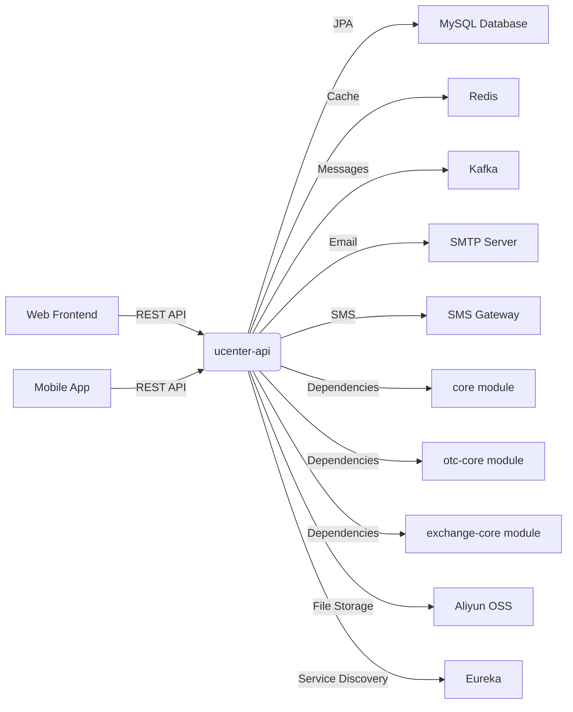
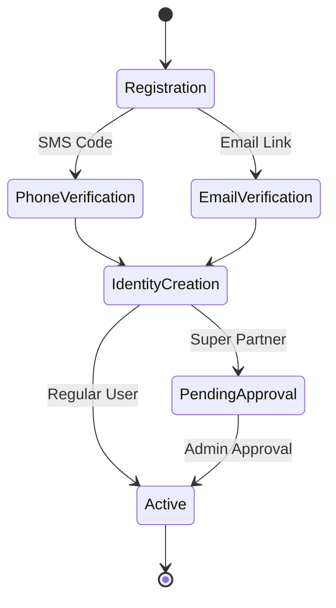
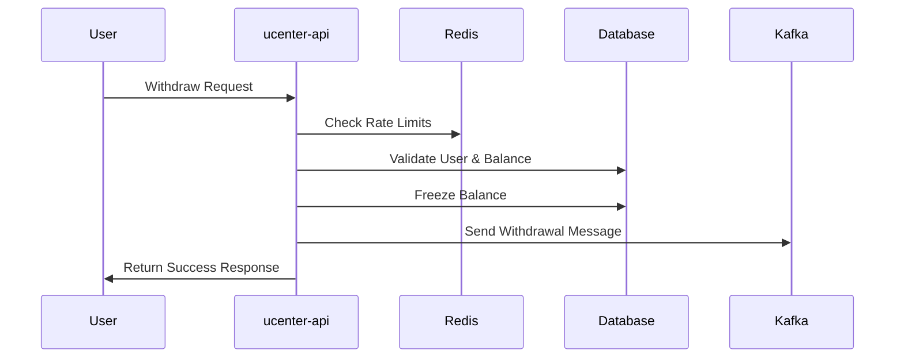

# Business Overview

## What It Is

The `ucenter-api` is a comprehensive User Center microservice within the CoinExchange cryptocurrency trading platform. It serves as the primary authentication, user management, and user-facing financial operations service. This component handles user registration, login, profile management, wallet operations, withdrawal processing, promotional activities, and various user account-related functions. It acts as the main interface between end-users and the trading platform's core services.

## Domain Concepts

The ucenter-api models several key domain concepts:

- **Member Management**: Complete user lifecycle including registration, authentication, profile management, and KYC (Know Your Customer) verification
- **Digital Asset Management**: User wallet operations, balance tracking, transaction history, and cryptocurrency address management
- **Withdrawal Processing**: Cryptocurrency withdrawal requests, address validation, fee calculation, and compliance checks
- **Promotional System**: Referral programs, invitation tracking, reward distribution, and promotional card management
- **Security & Compliance**: Multi-factor authentication, anti-attack protection, transaction verification, and regulatory compliance
- **Communication Services**: Email notifications, SMS verification, and internationalization support

## Component Boundaries

The ucenter-api service operates as a Spring Boot microservice within a larger cryptocurrency exchange ecosystem. It provides REST APIs for user-facing operations while depending on core platform services for business logic, shared data models, and infrastructure services.

> **Pointers for Functional Testing:**
> 
> - User registration flows with phone/email verification
> - Login/logout functionality with session management
> - Withdrawal request processing with various fee structures
> - Promotional system mechanics and reward calculations
> - Multi-language support and localization features



### Contract Interfaces Provided

#### APIs

- **Business Functions**: The API exposes comprehensive user account management including authentication, wallet operations, withdrawal processing, promotional activities, and user profile management
- **Endpoint Behavior**: Mix of read-only endpoints (balance queries, transaction history) and state-changing operations (registration, withdrawal requests, profile updates)
- **Audience**: Primarily serves web and mobile frontend applications, with some administrative endpoints for backend operations
- **Role**: Acts as both an orchestrator for complex user operations and a data access layer for user-related information

#### UIs

- **User Personas**: End users (traders, investors), customer support representatives
- **Supported Workflows**: Account creation, asset management, withdrawal requests, promotional activities
- **Purpose**: Self-service user management and financial operations interface
- **Accessibility**: Supports internationalization (English/Chinese) and mobile-responsive design

#### File/Data Exports

- **Formats**: Transaction history exports, user profile data (JSON format via APIs)
- **Consumers**: Frontend applications, mobile apps, administrative tools
- **Generation Triggers**: Real-time API requests, scheduled report generation

#### Messaging (Kafka)

- **Topics/Queues**: Produces messages to "withdraw" topic for withdrawal processing, "reset-member-address" for wallet address management
- **Message Specifications**: JSON formatted messages with user IDs, transaction details, and operation metadata
- **Delivery Guarantees**: At-least-once delivery for critical financial operations

### Contract Dependencies

#### API Clients

- **Consumed APIs**: Integration with exchange core services for coin information, wallet services for balance management, and promotional services for reward calculations
- **Role & Considerations**: Critical dependency on shared core modules for business logic; requires high availability for user-facing operations
- **Failure Handling**: Circuit breaker patterns, graceful degradation for non-critical features

#### External Databases

- **Data Interaction**: Primary MySQL database for user data, transaction records, and promotional information; Redis for session management and caching
- **Ownership & Consistency**: Owns user profile and transaction data; shares coin and wallet information with other services
- **Clarification**: Database schema is tightly coupled with core platform data models

#### Messaging Subscriptions

- **Topics/Queues**: Subscribes to platform-wide events for user account updates and system notifications
- **Message Schemas**: JSON-based message contracts for user events and system notifications
- **Reliability Concerns**: Handles duplicate messages through idempotent operations; maintains message ordering for user account updates

#### Other Systems

- **Aliyun OSS**: File storage for user avatars and document uploads
- **SMTP Services**: Email delivery for verification codes and notifications
- **SMS Gateway**: Phone verification and security notifications
- **Eureka**: Service discovery and load balancing
- **Geetest**: CAPTCHA verification service
- **Tencent Anti-Bot**: Anti-fraud and bot protection services

## Algorithms / Business Processes

### User Registration and Authentication

The service implements a comprehensive user onboarding process with multi-channel verification:



#### Security and Anti-Attack Logic

- **Rate Limiting**: Redis-based verification code throttling (10-minute windows)
- **CAPTCHA Integration**: Geetest and Tencent anti-bot services for registration and login
- **Session Management**: Secure session handling with Redis-backed storage
- **Password Security**: Salted MD5 hashing with unique salt generation per user

### Withdrawal Processing System

Complex withdrawal workflow with multiple validation layers:

#### Fee Calculation and Validation Logic

- **Dynamic Fee Structure**: Min/max fee validation based on coin configuration
- **Threshold-Based Processing**: Automatic vs. manual approval based on withdrawal amounts
- **Balance Verification**: Real-time balance checking with frozen amount management
- **Address Validation**: Multi-layered address verification including whitelist checking

#### Risk Management and Compliance

- **Daily Limits**: Per-user daily withdrawal limits with Redis tracking
- **KYC Integration**: Real-name verification requirements for withdrawal operations
- **Multi-Factor Authentication**: SMS/email verification for withdrawal requests
- **Audit Trail**: Complete transaction logging for compliance and dispute resolution

### Promotional System Logic

#### Referral Tracking Algorithm

- **Multi-Level Referrals**: Support for up to 3-level referral structures
- **Commission Calculations**: Dynamic commission rates based on user tiers and promotional levels
- **Reward Distribution**: Automated reward calculation and distribution to referrer wallets

#### Promotional Card System

- **Card Generation**: Unique promotional code generation with collision detection
- **Redemption Logic**: One-time use validation with race condition protection
- **Reward Lockup**: Time-based reward locking with automated unlock scheduling



---

# Technical Overview

## Implementation Summary

The ucenter-api is a Spring Boot 2.x application built with Java 8, utilizing Spring Cloud for microservices architecture. It's deployed as a standalone JAR file with embedded Tomcat, supporting multiple deployment profiles (dev, test, prod). The service integrates with various external systems including MySQL for data persistence, Redis for caching and session management, and Kafka for asynchronous messaging.

## Implementation Technologies

- **Java 8**: Primary programming language with modern Java features
- **Spring Boot 2.x**: Core framework providing auto-configuration, embedded server, and production-ready features
- **Spring Cloud Eureka**: Service discovery and registration for microservices communication
- **Spring Data JPA**: Object-relational mapping and database abstraction layer
- **Spring Security**: Authentication and authorization framework
- **Spring Session**: Distributed session management with Redis backend
- **Spring Kafka**: Asynchronous messaging and event-driven architecture
- **Hibernate**: JPA implementation for database operations
- **MySQL**: Primary relational database for user and transaction data
- **Redis**: In-memory data structure store for caching and session management
- **Druid**: High-performance database connection pooling
- **FreeMarker**: Template engine for email notifications and dynamic content
- **Lombok**: Code generation library for reducing boilerplate
- **Apache Shiro**: Security framework for authentication and authorization
- **RxJava**: Reactive programming extensions for asynchronous operations
- **FastJSON**: High-performance JSON processing library

## Local Runtime Environment

### Environment Setup

1. **Java Environment**: Install JDK 8 or higher
2. **Database Setup**: 
   - MySQL 5.7+ with schema creation
   - Redis 5.0+ for caching and session storage
3. **Message Queue**: Apache Kafka 2.x for event processing
4. **External Services**: 
   - Configure SMTP server for email notifications
   - Set up SMS gateway credentials
   - Configure Aliyun OSS for file storage

### Commands/Scripts

```bash
# Development profile
mvn spring-boot:run -Dspring.profiles.active=dev

# Test profile
mvn spring-boot:run -Dspring.profiles.active=test

# Production build
mvn clean package -Pprod
java -jar target/ucenter-api.jar
```

### Dependencies

- **Database Dependencies**: Requires running MySQL and Redis instances
- **External Service Mocks**: Use embedded H2 database for testing; Redis can be mocked with embedded Redis
- **Configuration**: Environment-specific properties files in `src/main/resources/{profile}/`

## Deployment

### Deployment Targets

- **Traditional Servers**: JAR deployment on Linux servers with systemd service management
- **Container Deployment**: Docker containerization with environment variable injection
- **Microservices Environment**: Eureka service registry for load balancing and discovery

### CI/CD Pipelines

- **Build Process**: Maven-based build with multi-profile support
- **Testing**: Automated unit tests with Surefire plugin (currently skipped in configuration)
- **Packaging**: Spring Boot Maven plugin creates executable JAR with all dependencies

### Build Artifacts

- **JAR Files**: Self-contained executable JAR with embedded Tomcat
- **Configuration**: Environment-specific property files bundled based on active profile
- **Dependencies**: All third-party libraries included in fat JAR

### Gating Processes

- **Profile-Based Deployment**: Separate configurations for dev, test, and production environments
- **Manual Approval**: Requires configuration review for production deployments

## Operability

### Logging

- **Framework**: Logback with SLF4J facade
- **Log Levels & Routing**: Configurable log levels with file and console appenders
- **Structure**: Structured logging with correlation IDs for request tracing
- **Configuration**: Environment-specific logback-spring.xml files

### Monitoring & Metrics

- **Metrics**: Spring Boot Actuator for application health and metrics
- **Custom Metrics**: Business-specific metrics for user registrations, withdrawals, and promotional activities
- **Tools**: Integration points for external monitoring systems (Prometheus, Grafana)
- **Health Checks**: Actuator health endpoints for service monitoring

### Configuration Management

- **Settings**: Spring profiles for environment-specific configuration
- **Sources**: Property files with environment variable override support
- **Database Configuration**: Druid connection pool with monitoring capabilities
- **External Service Configuration**: Configurable endpoints and credentials for third-party integrations

### Secrets Management

- **Storage**: Configuration files contain encrypted values and connection strings
- **Injection**: Environment variables for sensitive configuration in production
- **Rotation**: Manual secret rotation process through configuration updates

### Failure Handling

- **Dependency Outages**: Graceful degradation for non-critical features; circuit breaker patterns for external services
- **Database Resilience**: Connection pooling with automatic retry and failover
- **Cache Failures**: Redis failures handled with cache-miss fallback to database
- **Message Queue Resilience**: Kafka retry mechanisms with dead letter queues

## Repository Structure

### Folder Responsibilities

- **`src/main/java/com/bizzan/bitrade/`**: Main application code
  - **`controller/`**: REST API endpoints and request handling
  - **`entity/`**: Data model classes and DTOs
  - **`config/`**: Spring configuration classes
  - **`aspect/`**: Cross-cutting concerns (security, anti-attack)
  - **`job/`**: Scheduled tasks and background processing
  - **`system/`**: System utilities and factory classes
- **`src/main/resources/`**: Configuration and resource files
  - **`dev/test/prod/`**: Environment-specific configurations
  - **`templates/`**: FreeMarker email templates
  - **`i18n/`**: Internationalization message bundles
- **`src/test/`**: Test code (currently minimal)
- **`target/`**: Build artifacts and compiled classes

### Key Packages/Classes

- **`UcenterApplication`**: Main Spring Boot application class with service discovery
- **`LoginController`**: Authentication and session management
- **`RegisterController`**: User registration with multi-channel verification
- **`AssetController`**: Wallet operations and transaction history
- **`WithdrawController`**: Cryptocurrency withdrawal processing
- **`PromotionController`**: Referral system and promotional campaigns
- **`MemberController`**: User profile and account management
- **`LoginInfo`**: User session data model
- **`MemberAccount`**: User account aggregate model

### Testing Organization

- **Unit Tests**: Limited test coverage in `src/test/java/`
- **Integration Tests**: `BasicApplicationTest` and `FinanceTest` for core functionality
- **Test Configuration**: Separate test profiles with H2 in-memory database

### Utility Code

- **Configuration Classes**: Extensive configuration for external service integration
- **Aspect Classes**: Security and audit logging aspects
- **Template Files**: Email notification templates for user communications
- **Internationalization**: Multi-language support for user interfaces
