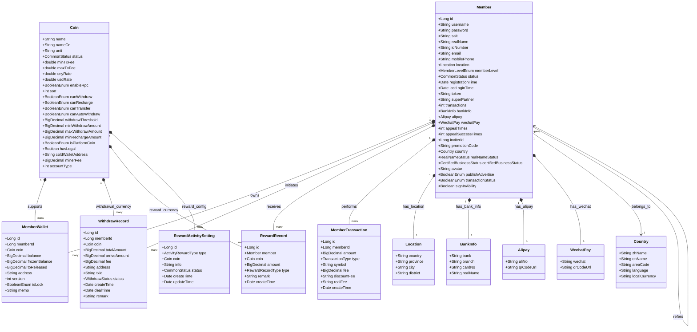

# Wallet Service Entity Relationship Diagram



## Entity Relationship Description

This class diagram illustrates the key entities in the Wallet Service and their relationships:

### 1. Core Entities

#### **Member**
- Central user entity representing registered exchange users
- Contains comprehensive profile information, KYC status, and referral data
- Primary key for all user-related operations

#### **MemberWallet** 
- Junction entity connecting Members to Coins
- Stores balance information (available, frozen, pending release)
- Contains blockchain addresses and wallet-specific configuration
- Uses optimistic locking (version field) for concurrent balance updates
- Unique constraint on (memberId, coin_id) ensures one wallet per member-coin pair

#### **Coin**
- Configuration entity for supported cryptocurrencies
- Defines operational parameters (fees, limits, capabilities)
- Controls RPC integration and automatic processing features
- Primary key is the full coin name, with unit as the symbol

### 2. Key Relationships

#### **Member ↔ MemberWallet (1:many)**
- Each member can have multiple wallets (one per supported cryptocurrency)
- Wallet creation triggered by member registration events
- Cascade operations maintain referential integrity

#### **Coin ↔ MemberWallet (1:many)**
- Each coin can be held in multiple member wallets
- Coin configuration determines wallet capabilities
- New coin activation creates wallets for all existing members

#### **Member ↔ WithdrawRecord (1:many)**
- Complete audit trail of withdrawal requests per member
- Links to specific coin being withdrawn
- Status tracking through withdrawal processing pipeline

#### **Member ↔ RewardRecord (1:many)**
- Tracks all rewards issued to members
- Different reward types (registration, activity, referral)
- Links reward to specific cryptocurrency

#### **Member ↔ MemberTransaction (1:many)**
- Comprehensive audit trail of all balance changes
- Links to transaction type and affected cryptocurrency
- Financial compliance and reporting support

### 3. Embedded Objects

#### **Location, BankInfo, Alipay, WechatPay**
- Embedded value objects within Member entity
- Support various payment methods and geographical data
- Not separate database tables but structured data within Member

#### **Country**
- Reference data entity for geographical organization
- Supports multi-currency and localization features

### 4. Status Enumerations

#### **CommonStatus**: NORMAL, ILLEGAL
- General status indicator for entities

#### **WithdrawStatus**: PROCESSING, SUCCESS, FAILED, WAITING
- Withdrawal processing state machine

#### **TransactionType**: RECHARGE, WITHDRAW, TRANSFER_ACCOUNTS, ACTIVITY_AWARD, PROMOTION_AWARD, DIVIDEND
- Categorizes different types of balance changes

#### **BooleanEnum**: IS_FALSE (0), IS_TRUE (1)
- Standardized boolean representation across the platform

#### **RewardRecordType**: ACTIVITY, PROMOTION, DIVIDEND
- Categories of rewards that can be issued

#### **ActivityRewardType**: REGISTER
- Specific activity types that trigger rewards

### 5. Processing Flow Relationships

1. **Member Registration Flow**:
   ```
   Member → MemberWallet (created for all Coins) → RewardRecord (if applicable) → MemberTransaction (audit)
   ```

2. **Deposit Processing Flow**:
   ```
   Blockchain Event → MemberWallet (balance update) → MemberTransaction (audit record)
   ```

3. **Withdrawal Processing Flow**:
   ```
   WithdrawRecord (created) → MemberWallet (frozen balance) → Blockchain RPC → WithdrawRecord (status update) → MemberTransaction (audit)
   ```

### 6. Data Integrity Features

- **Unique Constraints**: MemberWallet prevents duplicate wallets per member-coin
- **Optimistic Locking**: MemberWallet version field prevents concurrent updates
- **Foreign Key Relationships**: Maintain referential integrity across entities
- **Cascade Operations**: Ensure related data consistency during updates
- **Audit Trails**: MemberTransaction provides complete financial audit capability

This diagram represents the actual data model relationships implemented in the Bizzan Wallet Service codebase and demonstrates how financial operations are tracked and managed within the cryptocurrency exchange platform.
