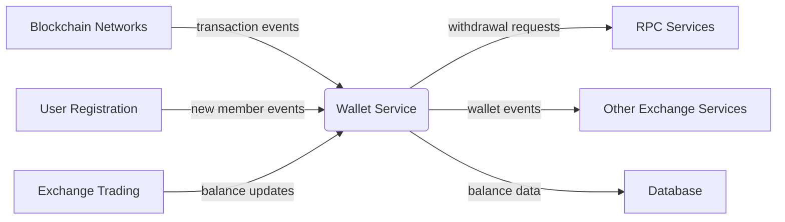
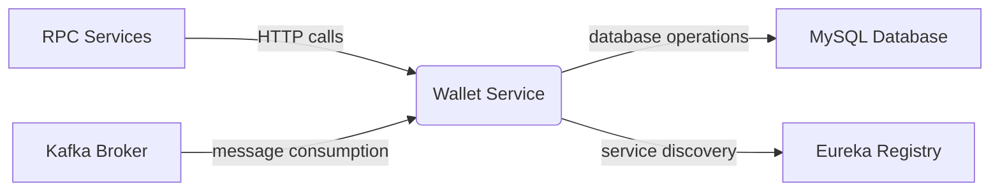
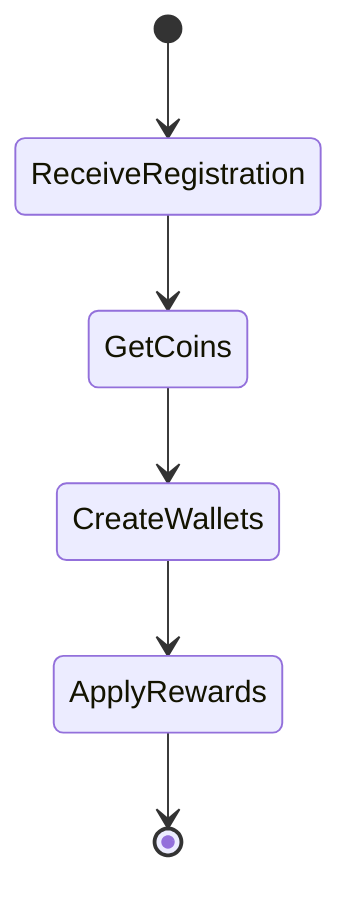
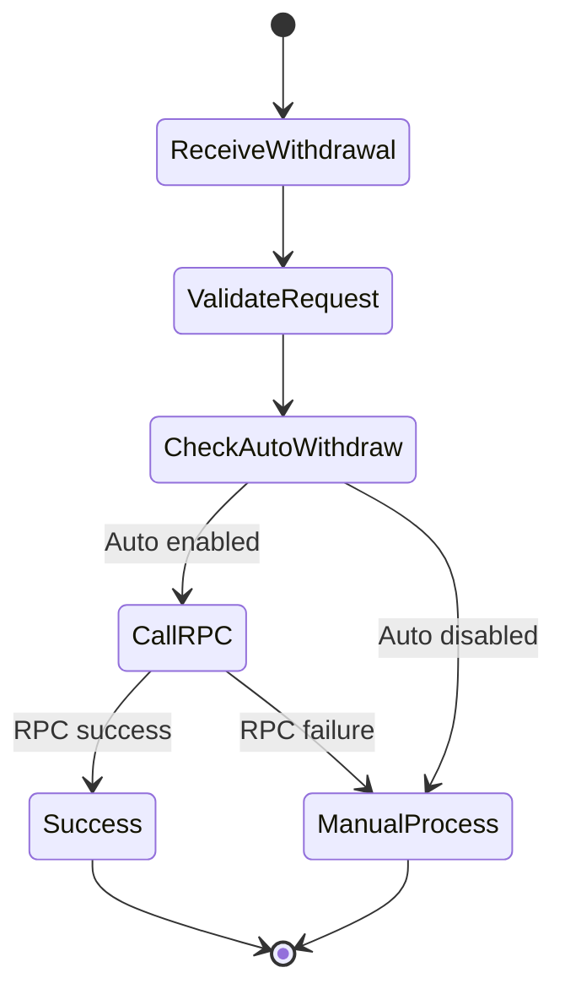

# Wallet Service Technical Overview

# Business Overview

## What It Is

The Wallet Service is a microservice component within the Bizzan Cryptocurrency Exchange platform that manages digital wallet operations and financial transactions for exchange users. It serves as the central hub for processing cryptocurrency deposits, withdrawals, wallet creation, and balance management across multiple supported cryptocurrencies. The service integrates with blockchain RPC nodes and handles real-time transaction processing through message-driven architecture.

## Domain Concepts

The Wallet Service models several key domain concepts:

- **Member Wallets**: Individual cryptocurrency wallets for each user-currency pair, containing available and frozen balances
- **Deposits/Recharges**: Processing of incoming cryptocurrency transactions from blockchain networks
- **Withdrawals**: Outgoing cryptocurrency transfers with automatic and manual processing capabilities
- **Wallet Addresses**: Unique blockchain addresses generated for each user-cryptocurrency combination
- **Financial Transactions**: Complete audit trail of all balance changes and movements
- **RPC Integration**: Communication with cryptocurrency nodes for blockchain operations

## Component Boundaries

The Wallet Service operates as an independent microservice with clear boundaries:

**External Boundaries:**
- Receives transaction notifications from blockchain monitoring systems
- Communicates with cryptocurrency RPC nodes for address generation and transaction submission
- Publishes wallet events to other exchange services via Kafka messaging
- Exposes HTTP endpoints for wallet status and testing operations

**Internal Boundaries:**
- Manages wallet data persistence through JPA/Hibernate
- Handles message consumption from Kafka topics for various wallet operations
- Maintains transaction integrity through optimistic locking and database constraints

> **Pointers for Functional Testing:**
> 
> - Test deposit processing by simulating blockchain transaction notifications
> - Verify withdrawal processing with both automatic and manual approval flows  
> - Test wallet creation during new user registration scenarios



### Contract Interfaces Provided

#### APIs

- **Business Functions:** The service exposes testing and monitoring endpoints for RPC connectivity validation
  
- **Endpoint Behavior:** Endpoints are primarily read-only for status checking, with no direct state-changing operations exposed externally
  
- **Audience:** Internal monitoring systems and operations teams for service health validation
  
- **Role:** Service acts as a message-driven processor rather than an API orchestrator

#### Messaging (Kafka Topics)

- **Topics/Queues:** 
  - Publishes to: wallet-related events after processing
  - Consumes from: `coin-start`, `deposit`, `withdraw`, `withdraw-notify`, `member-register`, `reset-member-address`

- **Message Specifications:** JSON-formatted messages with specific schemas for each operation type

- **Delivery Guarantees:** At-least-once processing with manual commit acknowledgment

### Contract Dependencies

#### API Clients

- **Consumed APIs:** Cryptocurrency RPC services (`SERVICE-RPC-{COIN}`) for address generation, transaction submission, and blockchain querying
  
- **Role & Considerations:** Critical dependency for all blockchain operations; includes retry logic and failure handling
  
- **Failure Handling:** Automatic withdrawal failures are handled by falling back to manual processing

#### External Databases

- **Data Interaction:** Direct read/write access to exchange database for wallet, member, and transaction data
  
- **Ownership & Consistency:** Shared database with other exchange services; uses optimistic locking for wallet balance updates

#### Messaging Subscriptions

- **Topics/Queues:** Consumes from multiple Kafka topics for different wallet operations
  
- **Message Schemas:** JSON schemas with specific field requirements for each topic type
  
- **Reliability Concerns:** Manual acknowledgment prevents message loss; no ordering guarantees between topics



## Algorithms / Business Processes

### Wallet Creation Process

During member registration, the service creates wallets for all supported cryptocurrencies:

1. Receives member registration event via Kafka
2. Retrieves all configured coins from database
3. Creates MemberWallet entries with zero balances
4. Generates blockchain addresses on-demand (commented out for performance)
5. Applies registration rewards if configured



### Deposit Processing Flow

Handles incoming cryptocurrency deposits through blockchain monitoring:

1. Receives deposit notification with transaction details
2. Validates transaction hasn't been processed previously
3. Determines account type (address-based vs memo-based)
4. Credits user wallet balance
5. Records transaction history

### Withdrawal Processing Flow

Manages outgoing cryptocurrency transfers with automatic processing:

1. Receives withdrawal request via Kafka
2. Validates withdrawal parameters and coin configuration
3. Calls RPC service for automatic transaction submission
4. Updates withdrawal status based on RPC response
5. Falls back to manual processing if automatic fails



### Address Reset Logic

Provides capability to regenerate wallet addresses for users:

1. Validates coin supports RPC operations
2. Generates new account identifier
3. Calls RPC service for new address generation
4. Updates wallet record with new address

---

# Technical Overview

## Implementation Summary

This is a Spring Boot microservice application using Java 8, deployed as part of the Bizzan cryptocurrency exchange platform. The service uses Spring Cloud for service discovery, Kafka for message processing, and JPA/Hibernate for data persistence. It communicates with cryptocurrency RPC nodes for blockchain operations and maintains wallet state in a MySQL database.

## Implementation Technologies

- **Spring Boot**: Core application framework providing dependency injection and auto-configuration
- **Spring Cloud Eureka**: Service discovery and registration for microservice communication  
- **Spring Kafka**: Message-driven processing for wallet operations and events
- **Spring Data JPA**: Object-relational mapping and database access layer
- **Spring Data Redis**: Caching and session storage (configured but minimal usage)
- **RestTemplate with Ribbon**: Load-balanced HTTP client for RPC service communication
- **MySQL with Druid**: Database persistence with connection pooling
- **MongoDB**: Document storage for additional data (configured in properties)
- **Querydsl**: Type-safe database query construction
- **Lombok**: Annotation-based code generation for entities
- **Logback**: Structured logging with environment-specific configuration

## Local Runtime Environment

### Environment Setup

1. **Java Requirements**: Java 8 or higher
2. **Database Setup**: 
   - MySQL server running on localhost:3306 or configured host
   - Database schema `bizzan` must exist
   - User credentials configured in application.properties
3. **Message Broker**: Kafka broker accessible at configured bootstrap servers
4. **Service Registry**: Eureka server running for service discovery

### Commands/Scripts

```bash
# Build the application
mvn clean compile

# Run with development profile
mvn spring-boot:run -Dspring.profiles.active=dev

# Run with specific profile
java -jar target/wallet.jar --spring.profiles.active=prod
```

### Dependencies

- **Database**: Requires MySQL connection and schema setup
- **Kafka**: Needs Kafka broker for message processing
- **RPC Services**: Cryptocurrency RPC services must be running for full functionality
- **Eureka**: Service registry for microservice discovery

Mock/test configurations available through test profile in `src/main/resources/test/`.

## Deployment

### Deployment Targets

The application builds as a Spring Boot JAR file suitable for containerization or direct deployment.

### Build Artifacts

- **JAR File**: `target/wallet.jar` - executable Spring Boot application
- **Maven Profiles**: Separate configurations for dev, test, and prod environments
- **Resource Filtering**: Environment-specific properties loaded based on active profile

### CI/CD Pipelines

Standard Maven build process with profile-based environment configuration. Test execution is currently skipped in Maven configuration.

## Operability

### Logging

- **Framework**: Logback with XML configuration
- **Log Levels & Routing**: Environment-specific log levels configured in logback-spring.xml
- **Structure**: Standard Spring Boot logging format with class-level loggers

### Monitoring & Metrics

- **Metrics**: Standard Spring Boot Actuator metrics (if enabled)
- **Custom Monitoring**: Test endpoints for RPC connectivity validation (`/test/rpc`)
- **Health Checks**: RPC service connectivity testing capability

### Configuration Management

- **Settings**: Environment-specific properties in separate folders (dev/test/prod)
- **Sources**: Application.properties files with profile-based loading
- **External Config**: Database connection, Kafka brokers, and service URLs configurable

### Secrets Management

- **Storage**: Database passwords and API keys stored in application.properties
- **Injection**: Configuration loaded through Spring's property system

### Failure Handling

- **Dependency Outages**: RPC service failures handled by fallback to manual processing
- **Resilience**: Kafka consumer manual acknowledgment prevents message loss
- **Error Recovery**: Database transaction rollback and optimistic locking for consistency

## Repository Structure

### Folder Responsibilities

- **`src/main/java/`**: Java source code organized by functional packages
- **`src/main/resources/`**: Environment-specific configuration files
  - **`dev/`**: Development environment configuration
  - **`test/`**: Test environment configuration  
  - **`prod/`**: Production environment configuration
- **`target/`**: Maven build artifacts and compiled classes

### Key Packages/Classes

- **`WalletApplication`**: Main Spring Boot application entry point
- **`config/`**: Configuration classes for Kafka, REST, and JPA setup
- **`consumer/`**: Kafka message consumers for different wallet operations
  - **`CoinConsumer`**: Handles new coin addition and wallet creation
  - **`FinanceConsumer`**: Processes deposits and withdrawals
  - **`MemberConsumer`**: Manages member registration and address resets
- **`controller/`**: REST endpoints for testing and monitoring

### Testing Organization

- **Unit Tests**: Currently skipped in Maven configuration
- **Integration Testing**: Test profile configuration available
- **Test Controllers**: `TestController` provides RPC connectivity validation

### Utility Code

- **Configuration Classes**: Modular configuration for different Spring components
- **Profile Support**: Multi-environment configuration with Maven profiles
- **Development Tools**: Spring Boot DevTools enabled for development convenience

---
