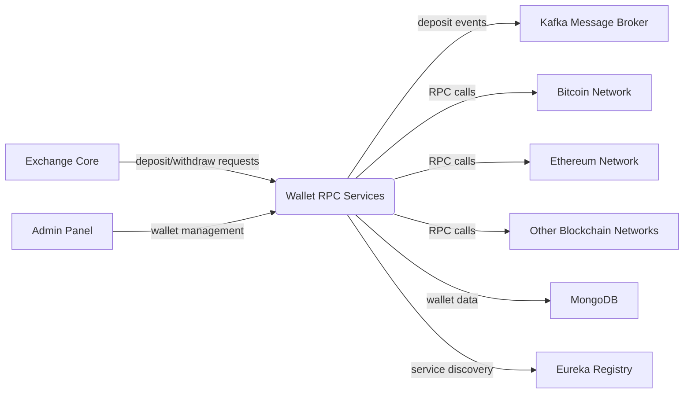
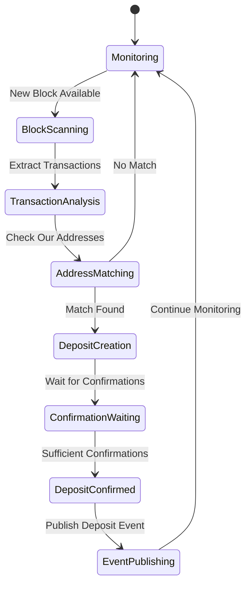
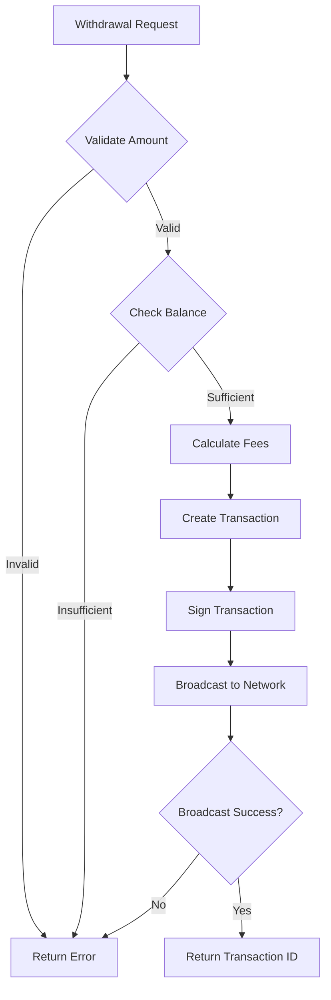

# Wallet RPC Services - Technical Overview

# Business Overview

## What It Is

The Wallet RPC Services component is a comprehensive multi-cryptocurrency wallet management system that provides secure wallet operations, transaction processing, and blockchain monitoring for a cryptocurrency exchange platform. This system manages multiple wallet types including Bitcoin, Ethereum, various ERC-20 tokens (USDT, custom tokens), and other cryptocurrencies like Litecoin, Monero, EOS, and Bitcoin forks (BCH, BSV).

The component serves as the backbone for all wallet-related operations in the exchange, handling user address generation, balance management, deposit detection, withdrawal processing, and blockchain synchronization across multiple cryptocurrency networks.

## Domain Concepts

The system models several key domain concepts:

- **Multi-Wallet Architecture**: Each supported cryptocurrency has its own dedicated service module with specialized blockchain integration
- **Address Management**: Automatic generation and tracking of user deposit addresses across different blockchain networks  
- **Deposit Detection**: Real-time blockchain monitoring to detect incoming transactions and credit user accounts
- **Withdrawal Processing**: Secure transaction creation and broadcasting for user withdrawals
- **Balance Tracking**: Accurate balance computation across hot wallets and individual user addresses
- **Transaction Monitoring**: Block-by-block scanning with configurable confirmation requirements

## Component Boundaries

The Wallet RPC Services component operates as a collection of microservices within the broader cryptocurrency exchange ecosystem. Each wallet service exposes standardized REST APIs while maintaining wallet-specific implementations for different blockchain protocols.

> **Pointers for Functional Testing:**
> 
> - Test deposit detection by sending test transactions to generated addresses and verifying event publication
> - Test withdrawal processing with various amounts and fee configurations
> - Verify balance accuracy across different wallet types and network conditions
> - Test blockchain synchronization recovery after service restarts



### Contract Interfaces Provided

#### APIs

- **Business Functions:** The APIs expose core wallet operations including address generation, balance queries, withdrawal processing, blockchain height monitoring, and administrative functions for wallet management.

- **Endpoint Behavior:** Most endpoints are state-changing (address generation, withdrawals) with some read-only operations (balance queries, height checks). All operations return standardized MessageResult responses.

- **Audience:** Primary consumers are other internal microservices within the exchange ecosystem, particularly the exchange core service for processing user transactions and the admin service for wallet management operations.

- **Role:** The APIs serve as orchestrators, coordinating between blockchain RPC clients, local wallet storage, and event publishing systems.

**Standard Wallet API Endpoints (per cryptocurrency):**
- `GET /rpc/height` - Current blockchain height
- `GET /rpc/address/{account}` - Generate new deposit address  
- `GET /rpc/withdraw` - Process withdrawal transaction
- `GET /rpc/transfer` - Internal wallet transfers
- `GET /rpc/balance` - Hot wallet total balance
- `GET /rpc/balance/{address}` - Individual address balance

#### Messaging (Kafka)

- **Topics/Queues:** Publishes to deposit confirmation topics when incoming transactions are detected and confirmed on the blockchain.

- **Message Specifications:** DepositEvent messages containing transaction details (txid, amount, address, block height, confirmation count).

- **Delivery Guarantees:** Assumes at-least-once delivery with idempotent event processing on the consumer side.

### Contract Dependencies

#### API Clients

- **Consumed APIs:** Each wallet service consumes blockchain RPC APIs specific to its cryptocurrency (Bitcoin RPC, Ethereum JSON-RPC, etc.).

- **Role & Considerations:** These APIs provide critical blockchain connectivity for transaction broadcasting, balance queries, and block data retrieval. Rate limiting and connection pooling are handled per blockchain client library.

- **Failure Handling:** Connection failures trigger automatic retries with exponential backoff. Service degradation is handled gracefully with error responses to clients.

#### External Databases

- **Data Interaction:** MongoDB serves as the primary data store for wallet addresses, account mappings, balance caches, and blockchain synchronization state. Each wallet type uses dedicated collections.

- **Ownership & Consistency:** The wallet services own their respective MongoDB collections exclusively. Cross-wallet operations are handled through service-to-service communication.

#### Messaging Subscriptions

- **Topics/Queues:** Services publish to but don't typically subscribe to external message queues, operating as event producers for deposit notifications.

- **Message Schemas:** DepositEvent schema includes transaction identifiers, amounts, addresses, and blockchain metadata.

#### Other Systems

- **Eureka Service Registry:** All wallet services register with Eureka for service discovery and health monitoring.
- **Blockchain Networks:** Direct RPC connections to full nodes or blockchain service providers for each supported cryptocurrency.

## Algorithms / Business Processes

### Deposit Detection and Processing

The system implements a sophisticated blockchain monitoring algorithm that continuously scans for incoming transactions:



**Key Algorithm Components:**

#### Block Synchronization Logic
- **Consensus Tracking:** Each watcher maintains current block height with configurable confirmation requirements (typically 3-20 confirmations depending on network security needs)
- **Gap Recovery:** Automatic detection and processing of missed blocks during service downtime
- **Batch Processing:** Configurable step size for processing multiple blocks in sequence to optimize sync performance

#### Transaction Matching
- **Address Recognition:** Efficient lookup of transaction outputs against locally managed address sets
- **Amount Extraction:** Precise decimal handling for different cryptocurrency denominations
- **Duplicate Prevention:** Transaction ID tracking to prevent double-processing of deposits

#### Balance Management
- **Real-time Updates:** Immediate balance updates upon transaction confirmation
- **Aggregation Logic:** Hot wallet total computation across all managed addresses
- **Gas/Fee Tracking:** Separate balance tracking for transaction fees (relevant for Ethereum-based tokens)

### Withdrawal Processing

The withdrawal system implements secure transaction creation with multiple validation layers:



#### Fee Calculation Algorithms
- **Dynamic Fee Estimation:** Real-time fee calculation based on network congestion for optimal transaction confirmation times
- **Multi-tier Fee Options:** Support for different confirmation speed preferences (fast, normal, slow)
- **Gas Limit Optimization:** Ethereum-based transactions use optimized gas limits based on transaction complexity

#### Security Controls
- **Multi-signature Support:** Hot wallet operations with configurable signature threshold requirements
- **Withdrawal Limits:** Configurable daily/transaction limits with administrative override capabilities
- **Address Validation:** Comprehensive validation of destination addresses using network-specific checksum algorithms

---

# Technical Overview

## Implementation Summary

The Wallet RPC Services component is implemented as a collection of Spring Boot microservices using Java 8, with each cryptocurrency supported by a dedicated service module. The architecture follows a hub-and-spoke pattern where a common `rpc-common` module provides shared functionality, and individual wallet modules (bitcoin, eth, erc-token, etc.) implement cryptocurrency-specific logic. Services are deployed independently and communicate through REST APIs and Kafka messaging, with MongoDB providing persistent storage and Eureka enabling service discovery.

## Implementation Technologies

- **Java 8**: Primary programming language with Lombok for code generation
- **Spring Boot 1.5.10**: Microservice framework providing web services, dependency injection, and auto-configuration
- **Spring Cloud Edgware**: Microservice orchestration with Eureka service registry
- **MongoDB**: NoSQL database for wallet addresses, balances, and blockchain synchronization state
- **Apache Kafka**: Message broker for publishing deposit events and inter-service communication
- **Web3j 3.3.1**: Java library for Ethereum blockchain interaction
- **Custom Bitcoin RPC Client**: Proprietary library for Bitcoin network operations
- **FastJSON**: JSON serialization/deserialization for API responses
- **Maven**: Build tool and dependency management

**Key Pattern Implementations:**
- Template Method Pattern: Abstract `Watcher` class with concrete implementations per blockchain
- Strategy Pattern: Different RPC client strategies for various blockchain protocols
- Observer Pattern: Event-driven deposit notifications through Kafka

## Local Runtime Environment

### Environment Setup

1. **Prerequisites:**
   ```bash
   # Java 8 JDK
   java -version  # Should show 1.8.x
   
   # Maven 3.x
   mvn -version
   
   # MongoDB (local or remote)
   mongod --version
   
   # Apache Kafka (local or remote)  
   kafka-topics --version
   ```

2. **Database Setup:**
   ```bash
   # MongoDB collections are created automatically
   # Each wallet uses pattern: {COIN_UNIT}_address_book
   # Example: BTC_address_book, ETH_address_book
   ```

3. **External Dependencies:**
   - Bitcoin Core node with RPC enabled
   - Ethereum node (Geth/Parity) with RPC enabled
   - Other blockchain nodes as required

### Commands/Scripts

**Build all modules:**
```bash
cd 01_wallet_rpc
mvn clean package
```

**Run specific wallet service:**
```bash
# Bitcoin wallet
cd bitcoin
mvn spring-boot:run

# Ethereum wallet  
cd eth
mvn spring-boot:run

# ERC-20 token wallet
cd erc-token
mvn spring-boot:run
```

**Configuration:**
Each wallet service requires an `application.properties` file with:
- Server port and service name
- Kafka broker configuration
- MongoDB connection string
- Eureka registry URL
- Blockchain RPC endpoint
- Wallet-specific parameters (gas limits, confirmation counts, etc.)

### Dependencies

**Required External Services:**
- **Kafka**: Message broker for deposit event publishing
- **MongoDB**: Primary data store
- **Eureka**: Service registry and discovery
- **Blockchain RPC Nodes**: Full nodes for each supported cryptocurrency

**Mock/Test Setup:**
- In-memory MongoDB can be used for unit tests
- Kafka test containers for integration testing
- Blockchain test networks (testnet/regtest) for development

## Deployment

### Deployment Targets

Each wallet service is deployed as an independent Spring Boot JAR application, typically containerized with Docker for deployment to:
- **Kubernetes clusters** for production orchestration
- **Traditional JVM environments** on dedicated servers
- **Docker Compose** for development/staging environments

### CI/CD Pipelines

The build process follows Maven multi-module patterns:
1. **Build Phase:** `mvn clean package` compiles and packages each wallet service
2. **Test Phase:** Unit and integration tests with Kafka/MongoDB test containers
3. **Artifact Creation:** Spring Boot fat JARs with embedded dependencies
4. **Containerization:** Docker images built from JAR artifacts

### Build Artifacts

- **Fat JARs:** Each wallet service produces a self-contained executable JAR
- **Docker Images:** Multi-stage Docker builds for optimized container size
- **Configuration Externalization:** Properties files mounted as volumes or config maps

### Gating Processes

- **Automated Testing:** Full test suite including blockchain integration tests
- **Security Scanning:** Container image vulnerability scanning
- **Performance Testing:** Load testing for high-volume transaction scenarios
- **Manual Approval:** Required for production deployments with financial impact

## Operability

### Logging

- **Framework:** SLF4J with Logback implementation
- **Log Levels & Routing:** Standard levels (ERROR, WARN, INFO, DEBUG) with structured output
- **Structure:** JSON-formatted logs with correlation IDs for request tracing across services

**Key Log Events:**
- Deposit detection with transaction details
- Withdrawal processing with amount and destination
- Blockchain synchronization progress
- RPC communication errors and retries

### Monitoring & Metrics

- **Metrics:** Spring Boot Actuator endpoints expose JVM, HTTP, and custom business metrics
- **Custom Metrics:** 
  - Deposit detection rate per cryptocurrency
  - Withdrawal processing latency
  - Blockchain synchronization lag
  - RPC client connection health

- **Tools:** Metrics accessible via Micrometer for integration with Prometheus/Grafana

### Configuration Management

- **Settings:** Spring Boot property files with environment-specific overrides
- **External Configuration:** Properties injected via environment variables for containerized deployments
- **Sources:** 
  - `application.properties` files embedded in JARs
  - Environment-specific property files
  - Kubernetes ConfigMaps/Secrets for cloud deployments

### Secrets Management

- **Storage:** Sensitive data (RPC credentials, wallet passwords, database credentials) stored in:
  - Kubernetes Secrets for cloud deployments
  - Encrypted property files for traditional deployments
  - External secret management systems (HashiCorp Vault, AWS Secrets Manager)

- **Injection:** Secrets injected at runtime through environment variables or mounted volume files

### Failure Handling

- **Dependency Outages:** 
  - **Blockchain RPC failures:** Automatic retry with exponential backoff, service continues with degraded functionality
  - **Database unavailability:** Connection pooling with automatic reconnection, temporary caching of critical operations
  - **Kafka unavailability:** Event queuing with local persistence, automatic replay when connectivity restored

- **Resilience:** 
  - **Circuit Breaker Pattern:** Prevents cascade failures to external dependencies
  - **Health Checks:** Spring Boot Actuator health endpoints for load balancer integration
  - **Graceful Degradation:** Read-only operations continue during partial system failures

## Repository Structure

### Folder Responsibilities

- **`rpc-common/`**: Shared library containing common entities, services, and utilities used by all wallet implementations
- **`{wallet-name}/`** (bitcoin, eth, etc.): Individual wallet service implementations with cryptocurrency-specific logic
- **`lib/`**: Third-party JAR files not available in public Maven repositories (bitcoin-rpc library)
- **Root `pom.xml`**: Parent Maven configuration managing dependency versions and common build configuration

### Key Packages/Classes

**Common Infrastructure (rpc-common):**
- **`com.bizzan.bc.wallet.entity`**: Core data models
  - `Account`: User wallet address and balance information
  - `Deposit`: Transaction deposit records  
  - `Coin`: Cryptocurrency configuration
  - `Contract`: Smart contract information for token wallets
- **`com.bizzan.bc.wallet.component`**: Core abstractions
  - `Watcher`: Abstract blockchain monitoring component
  - `RpcController`: Standard wallet API interface
- **`com.bizzan.bc.wallet.service`**: Shared business logic
  - `AccountService`: Account and address management
  - `DepositService`: Deposit event handling

**Wallet-Specific Implementations:**
- **`{wallet}.controller.WalletController`**: REST API endpoints implementing the standard wallet interface
- **`{wallet}.component.{Wallet}Watcher`**: Blockchain monitoring implementation for specific cryptocurrency
- **`{wallet}.service.{Wallet}Service`**: Wallet-specific business logic (transaction creation, balance queries, etc.)

### Testing Organization

- **Unit Tests:** Located in `src/test/java` following the same package structure as source code
- **Integration Tests:** Focus on external system integration (blockchain RPC, MongoDB, Kafka)
- **Test Naming:** Test classes follow `{ClassName}Test` convention
- **Mock Usage:** Mockito for unit testing, TestContainers for integration testing with real external dependencies

### Utility Code

- **`MessageResult`**: Standardized API response wrapper used across all wallet services
- **`EthConvert`**: Ethereum unit conversion utilities
- **`WalletOperationUtil`**: Common wallet operation helper functions
- **Test Fixtures**: Mock blockchain data and test wallet configurations for development and testing

---
