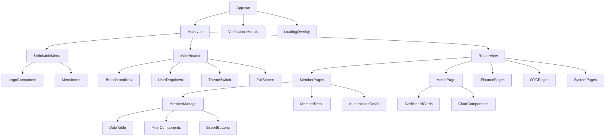

# Admin Portal Component Architecture

This document describes the core UI components of the Bizzan Admin Portal and their relationships.

## Core Components

### 1. Main Layout Component (`Main.vue`)

Primary application shell that provides consistent layout structure across all admin pages.

```jsx
// Main layout structure
<template>
  <div class="main">
    <shrinkable-menu 
      :shrink="shrink"
      :menu-list="menuList">
      <logo-component slot="top" />
    </shrinkable-menu>
    <main-header />
    <router-view /> // Dynamic page content
  </div>
</template>
```

**Key Features:**
- Collapsible sidebar navigation
- Responsive header with user controls
- Dynamic content area via router-view
- Theme switching capabilities
- Breadcrumb navigation integration

### 2. Shrinkable Menu Component

Adaptive sidebar navigation that supports both expanded and collapsed states.

```jsx
// Menu component with permission-based visibility
const ShrinkableMenu = {
  props: ['menuList', 'shrink', 'theme'],
  computed: {
    filteredMenu() {
      return this.menuList.filter(item => 
        this.hasPermission(item.permission)
      );
    }
  }
};
```

**Functionality:**
- Permission-based menu item visibility
- Hierarchical menu structure support
- Icon and text display modes
- Active state management

### 3. Data Table Components

Standardized table components used throughout the application for data display and management.

```jsx
// Generic data table with common features
<Table 
  :columns="tableColumns"
  :data="tableData"
  :loading="isLoading"
  border
  @on-selection-change="handleSelection">
</Table>
```

**Common Features:**
- Sortable columns
- Filterable data
- Pagination integration
- Bulk selection capabilities
- Export functionality
- Real-time data refresh

### 4. Modal Dialog Components

Reusable modal components for various workflows including member verification and document review.

```jsx
// Member verification modal with step navigation
<Modal v-model="memberCheckMask" :width="800">
  <Steps :current="currentStep">
    <Step title="身份证正面" />
    <Step title="身份证手持" />
    <Step title="身份证反面" />
  </Steps>
  <image-viewer :src="currentImage" />
  <approval-buttons @approve="handleApproval" />
</Modal>
```

**Modal Types:**
- Member verification workflows
- Document review interfaces
- Confirmation dialogs
- Form submission modals

### 5. Form Components

Standardized form components with validation and error handling.

```jsx
// Form with validation and error states
<Form :model="formData" :rules="validationRules">
  <FormItem label="用户名" prop="username">
    <Input v-model="formData.username" />
  </FormItem>
  <FormItem label="状态" prop="status">
    <Select v-model="formData.status">
      <Option value="active">活跃</Option>
      <Option value="inactive">未激活</Option>
    </Select>
  </FormItem>
</Form>
```

**Form Features:**
- Real-time validation
- Error message display
- Required field indicators
- Multi-step form wizards

### 6. Dashboard Components

Specialized components for analytics and monitoring displays.

```jsx
// Dashboard card component
<Card>
  <p slot="title">用户类型统计</p>
  <div class="stats-grid">
    <stat-item label="注册用户" :value="registeredUsers" />
    <stat-item label="实名用户" :value="verifiedUsers" />
    <stat-item label="认证商家" :value="businessUsers" />
  </div>
</Card>
```

**Dashboard Elements:**
- Statistics cards with counters
- Chart integration (ECharts)
- Real-time data display
- Trend indicators

### 7. Filter and Search Components

Reusable components for data filtering and search functionality.

```jsx
// Search and filter interface
<div class="search-wrapper">
  <Input placeholder="搜索用户名、邮箱、手机号" v-model="searchQuery" />
  <Select v-model="statusFilter">
    <Option value="">全部状态</Option>
    <Option value="active">活跃</Option>
    <Option value="inactive">未激活</Option>
  </Select>
  <Button type="info" @click="performSearch">搜索</Button>
</div>
```

## Component Hierarchy



## Shared Components

### 1. Notification System

Global notification system for user feedback and system messages.

```jsx
// Usage across components
this.$Message.success('操作成功');
this.$Message.error('操作失败');
this.$Message.warning('请注意');
```

**Features:**
- Success/error/warning message types
- Auto-dismiss functionality
- Queue management for multiple messages
- Global accessibility

### 2. Loading Components

Centralized loading state management for async operations.

```jsx
// Global loading overlay
<div class="loading-mask" v-show="loading">
  <div class="wrapper">
    <Icon type="load-c" class="loading-icon"></Icon>
    <p>加载中...</p>
  </div>
</div>
```

**Loading States:**
- Global page loading overlay
- Component-level loading indicators
- Button loading states
- Table loading states

### 3. Permission Components

Components that handle permission-based visibility and access control.

```jsx
// Permission-aware component wrapper
<template v-if="hasPermission('member:manage')">
  <member-management-component />
</template>
```

## Composition Patterns

### 1. Higher-Order Components

Wrapper components that provide common functionality like permission checking and data loading.

```jsx
// WithPermission HOC pattern
const WithPermission = {
  functional: true,
  props: ['permission', 'fallback'],
  render(h, { props, children, parent }) {
    if (parent.$store.getters.hasPermission(props.permission)) {
      return children;
    }
    return props.fallback || null;
  }
};
```

### 2. Mixin Patterns

Shared functionality across multiple components using Vue mixins.

```jsx
// Common table operations mixin
const TableMixin = {
  data() {
    return {
      loading: false,
      tableData: [],
      currentPage: 1,
      pageSize: 20
    };
  },
  methods: {
    async fetchData() {
      this.loading = true;
      try {
        const response = await this.api.getData({
          page: this.currentPage,
          size: this.pageSize
        });
        this.tableData = response.data;
      } finally {
        this.loading = false;
      }
    },
    handlePageChange(page) {
      this.currentPage = page;
      this.fetchData();
    }
  }
};
```

### 3. Slot-based Composition

Flexible component composition using Vue slots for customizable content areas.

```jsx
// Card component with customizable slots
<Card>
  <template slot="title">
    <Icon type="person" />
    <span>会员管理</span>
    <Button slot="extra" size="small">
      <Icon type="refresh" />刷新
    </Button>
  </template>
  
  <slot name="filters">
    <!-- Custom filter components -->
  </slot>
  
  <slot name="content">
    <!-- Main content area -->
  </slot>
</Card>
```

## State Management

### Component State Patterns

1. **Local State:** Form data, UI state, temporary values
2. **Computed Properties:** Derived data, filtered lists, formatted values
3. **Vuex Integration:** Global state access, actions, mutations

```jsx
// Typical component state pattern
export default {
  data() {
    return {
      // Local component state
      formData: {},
      localLoading: false,
      selectedItems: []
    };
  },
  computed: {
    // Access global state
    ...mapGetters(['currentUser', 'permissions']),
    
    // Computed local state
    filteredData() {
      return this.tableData.filter(item => 
        item.status === this.selectedStatus
      );
    }
  },
  methods: {
    // Actions that modify state
    ...mapActions(['updateUser', 'fetchUserData']),
    
    // Local methods
    handleSubmit() {
      this.localLoading = true;
      this.updateUser(this.formData)
        .finally(() => this.localLoading = false);
    }
  }
};
```

### Parent-Child Communication

- **Props Down:** Configuration and data flow from parent to child
- **Events Up:** User actions and state changes bubbled to parents
- **Provide/Inject:** Deep component communication for themes and configuration

```jsx
// Parent component
<template>
  <member-table 
    :data="memberData"
    :loading="isLoading"
    @edit-member="handleMemberEdit"
    @delete-member="handleMemberDelete" />
</template>

// Child component
<template>
  <Table :data="data" :loading="loading">
    <template slot-scope="{ row }">
      <Button @click="$emit('edit-member', row)">编辑</Button>
      <Button @click="$emit('delete-member', row)">删除</Button>
    </template>
  </Table>
</template>
```

## Component Communication Patterns

### 1. Event Bus Pattern

Global event communication for loosely coupled components.

```jsx
// Global event bus
const EventBus = new Vue();

// Emitting events
EventBus.$emit('refresh-data', { type: 'member' });

// Listening to events
EventBus.$on('refresh-data', this.handleDataRefresh);
```

### 2. Store-based Communication

Vuex store as single source of truth for shared state.

```jsx
// Component A triggers action
this.$store.dispatch('member/loadMemberData');

// Component B reacts to state change
computed: {
  memberData() {
    return this.$store.state.member.list;
  }
}
```

### 3. Route-based Communication

URL parameters and query strings for component state management.

```jsx
// Route with parameters
{ path: '/member/detail/:id', component: MemberDetail }

// Component accessing route data
computed: {
  memberId() {
    return this.$route.params.id;
  }
}
```
