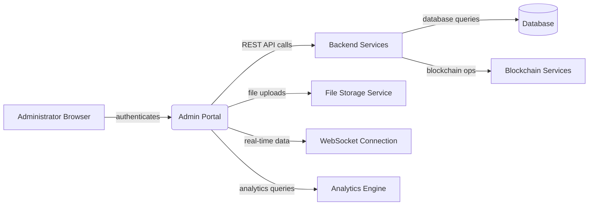
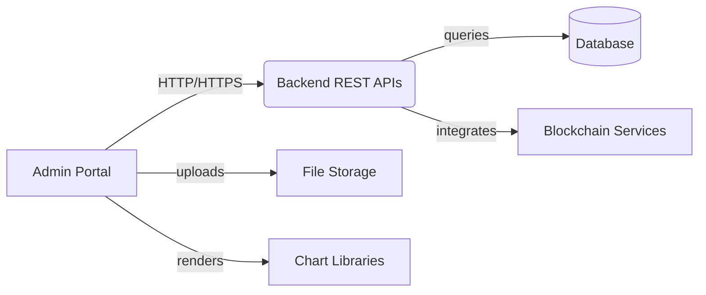
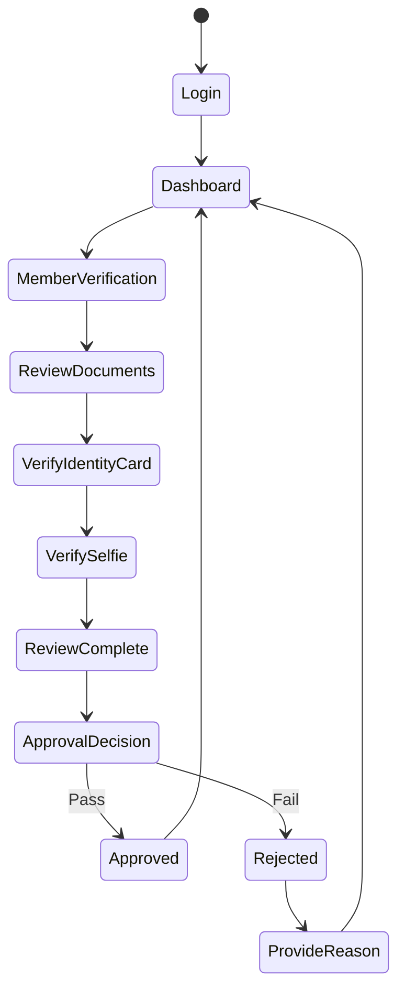

# Admin Portal Technical Overview

---

# Business Overview

## What It Is

The Admin Portal is a comprehensive web-based management interface for the Bizzan (币严) cryptocurrency exchange platform. It serves as the primary administrative dashboard for managing all aspects of the digital asset trading platform, including member management, financial operations, OTC (Over-The-Counter) trading oversight, system configuration, and regulatory compliance.

The portal provides administrators with centralized control over user accounts, transaction monitoring, audit workflows, content management, and system analytics. It handles complex workflows such as member identity verification, withdrawal approvals, business partner authentication, and real-time trading supervision.

## User Personas

### 1. System Administrator
- **Goals:** Overall platform health, system configuration, user role management
- **Needs:** Dashboard analytics, system logs, permission management, employee management
- **Pain Points:** Need for real-time monitoring, complex permission structures

### 2. Financial Administrator
- **Goals:** Monitor financial transactions, approve withdrawals, manage fees
- **Needs:** Transaction audit trails, withdrawal approval workflows, financial reporting
- **Pain Points:** Manual approval processes, compliance requirements, risk assessment

### 3. Customer Service Manager
- **Goals:** Handle member inquiries, manage member accounts, resolve disputes
- **Needs:** Member profile access, transaction history, communication tools
- **Pain Points:** Complex member data navigation, multi-step verification processes

### 4. Compliance Officer
- **Goals:** Ensure regulatory compliance, review KYC/AML processes
- **Needs:** Member verification workflows, audit trails, reporting capabilities
- **Pain Points:** Manual document review, complex approval workflows

### 5. OTC Trading Supervisor
- **Goals:** Oversee peer-to-peer trading, manage business partners, handle disputes
- **Needs:** Advertisement management, order monitoring, appeal resolution tools
- **Pain Points:** High-volume transaction monitoring, dispute resolution complexity

## User Journeys and Workflows

### Primary Workflows:

1. **Member Identity Verification Flow**
   - Review identity documents (ID card front/back, selfie with ID)
   - Step-by-step image verification process
   - Approval/rejection with reason documentation
   - Automated notification to members

2. **Withdrawal Approval Process**
   - Transaction review and risk assessment
   - Batch approval capabilities for efficiency
   - Multi-stage approval for high-value transactions
   - Integration with blockchain confirmation systems

3. **OTC Business Partner Verification**
   - Asset proof verification (cryptocurrency holdings)
   - Trading history validation
   - Multi-document approval workflow
   - Bond/margin management

4. **System Monitoring and Analytics**
   - Real-time dashboard with key metrics
   - Member registration and activity trends
   - Financial transaction summaries
   - Trading volume analytics

5. **Content and Announcement Management**
   - Multi-language content creation
   - Rich text editing with media support
   - Publication workflow and scheduling
   - Help documentation management

## Component Boundaries

### External Boundaries:
- **User Authentication:** Integrates with backend authentication services
- **Backend APIs:** Consumes REST APIs for data management and business logic
- **File Upload Services:** Integrates with file storage for document management
- **Analytics Services:** Connects to analytics engines for reporting

### Internal Boundaries:
- **Modular Architecture:** Organized by business domain (member, finance, OTC, system)
- **Shared Components:** Reusable UI components across modules
- **State Management:** Centralized Vuex store with module separation
- **Routing:** Domain-based route organization with permission guards

> **Pointers for UI Testing:**
> 
> - Test member verification workflows with various document types and scenarios
>     
> - Validate financial approval processes under different transaction volumes and values
>     



### Frontend Interfaces

#### UI Components and Views

- **Core Screens:** 
  - Dashboard with real-time analytics and member statistics
  - Member Management (user accounts, verification, assets)
  - Financial Management (transactions, withdrawals, deposits, fees)
  - OTC Management (advertisements, orders, disputes, business partners)
  - System Management (employees, roles, permissions, coins, settings)
  - Content Management (announcements, help articles, advertisements)

- **Navigation Structure:** 
  - Collapsible sidebar navigation with hierarchical menu structure
  - Breadcrumb navigation for deep page hierarchies
  - Tab-based navigation for multi-step workflows
  - Permission-based menu visibility

- **Responsive Design:** 
  - Desktop-first design optimized for admin workstations
  - Responsive breakpoints for tablet usage
  - Mobile compatibility for emergency access

- **Accessibility:** 
  - Basic accessibility features with iView component library
  - Keyboard navigation support
  - Screen reader compatibility for data tables

#### User Interaction Patterns

- **Primary Actions:**
  - Data filtering and searching with multi-criteria support
  - Batch operations (bulk approval/rejection)
  - CRUD operations with form validation
  - File upload and document review
  - Real-time data refresh and pagination

- **Form Patterns:**
  - Step-by-step wizards for complex workflows
  - Inline editing for quick updates
  - Form validation with real-time feedback
  - Auto-save functionality for draft states

- **Feedback Mechanisms:**
  - Toast notifications for action confirmations
  - Modal dialogs for critical actions
  - Loading states for async operations
  - Progress indicators for multi-step processes

- **Error Handling:**
  - User-friendly error messages
  - Form field-level error highlighting
  - Network error recovery mechanisms
  - Permission denied redirects

#### Visual Design

- **Design System:** 
  - Based on iView UI component library
  - Consistent color scheme with primary blue theme
  - Custom styling for brand identity

- **Themes:** 
  - Light and dark theme support
  - Theme switching capability
  - Brand logo adaptation for themes

- **Visual Hierarchy:** 
  - Clear information prioritization with card-based layouts
  - Data tables with sorting and filtering
  - Color-coded status indicators
  - Typography hierarchy for content structure

### External Dependencies

#### API Dependencies

- **Backend Services:** 
  - Member management APIs for user data and verification
  - Financial APIs for transaction processing and auditing
  - OTC APIs for peer-to-peer trading management
  - System APIs for configuration and analytics

- **Authentication:** 
  - Role-based authentication with JWT tokens
  - Permission-based access control
  - Session management with automatic renewal

- **API Integration Patterns:** 
  - Direct API calls using Axios HTTP client
  - Request/response interceptors for authentication
  - Centralized error handling

- **Failure Handling:** 
  - Automatic retry mechanisms for failed requests
  - Fallback UI states for service unavailability
  - User notification of system issues

#### Third-party Integrations

- **External Libraries:**
  - iView UI component library for consistent interface
  - ECharts for data visualization and analytics
  - TinyMCE for rich text editing
  - Viser-Vue for advanced chart components

- **Analytics Tools:** 
  - Built-in analytics dashboard
  - Custom reporting capabilities
  - Data export functionality

- **External Widgets:** 
  - File upload components
  - Image cropping tools
  - Chart visualization widgets

#### Asset Dependencies

- **CDN Usage:** 
  - Static assets served from local distribution
  - Vendor libraries bundled with webpack

- **Media Sources:** 
  - Logo and branding assets stored locally
  - User-uploaded documents managed by backend services
  - Icon fonts for UI elements

- **Font Services:** 
  - System fonts with fallbacks
  - Icon fonts for UI elements



## UI Business Logic

### Form Validation and Processing

- **Client-side Validation:** 
  - Required field validation
  - Format validation (email, phone, amounts)
  - Business rule validation (minimum amounts, valid ranges)
  - Real-time validation feedback

- **Multi-step Processes:** 
  - Member verification workflow with image review steps
  - OTC partner verification with document validation
  - Withdrawal approval process with multi-stage reviews

### State Management

- **Global State:** 
  - User authentication state and permissions
  - Navigation state and opened pages
  - Global loading states and notifications
  - Theme and UI preferences

- **Caching Strategy:** 
  - Local storage for user preferences
  - Session storage for temporary form data
  - Vuex state for active session data
  - Automatic data refresh mechanisms

### UI Workflows

- **Conditional Flows:** 
  - Permission-based feature availability
  - Role-specific interface customization
  - Status-dependent action visibility
  - Dynamic form fields based on selections

- **Process Visualization:** 
  - Step progress indicators for workflows
  - Status badges for approval states
  - Timeline views for transaction history
  - Visual process flows for complex operations

Example member verification flow:


> **Tip:** The portal emphasizes workflow efficiency with batch operations and quick action buttons while maintaining audit trails for compliance.

---

# Technical Overview

## Implementation Summary

This is a Vue.js 2.x single-page application built with iView UI components, using Vuex for state management and Vue Router for navigation. The application is designed as a comprehensive admin dashboard for cryptocurrency exchange management, featuring modular architecture with domain-specific components for member management, financial operations, OTC trading, and system administration.

## Implementation Technologies

#### Core Technologies

- **Framework/Library:** Vue.js 2.5.9 - Progressive JavaScript framework for building user interfaces
- **Language:** JavaScript ES6+ with Babel transpilation
- **State Management:** Vuex 3.0.1 - Centralized state management pattern
- **Routing:** Vue Router 3.0.1 - Official router for Vue.js

#### UI Component Libraries

- **Component Framework:** iView 2.13.1 - High-quality UI components for Vue.js
- **Chart/Visualization:** 
  - ECharts 3.8.5 for dashboard analytics and data visualization
  - Viser-Vue 2.2.3 for advanced statistical charts
- **Form Handling:** Built-in iView form components with custom validation
- **Rich Text Editor:** TinyMCE 4.7.3 for content management

#### Build and Development Tools

- **Build System:** Webpack 3.10.0 with custom configuration
- **Package Manager:** npm with package-lock.json for consistent dependencies
- **Development Server:** Webpack Dev Server 2.9.5 with hot module replacement
- **Testing Framework:** Not currently implemented
- **Code Quality:** ESLint with custom rules for code consistency

#### Additional Libraries

- **HTTP Client:** Axios 0.17.1 for API communication
- **Internationalization:** Vue-i18n 5.0.3 for multi-language support  
- **Utilities:**
  - js-cookie 2.2.0 for cookie management
  - js-file-download 0.4.1 for file export functionality
  - cropperjs 1.1.3 for image cropping
  - countup 1.8.2 for animated number counters

## Local Runtime Environment

### Environment Setup

1. **Prerequisites:**
   ```bash
   Node.js >= 8.x
   npm >= 5.x
   ```

2. **Installation:**
   ```bash
   cd 04_Web_Admin
   npm install
   ```

3. **Development Setup:**
   ```bash
   # Start development server
   npm run dev
   
   # Build for production
   npm run build
   
   # Initialize webpack (if needed)
   npm run init
   ```

### Commands/Scripts

- **`npm run dev`** - Starts webpack dev server with hot reload on http://localhost:8080
- **`npm run build`** - Builds production-ready assets to `/dist` folder
- **`npm run init`** - Initializes webpack development configuration

### Environment Variables

- **API Base URL:** Configured in `src/config/api.js` (currently: `http://49.234.13.106:8801`)
- **Build Environment:** Managed through `build/env.js` (development/production)

### Configuration Files

- **`build/webpack.dev.config.js`** - Development build configuration
- **`build/webpack.prod.config.js`** - Production build configuration  
- **`src/config/api.js`** - API endpoint configuration
- **`src/config/storage.js`** - Local storage utilities

## Deployment

### Deployment Targets

- **Static File Hosting:** Builds to static files suitable for CDN or web server deployment
- **Asset Distribution:** `/dist` folder contains all compiled assets
- **Single Page Application:** Requires web server configuration for client-side routing

### Build Artifacts

- **JavaScript Bundles:** 
  - `main.[hash].js` - Application code
  - `vendor-base.js` - Core vendor libraries  
  - `vendor-exten.js` - Extended vendor libraries
- **CSS Assets:** `main.css` - Compiled stylesheets
- **Static Assets:** Images, fonts, and icons in `/dist` folder

### CI/CD Pipelines

- Currently no automated CI/CD pipeline configured
- Manual build and deployment process
- Webpack production build optimizes and minifies assets

### Environment Configuration

- **Development:** Local development with mock/development API endpoints
- **Production:** Production API endpoints configured in `api.js`
- **Asset Paths:** Configured for `/dist/` public path in production

## Operability

### Logging and Monitoring

- **Client-side Logging:** 
  - Console logging for development debugging
  - Error capturing in Axios interceptors
  - Custom error handling for API failures

- **Error Tracking:** 
  - Basic error handling with user-friendly messages
  - Network error detection and user notification
  - Authentication error automatic redirect

- **User Analytics:** 
  - Built-in dashboard analytics for admin usage
  - User action tracking through API calls
  - Performance metrics via browser developer tools

- **Performance Monitoring:** 
  - Webpack bundle analysis available
  - Browser performance profiling
  - Network request monitoring

### Configuration Management

- **Feature Flags:** 
  - Permission-based feature visibility
  - Role-based interface customization
  - Environment-specific API endpoints

- **Environment-specific Settings:** 
  - API base URLs configured per environment
  - Build-time environment variable injection
  - Theme and branding configuration

### Performance Optimization

- **Bundling Strategy:** 
  - Webpack code splitting for vendor libraries
  - Separate bundles for core and extended vendors
  - Hash-based file names for cache busting

- **Lazy Loading:** 
  - Route-based code splitting with dynamic imports
  - Component lazy loading for large views
  - Image lazy loading for document review

- **Caching Strategy:** 
  - Browser caching for static assets with hash-based names
  - Local storage for user preferences
  - Session storage for temporary form data

### Browser Compatibility

- **Supported Browsers:** 
  - Modern browsers (Chrome 60+, Firefox 55+, Safari 11+)
  - IE11+ with polyfills
  - Mobile browsers for emergency access

- **Polyfills:** 
  - Babel polyfills for ES6+ features
  - Vue.js handles most cross-browser compatibility

- **Responsive Breakpoints:** 
  - Desktop primary: 1200px+
  - Tablet: 768px - 1199px  
  - Mobile: < 768px

## Repository Structure

### Folder Structure

```
04_Web_Admin/
├── build/                 # Webpack build configurations
├── src/
│   ├── components/        # Reusable Vue components
│   ├── views/            # Page-level components organized by domain
│   │   ├── home/         # Dashboard and analytics
│   │   ├── member/       # Member management
│   │   ├── finance/      # Financial operations  
│   │   ├── otc/          # OTC trading management
│   │   ├── system/       # System administration
│   │   └── content/      # Content management
│   ├── router/           # Vue Router configuration
│   ├── store/            # Vuex state management
│   │   └── modules/      # Domain-specific store modules
│   ├── service/          # API service layer
│   ├── config/           # Configuration files
│   ├── libs/             # Utility libraries
│   ├── locale/           # Internationalization
│   ├── styles/           # Global stylesheets and themes
│   └── assets/           # Static assets (images, fonts)
├── dist/                 # Built production assets
└── package.json          # Dependencies and scripts
```

### Key Components

- **`src/views/Main.vue`** - Main layout component with navigation and header
- **`src/app.vue`** - Root application component with global overlays
- **`src/main.js`** - Application entry point with Vue initialization
- **`src/router/router.js`** - Route definitions with permission-based access
- **`src/store/index.js`** - Vuex store configuration with modules

### Shared Resources

- **`src/libs/util.js`** - Common utility functions
- **`src/service/getData.js`** - Centralized API service methods
- **`src/service/http.js`** - HTTP client configuration and interceptors
- **`src/styles/common.less`** - Shared CSS styles and variables
- **`src/main-components/`** - Reusable layout components

### Testing Organization

- No testing framework currently implemented
- Recommended to add unit tests for components and integration tests for workflows
- Manual testing primarily through development environment
