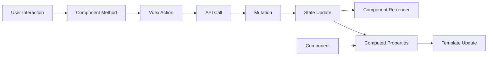

# Admin Portal State Management

This document describes the state management approach used in the Bizzan Admin Portal.

## State Management Architecture

The admin portal uses Vuex as the centralized state management solution, organized into domain-specific modules. The store follows the Flux pattern with a single source of truth, predictable state mutations, and clear separation between synchronous mutations and asynchronous actions.

The state is divided into two main modules:
- **App Module**: UI state, navigation, themes, permissions
- **User Module**: User-specific state, authentication, workflow states

## Global State

### Store Structure

```js
const store = {
  // App module - UI and application state
  app: {
    // Navigation and UI state
    cachePage: [],                    // Pages to cache for performance
    isFullScreen: false,             // Fullscreen toggle state
    openedSubmenuArr: [],            // Expanded menu items
    menuTheme: 'dark',               // Current UI theme
    themeColor: '',                  // Custom theme colors
    
    // Page management
    pageOpenedList: [{               // Open page tabs
      title: '首页',
      path: '',
      name: 'home_index'
    }],
    currentPageName: '',             // Active page identifier
    currentPath: [{                  // Breadcrumb navigation path
      title: '首页',
      path: '',
      name: 'home_index'
    }],
    
    // Menu and permissions
    menuList: [],                    // User's accessible menu items
    permissionData: {},              // User permission matrix
    routers: [],                     // Available routes
    tagsList: [],                    // Page tag list for navigation
    
    // UI state
    maskLayer: true,                 // Global mask layer visibility
    messageCount: 0,                 // Notification counter
    dontCache: []                    // Pages excluded from caching
  },
  
  // User module - User and workflow state
  user: {
    // Loading states
    pageLoading: false,              // Global page loading indicator
    
    // Member verification workflow
    memberCheckMask: false,          // Member verification modal visibility
    memberCheckImgInfo: {},          // Member verification document data
    
    // Business verification workflow  
    businessCheckMask: false,        // Business verification modal visibility
    businessCheckInfo: {},           // Business verification data
    
    // Data refresh trigger
    date: ''                         // Timestamp for triggering data refreshes
  }
}
```

### Key Actions and Reducers

#### App Module Actions

**Navigation Management:**
```js
// Menu and page management
setOpenedList(state) {
  // Initialize opened page list from localStorage
  state.pageOpenedList = JSON.parse(localStorage.pageOpenedList || '[]');
}

updateMenulist(state) {
  // Filter menu items based on user permissions
  state.menuList = filterMenuByPermission(state.routers, state.permissionData);
}

// Page caching management
initCachepage(state) {
  // Initialize cached pages for performance
  state.cachePage = state.pageOpenedList.filter(item => 
    !state.dontCache.includes(item.name)
  );
}
```

**Theme Management:**
```js
switchLang(state, lang) {
  // Switch application language
  state.lang = lang;
  localStorage.setItem('language', lang);
}

changeTheme(state, theme) {
  // Update UI theme
  state.menuTheme = theme;
  localStorage.setItem('theme', theme);
}
```

**Permission Management:**
```js
updatePermission(state, permissionData) {
  // Update user permissions and filter accessible features
  state.permissionData = permissionData;
  localStorage.setItem('permissionData', JSON.stringify(permissionData));
}
```

#### User Module Actions

**Authentication:**
```js
logout(state, vm) {
  // Clear user session and stored data
  Cookies.remove('user');
  Cookies.remove('password');
  Cookies.remove('access');
  
  // Reset theme to default
  let themeLink = document.querySelector('link[name="theme"]');
  themeLink.setAttribute('href', '');
  
  // Preserve theme preference while clearing other data
  let theme = localStorage.theme;
  localStorage.clear();
  if (theme) localStorage.theme = theme;
}
```

**Workflow State Management:**
```js
switchMemberMask(state, visible) {
  // Toggle member verification modal
  state.memberCheckMask = visible;
}

memeberCheckImg(state, imageData) {
  // Set member verification document data
  state.memberCheckImgInfo = imageData;
}

switchBusinessMask(state, visible) {
  // Toggle business verification modal
  state.businessCheckMask = visible;
}

businessCheckInfo(state, businessData) {
  // Set business verification data
  state.businessCheckInfo = businessData;
}
```

**Loading State:**
```js
switchLoading(state, isLoading) {
  // Control global loading overlay
  state.pageLoading = isLoading;
}

changeDate(state, timestamp) {
  // Trigger data refresh across components
  state.date = timestamp;
}
```

## Local Component State

### State Patterns

Components typically manage three types of local state:

1. **Form State**: Input values, validation states, submission status
2. **UI State**: Loading indicators, modal visibility, selection states  
3. **Data State**: Local data caching, filtered results, pagination

```js
// Typical component state pattern
export default {
  data() {
    return {
      // Form state
      formData: {
        username: '',
        email: '',
        status: 'active'
      },
      formErrors: {},
      
      // UI state
      loading: false,
      showModal: false,
      selectedItems: [],
      
      // Data state
      tableData: [],
      filteredData: [],
      currentPage: 1,
      pageSize: 20,
      totalItems: 0
    };
  }
}
```

### Computed Properties for State Derivation

```js
computed: {
  // Derive state from Vuex store
  ...mapGetters({
    currentUser: 'app/currentUser',
    userPermissions: 'app/permissions',
    isLoading: 'user/pageLoading'
  }),
  
  // Local computed state
  filteredTableData() {
    return this.tableData.filter(item => {
      return this.searchQuery ? 
        item.name.includes(this.searchQuery) : true;
    });
  },
  
  canEdit() {
    return this.userPermissions.includes('member:edit');
  },
  
  paginatedData() {
    const start = (this.currentPage - 1) * this.pageSize;
    return this.filteredTableData.slice(start, start + this.pageSize);
  }
}
```

## Data Flow

The application follows a unidirectional data flow pattern:



### Data Flow Examples

**Member Verification Flow:**
```js
// 1. User clicks verify button
handleMemberVerify(memberData) {
  // 2. Component dispatches action
  this.$store.commit('user/memeberCheckImg', memberData);
  this.$store.commit('user/switchMemberMask', true);
}

// 3. Component reacts to state change
computed: {
  showMemberModal() {
    return this.$store.state.user.memberCheckMask;
  },
  memberData() {
    return this.$store.state.user.memberCheckImgInfo;
  }
}

// 4. User approves/rejects in modal
async handleApproval(approved) {
  try {
    this.$store.commit('user/switchLoading', true);
    if (approved) {
      await memberCheckPass(this.memberData.id);
    } else {
      await memberCheckNotPass(this.memberData.id, { reason: this.rejectReason });
    }
    this.$Message.success('操作成功');
    
    // 5. Trigger data refresh
    this.$store.commit('user/changeDate', Date.now());
    this.closeMemberModal();
  } catch (error) {
    this.$Message.error('操作失败');
  } finally {
    this.$store.commit('user/switchLoading', false);
  }
}
```

**Navigation State Flow:**
```js
// Router navigation triggers state updates
beforeRouteEnter(to, from, next) {
  next(vm => {
    // Update current path for breadcrumbs
    vm.$store.commit('app/setCurrentPath', vm.getBreadcrumbPath(to));
    
    // Add to opened pages list
    vm.$store.commit('app/addOpenedPage', {
      title: to.meta.title,
      name: to.name,
      path: to.path
    });
  });
}
```

## API Integration

### Service Layer Pattern

API calls are centralized in service modules and integrated with state management:

```js
// Service layer (getData.js)
export const getMemberList = (params) => {
  return post('admin/member/page-query', params);
};

export const approveMember = (id) => {
  return patch(`admin/member/${id}/approve`);
};

// Component integration
methods: {
  async loadMemberData() {
    try {
      this.$store.commit('user/switchLoading', true);
      
      const response = await getMemberList({
        page: this.currentPage,
        size: this.pageSize,
        ...this.filters
      });
      
      this.tableData = response.data.content;
      this.totalItems = response.data.totalElements;
      
    } catch (error) {
      this.$Message.error('数据加载失败');
      console.error('Load error:', error);
    } finally {
      this.$store.commit('user/switchLoading', false);
    }
  },
  
  async handleMemberApproval(memberId) {
    try {
      await approveMember(memberId);
      this.$Message.success('审核成功');
      
      // Trigger global data refresh
      this.$store.commit('user/changeDate', Date.now());
      
    } catch (error) {
      this.$Message.error('审核失败');
    }
  }
}

// Reactive data refresh
watch: {
  // Watch for global refresh triggers
  '$store.state.user.date'() {
    this.loadMemberData();
  }
}
```

### Error Handling Integration

Global error handling through Axios interceptors and state management:

```js
// HTTP interceptors (main.js)
axios.interceptors.response.use(
  (response) => response,
  (error) => {
    if (error.response?.status === 401) {
      // Handle authentication errors
      this.$store.commit('user/logout');
      this.$router.push('/login');
    } else if (error.response?.status === 403) {
      // Handle permission errors
      this.$router.push('/403');
    }
    
    return Promise.reject(error);
  }
);
```

## Caching Strategy

### Local Storage Strategy

Persistent storage for user preferences and session data:

```js
// App preferences (stored in localStorage)
const persistedState = {
  theme: localStorage.getItem('theme') || 'dark',
  language: localStorage.getItem('language') || 'zh-CN',
  pageOpenedList: JSON.parse(localStorage.getItem('pageOpenedList') || '[]'),
  permissionData: JSON.parse(localStorage.getItem('permissionData') || '{}')
};

// Update localStorage when state changes
watch: {
  menuTheme(newTheme) {
    localStorage.setItem('theme', newTheme);
  },
  
  pageOpenedList: {
    handler(newList) {
      localStorage.setItem('pageOpenedList', JSON.stringify(newList));
    },
    deep: true
  }
}
```

### Component-Level Caching

Page-level caching for improved performance:

```js
// Cache management in app store
mutations: {
  addToCache(state, pageName) {
    if (!state.dontCache.includes(pageName) && 
        !state.cachePage.includes(pageName)) {
      state.cachePage.push(pageName);
    }
  },
  
  removeFromCache(state, pageName) {
    const index = state.cachePage.indexOf(pageName);
    if (index > -1) {
      state.cachePage.splice(index, 1);
    }
  }
}

// Usage in keep-alive components
<keep-alive :include="$store.state.app.cachePage">
  <router-view />
</keep-alive>
```

### Session Storage for Temporary Data

Temporary data storage for form states and workflow data:

```js
// Component session storage
data() {
  return {
    formData: JSON.parse(sessionStorage.getItem('memberForm') || '{}')
  };
},

watch: {
  formData: {
    handler(newData) {
      sessionStorage.setItem('memberForm', JSON.stringify(newData));
    },
    deep: true
  }
},

beforeDestroy() {
  // Clean up session data when leaving
  sessionStorage.removeItem('memberForm');
}
```

## State Persistence and Hydration

### Initial State Loading

State hydration on application initialization:

```js
// Store initialization (store/index.js)
const store = new Vuex.Store({
  // ... modules
});

// Hydrate state from localStorage
const savedState = localStorage.getItem('vuex-state');
if (savedState) {
  const parsedState = JSON.parse(savedState);
  store.replaceState({
    ...store.state,
    app: { ...store.state.app, ...parsedState.app }
  });
}

// Save state on changes
store.subscribe((mutation, state) => {
  localStorage.setItem('vuex-state', JSON.stringify({
    app: {
      theme: state.app.menuTheme,
      openedPages: state.app.pageOpenedList,
      permissions: state.app.permissionData
    }
  }));
});
```

### Route-based State Management

State synchronization with route changes:

```js
// Router integration
router.beforeEach((to, from, next) => {
  // Update navigation state
  store.commit('app/setCurrentPageName', to.name);
  store.commit('app/setCurrentPath', getBreadcrumbPath(to));
  
  // Check permissions
  if (requiresPermission(to) && !hasPermission(to.meta.permission)) {
    next('/403');
  } else {
    next();
  }
});
```
