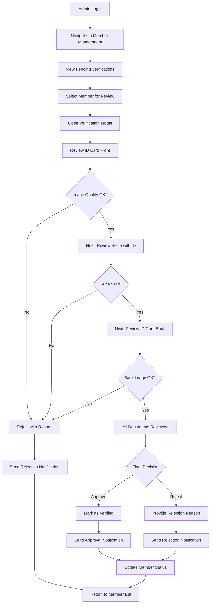
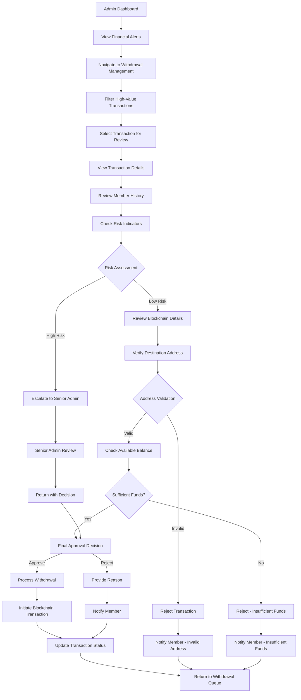
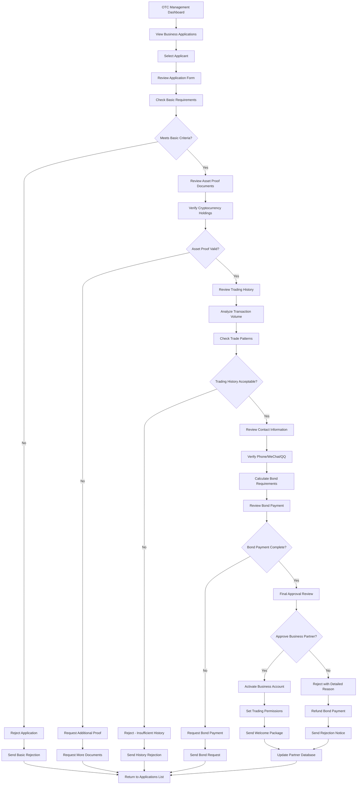
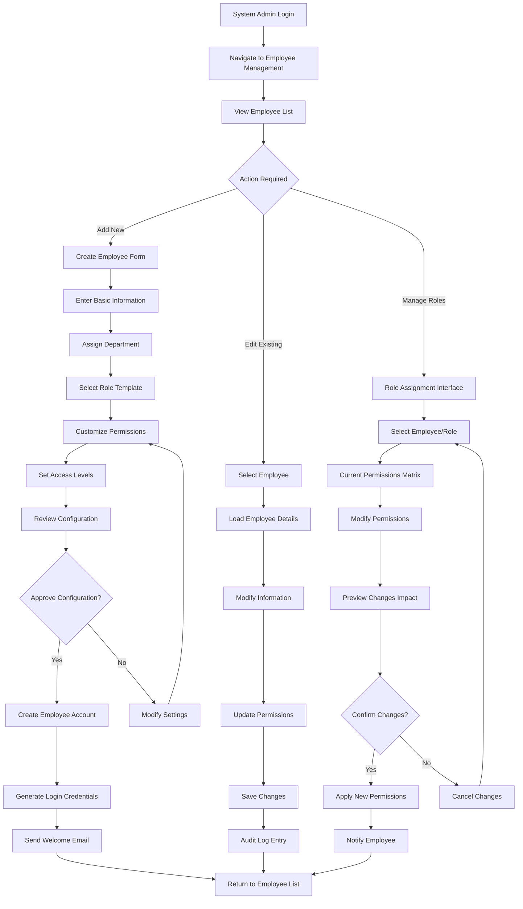
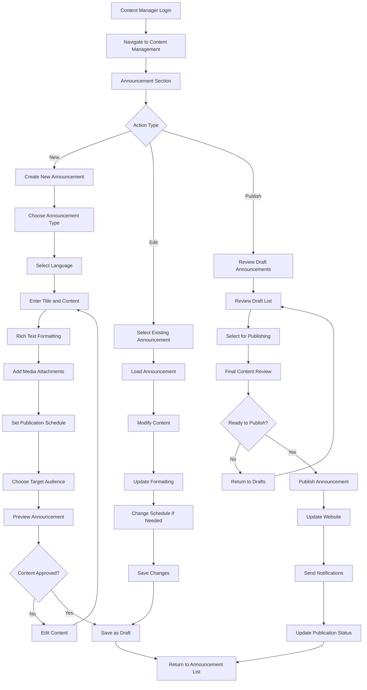
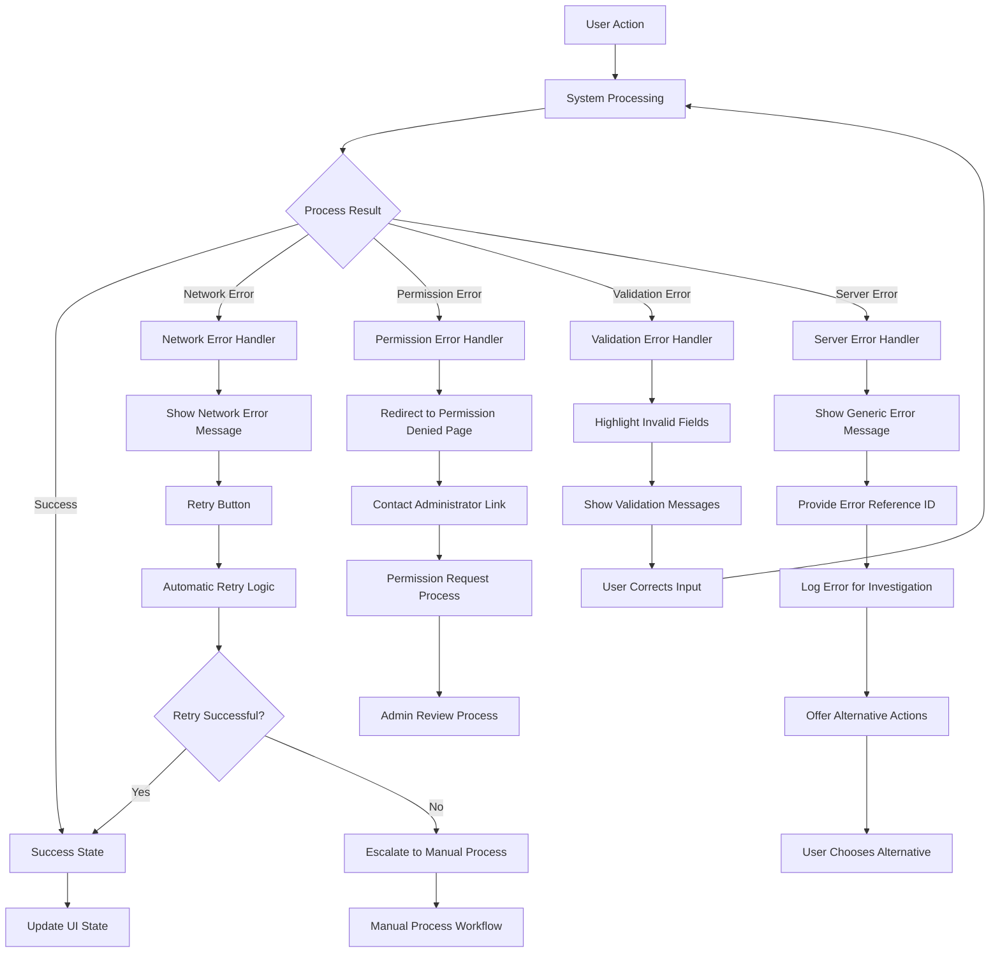

# Admin Portal User Flow Diagrams

This document illustrates the key user flows in the Bizzan Admin Portal.

## User Flow: Member Identity Verification

### Flow Description

**Entry Points:**
- Dashboard notification of pending verifications
- Direct navigation to Member Management section
- Bulk verification workflow from member list

**User Decisions:**
- Image quality assessment at each step
- Final approval/rejection decision
- Reason selection for rejections

**System Responses:**
- Real-time status updates
- Automated notification sending
- Database record updates
- UI state refresh

**Exit Points:**
- Return to member list with updated status
- Navigation to next pending verification
- Dashboard update with verification statistics

## User Flow: Financial Transaction Approval

### Flow Description

**Entry Points:**
- Financial dashboard alerts
- Scheduled review of pending withdrawals
- High-value transaction notifications

**Decision Points:**
- Risk level assessment based on amount and user history
- Address validation against blockchain standards
- Balance verification
- Senior admin escalation for high-risk transactions

**System Integration:**
- Real-time balance checking
- Blockchain address validation
- Transaction status tracking
- Automated notification system

## User Flow: OTC Business Partner Verification

### Flow Description

**Multi-Stage Process:**
1. Application form review
2. Asset proof verification  
3. Trading history analysis
4. Contact verification
5. Bond payment processing
6. Final approval decision

**Complex Decision Points:**
- Multi-criteria evaluation at each stage
- Document authenticity verification
- Financial capability assessment
- Risk evaluation based on trading patterns

**Integration Points:**
- Payment processing system for bonds
- Contact verification services
- Trading history database queries
- Notification system for status updates

## User Flow: System Administration - Employee Management

### Flow Description

**Employee Lifecycle Management:**
- New employee onboarding with role assignment
- Existing employee information updates
- Permission modifications and role changes
- Employee deactivation and access revocation

**Permission Management:**
- Role-based access control configuration
- Custom permission matrix setup
- Impact analysis before permission changes
- Audit trail maintenance

## User Flow: Content Management - Announcement Publishing

### Flow Description

**Content Creation Workflow:**
- Multi-language content support
- Rich text editing with media integration
- Scheduled publishing capabilities
- Target audience selection

**Publishing Process:**
- Draft review and approval
- Scheduled or immediate publication
- Multi-channel notification distribution
- Status tracking and analytics

## Critical Path Analysis

### Most Critical User Flows (Business Impact Priority)

1. **Member Identity Verification (Critical)**
   - **Business Impact:** Regulatory compliance, user onboarding
   - **Frequency:** High (100-500 daily)
   - **Complexity:** Medium
   - **Failure Impact:** Regulatory violations, user complaints

2. **Financial Transaction Approval (Critical)**
   - **Business Impact:** Financial security, user trust
   - **Frequency:** Very High (1000+ daily)
   - **Complexity:** High
   - **Failure Impact:** Financial losses, security breaches

3. **OTC Business Partner Verification (Important)**
   - **Business Impact:** Trading volume, partner network growth
   - **Frequency:** Medium (10-50 weekly)
   - **Complexity:** Very High
   - **Failure Impact:** Reduced trading volume, partner dissatisfaction

4. **System Administration (Important)**
   - **Business Impact:** Operational efficiency, security
   - **Frequency:** Low (daily maintenance)
   - **Complexity:** Medium
   - **Failure Impact:** Operational disruption, security vulnerabilities

5. **Content Management (Moderate)**
   - **Business Impact:** User communication, marketing
   - **Frequency:** Low (weekly updates)
   - **Complexity:** Low
   - **Failure Impact:** Communication delays, user confusion

### Performance Optimization Focus Areas

- **Member Verification:** Optimize document loading and image processing
- **Financial Approvals:** Implement batch processing for efficiency
- **Real-time Updates:** WebSocket integration for status changes
- **Mobile Responsiveness:** Emergency access from mobile devices

## Error Paths and Recovery Flows

### Common Error Scenarios

### Recovery Mechanisms

**Network Failure Recovery:**
- Automatic retry with exponential backoff
- Offline mode with local data caching
- Manual retry options with status feedback

**Permission Error Recovery:**
- Clear permission denied messages
- Contact administrator workflow
- Alternative action suggestions

**Validation Error Recovery:**
- Field-level error highlighting
- Real-time validation feedback
- Auto-correction suggestions where possible

**Server Error Recovery:**
- User-friendly error messages
- Error reference IDs for support
- Alternative workflow options
- Graceful degradation of features
