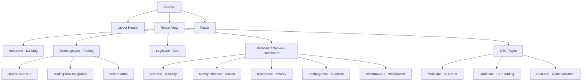
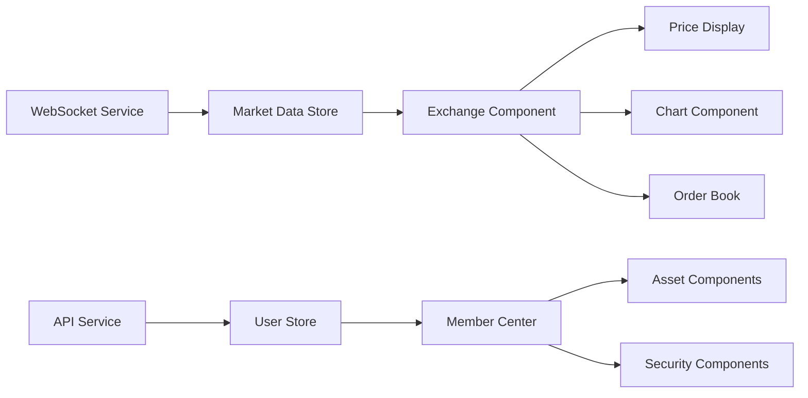

# Web Frontend Component Architecture

This document describes the core UI components of the Web Frontend (Bizzan Exchange) and their relationships.

## Core Components

### 1. App.vue (Root Application Shell)

The main application component that provides the overall layout structure, navigation system, and routing container. It handles global state initialization, user authentication status, and responsive behavior across different device types.

```vue
<template>
  <div class="page-view">
    <div class="layout">
      <div class="layout-ceiling">
        <!-- Navigation Header -->
        <!-- User Authentication/Profile -->
        <!-- Language Selection -->
        <!-- Mobile Menu Toggle -->
      </div>
    </div>
    <router-view v-if="isRouterAlive"></router-view>
    <div class="footer">
      <!-- Global Footer -->
    </div>
  </div>
</template>

<script>
export default {
  data() {
    return {
      isRouterAlive: true,
      navDrawerModal: false
    }
  },
  computed: {
    isLogin: function() {
      return this.$store.getters.isLogin;
    }
  }
}
</script>
```

**Key Responsibilities:**
- Global navigation and routing
- User authentication state management
- Language switching functionality
- Mobile responsive menu system
- Footer with social media links and resources

### 2. Exchange.vue (Trading Interface)

The core trading component that provides real-time cryptocurrency trading functionality, including market data display, order placement, portfolio management, and advanced charting integration.

```vue
<template>
  <div class="container exchange">
    <div class="main">
      <div class="right">
        <!-- Cryptocurrency pair selection -->
      </div>
      <div class="center">
        <!-- Price display and charts -->
        <!-- TradingView integration -->
        <!-- Trading forms -->
      </div>
      <div class="left">
        <!-- Order book and trade history -->
      </div>
    </div>
  </div>
</template>

<script>
export default {
  data() {
    return {
      currentCoin: {},
      orderForm: {},
      marketData: []
    }
  },
  mounted() {
    this.initializeWebSocket();
    this.loadTradingViewChart();
  }
}
</script>
```

**Key Responsibilities:**
- Real-time market data visualization
- Trading order placement and management
- Price charts and technical analysis tools
- WebSocket connection management
- Portfolio and balance display

### 3. Login.vue (Authentication)

Handles user authentication with support for multiple countries, phone number validation, and security features. Provides the entry point for user access to the platform.

```vue
<template>
  <div class="login_form">
    <div class="login_right">
      <Form :model="formInline" :rules="ruleInline">
        <!-- Country code selection -->
        <!-- User credential inputs -->
        <!-- Security validation -->
        <!-- Registration link -->
      </Form>
    </div>
  </div>
</template>

<script>
export default {
  data() {
    return {
      formInline: {
        user: '',
        password: ''
      },
      country: '+86'
    }
  }
}
</script>
```

**Key Responsibilities:**
- User authentication and session management
- International phone number support
- Form validation and security checks
- Navigation to user dashboard post-login

### 4. Index.vue (Landing Page)

The main landing page component that showcases platform features, market highlights, and promotional content. Serves as the primary marketing and information hub for new users.

```vue
<template>
  <div id="fullpage">
    <!-- Banner section with promotional content -->
    <!-- Getting started guide -->
    <!-- Feature highlights -->
    <!-- Market data overview -->
    <!-- News and announcements -->
  </div>
</template>

<script>
export default {
  data() {
    return {
      picList: [],
      FAQList: [],
      marketData: []
    }
  },
  mounted() {
    this.loadPromotionalContent();
    this.loadMarketOverview();
  }
}
</script>
```

**Key Responsibilities:**
- Marketing content presentation
- Platform feature introduction
- Market data overview display
- User onboarding guidance

### 5. MemberCenter.vue (User Dashboard)

Central hub for user account management, providing access to all user-related functionality including security settings, asset management, trading history, and profile configuration.

```vue
<template>
  <div class="user_center">
    <div class="layout_menu_left">
      <!-- Navigation sidebar -->
    </div>
    <div class="layout_menu_right">
      <router-view></router-view>
    </div>
  </div>
</template>

<script>
export default {
  data() {
    return {
      activeMenuItem: 'safe'
    }
  },
  computed: {
    userInfo() {
      return this.$store.getters.member;
    }
  }
}
</script>
```

**Key Responsibilities:**
- User account navigation
- Profile and security management
- Asset and transaction oversight
- Nested routing for user features

### 6. DepthGraph.vue (Market Depth Visualization)

Specialized component for displaying market depth data with interactive visualization, showing buy and sell order distributions in real-time.

```vue
<template>
  <div class="depth-graph">
    <canvas ref="depthCanvas"></canvas>
  </div>
</template>

<script>
export default {
  props: {
    depthData: {
      type: Object,
      required: true
    }
  },
  watch: {
    depthData: {
      handler: 'redrawChart',
      deep: true
    }
  }
}
</script>
```

**Key Responsibilities:**
- Market depth data visualization
- Interactive chart rendering
- Real-time data updates
- Trading decision support

## Component Hierarchy



## Shared Components

### 1. Navigation Components

**Header Navigation:** Consistent navigation bar used across all authenticated pages with dropdown menus, language selection, and user profile access.

**Mobile Menu:** Responsive navigation drawer for mobile devices with touch-friendly interface and condensed menu structure.

### 2. Form Components

**Input Wrappers:** Standardized form inputs with validation, error display, and consistent styling across all forms.

**Country Selection:** Reusable dropdown component for international phone number support with country codes and flags.

### 3. Data Display Components

**Price Display:** Formatted price components with color-coded change indicators (green for increases, red for decreases).

**Table Components:** Enhanced iView tables with custom styling, sorting, and filtering for various data types (orders, transactions, assets).

### 4. User Center Sub-Components

Located in `src/components/uc/`, these components handle specific user account management functions:

- **Safe.vue** - Security settings and two-factor authentication
- **Account.vue** - Profile information and personal details
- **MoneyIndex.vue** - Asset overview and portfolio summary
- **Record.vue** - Transaction history and activity logs
- **Recharge.vue** - Cryptocurrency deposit functionality
- **Withdraw.vue** - Asset withdrawal with security confirmations
- **EntrustCurrent.vue** - Active trading orders management
- **EntrustHistory.vue** - Historical trading records

## Composition Patterns

### 1. Route-Based Composition

The application uses Vue Router for lazy-loaded components, improving initial load performance through code splitting:

```javascript
{
  path: '/exchange',
  component: resolve => (require(["../pages/exchange/exchange"], resolve))
}
```

### 2. Nested Routing Pattern

Complex features like the user center use nested routing to maintain URL structure while sharing layout components:

```javascript
{
  path: '/uc',
  component: MemberCenter,
  children: [
    { path: 'safe', component: Safe },
    { path: 'money', component: MoneyIndex }
  ]
}
```

### 3. Mixin Pattern for Shared Logic

Common functionality is shared across components using Vue mixins for authentication checks, API calling patterns, and data formatting.

### 4. Event Bus Communication

Components communicate through the global event bus pattern for cross-component communication, particularly for real-time market data updates.

## State Management

### Component-Level State

- **Local Data:** Form inputs, UI state (modals, tabs, loading states)
- **Computed Properties:** Derived state from store data and local state
- **Watchers:** Reactive updates to external changes (WebSocket data, route changes)

### Global State Integration

Components integrate with Vuex store for:
- User authentication and profile data
- Application-wide settings (language, theme)
- Market data and trading information
- Navigation state and active sections

### Props and Events

- **Props Down:** Parent components pass configuration and data to children
- **Events Up:** Child components emit events for parent handling
- **Provide/Inject:** Root components provide services to deeply nested components

### Real-Time Data Flow



Components subscribe to real-time data through:
1. WebSocket connections managed at the application level
2. Store mutations triggered by incoming data
3. Component reactivity through computed properties and watchers
4. Automatic UI updates through Vue's reactivity system

The architecture emphasizes separation of concerns with clear data flow patterns, making the application maintainable and scalable for the complex requirements of a cryptocurrency trading platform.
