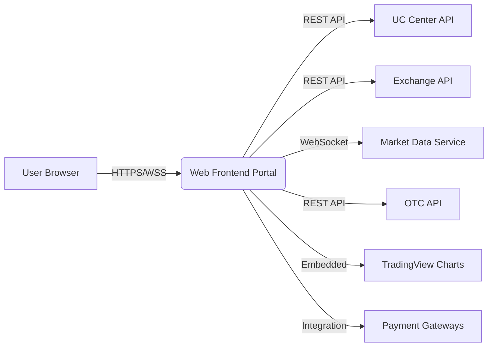
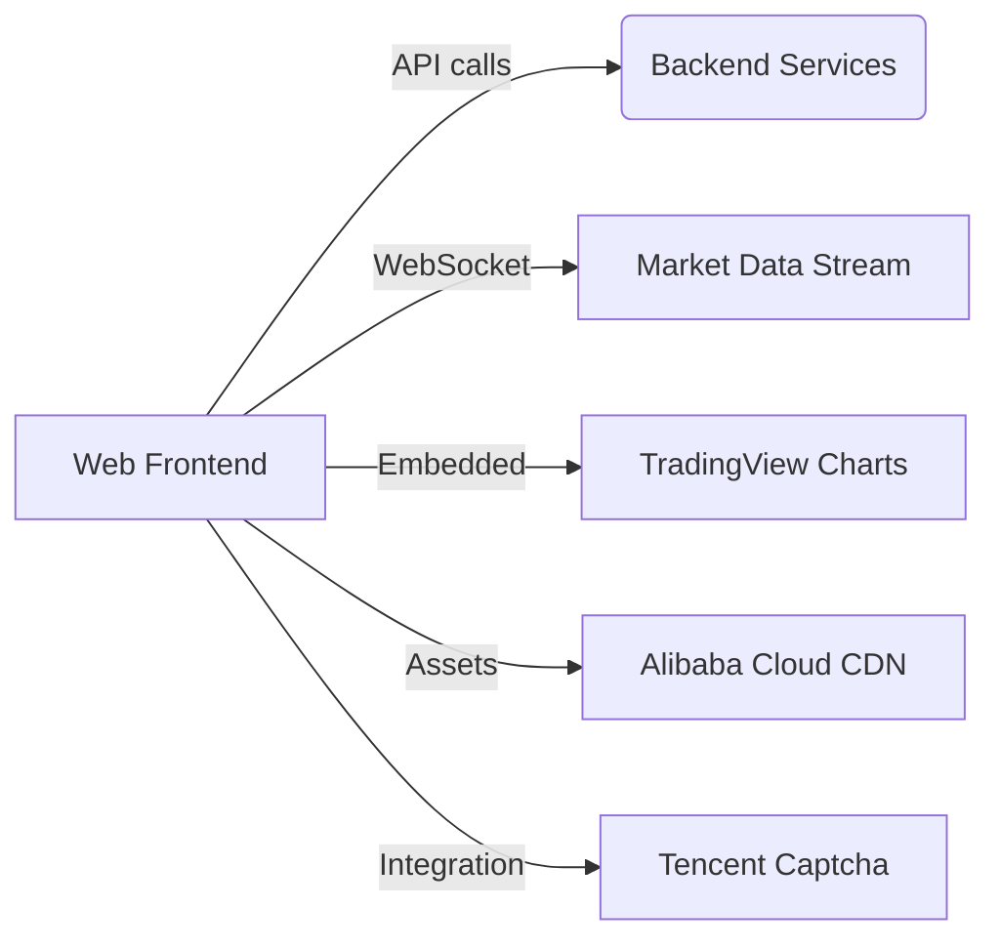
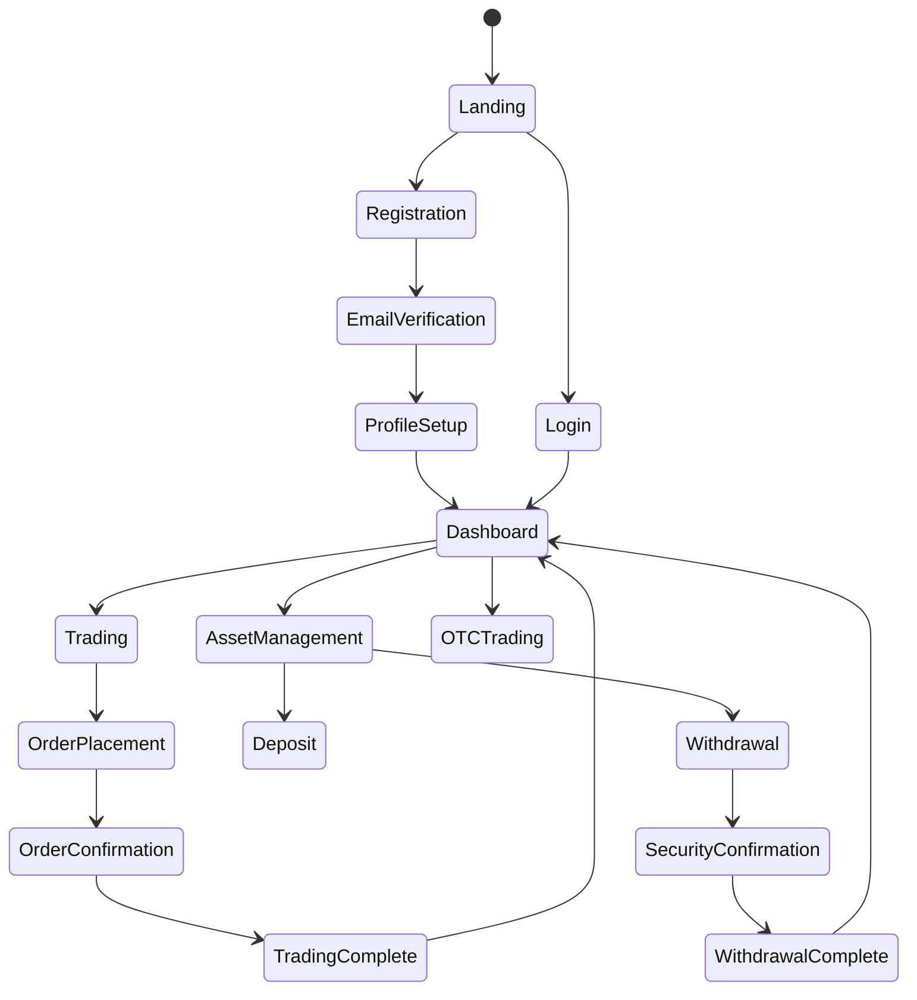

# Web Frontend Technical Overview

---

# Business Overview

## What It Is

The Web Frontend portal (05_Web_Front) is a cryptocurrency exchange trading platform built with Vue.js that enables users to trade digital currencies, manage their assets, and participate in various crypto-related activities. This is the main customer-facing web application for the Bizzan cryptocurrency exchange platform, providing a comprehensive trading experience with real-time market data, secure user authentication, and multi-language support.

The portal serves as the primary interface for retail crypto traders and investors, offering both spot trading (币币交易) and OTC (Over-The-Counter) trading capabilities, along with innovative features like mining activities, referral programs, and educational resources.

## User Personas

### Primary Trader
- **Goals**: Execute cryptocurrency trades efficiently, monitor portfolio performance, access real-time market data
- **Needs**: Advanced trading interface, depth charts, order management, portfolio tracking
- **Pain Points**: Market volatility awareness, execution speed, complex trading interfaces

### Casual Investor  
- **Goals**: Buy and hold cryptocurrencies, understand market trends, secure asset storage
- **Needs**: Simple buy/sell interface, educational resources, secure wallet management
- **Pain Points**: Complexity of crypto trading, security concerns, lack of knowledge

### OTC Trader
- **Goals**: Large volume trades, better pricing, private transactions
- **Needs**: P2P trading interface, identity verification, secure chat system
- **Pain Points**: Finding reliable counterparties, price negotiations, transaction security

### International Users
- **Goals**: Access platform regardless of location, trade in familiar language
- **Needs**: Multi-language support, regional compliance, localized payment methods
- **Pain Points**: Language barriers, regulatory restrictions, currency conversions

## User Journeys and Workflows

### New User Onboarding
1. Landing page discovery → Registration → Identity verification → First deposit → Educational content consumption → First trade execution

### Active Trading Session
1. Login → Market analysis (charts/news) → Order placement → Portfolio monitoring → Order management → Session completion

### Asset Management
1. Login → Wallet overview → Deposit/withdrawal operations → Transaction history review → Security settings management

### OTC Trading Flow
1. Browse OTC advertisements → Select counterparty → Initiate trade → Payment confirmation → Asset transfer → Rating/feedback

## Component Boundaries

The Web Frontend portal serves as the presentation layer of the cryptocurrency exchange system, integrating with multiple backend services while providing a unified user experience.

**External Boundaries:**
- **Users**: Retail traders, institutional clients, OTC participants
- **Backend APIs**: User center API, Exchange API, Market data API, OTC API
- **Third-party Services**: TradingView charts, payment gateways, notification services
- **Mobile Apps**: Shares backend services but maintains separate UI layer

**Internal Boundaries:**
- **Core Trading Interface**: Real-time market data, order placement, portfolio management
- **User Management**: Authentication, profile management, security settings
- **Asset Operations**: Deposits, withdrawals, transaction history
- **Educational Content**: Help center, guides, announcements

> **Pointers for UI Testing:**
> 
> - Focus on real-time data synchronization between WebSocket connections and UI updates
> - Test responsive design across different screen sizes and mobile devices
> - Verify multi-language switching maintains state and functionality
> - Validate trading operations under high-frequency market data updates

### Frontend Interfaces

#### UI Components and Views

- **Core Screens:** 
  - Landing page with market overview and promotional content
  - Trading interface with advanced charting and order management
  - User center with asset management and security settings
  - OTC trading marketplace with P2P transaction support
  - Help center with educational resources and support documentation

- **Navigation Structure:** 
  - Top navigation bar with main sections (Trading, OTC, Innovation Lab, Announcements)
  - User dropdown menu for account management when authenticated
  - Mobile hamburger menu with full navigation hierarchy
  - Breadcrumb navigation in nested sections like help center

- **Responsive Design:** 
  - Desktop-first approach with breakpoints at 768px for mobile
  - Mobile users redirected to simplified registration flow (/reg)
  - Trading interface optimized for desktop with mobile warnings
  - Footer and complex features hidden on mobile for cleaner experience

- **Accessibility:** 
  - Basic keyboard navigation support
  - Limited WCAG compliance (appears to be AA level in some areas)
  - Color contrast considerations for dark theme
  - Icon fonts with fallback text

#### User Interaction Patterns

- **Primary Actions:** 
  - Trade execution (buy/sell orders with various types)
  - Asset deposits and withdrawals
  - Account security management (2FA, password changes)
  - OTC advertisement creation and trading
  - Referral program participation

- **Form Patterns:** 
  - Real-time validation with immediate feedback
  - Multi-step processes for complex operations (KYC, withdrawals)
  - Auto-formatting for numeric inputs (prices, quantities)
  - Country code selection for phone number inputs

- **Feedback Mechanisms:** 
  - Toast notifications using iView Message component
  - Loading states with custom spinning indicators
  - Progressive disclosure for complex trading features
  - Real-time price updates with color-coded changes (green/red)

- **Error Handling:** 
  - Modal dialogs for critical errors
  - Inline validation messages for form errors
  - Network error detection with retry mechanisms
  - Graceful degradation when WebSocket connections fail

#### Visual Design

- **Design System:** 
  - Built on iView UI framework 3.1.0 with extensive customizations
  - Dark theme as primary color scheme (#0b1520 background)
  - Custom component library extending iView components
  - Consistent spacing and typography system

- **Themes:** 
  - Primary dark theme for main application
  - Exchange interface has separate day/night skin options
  - Mobile registration uses alternate lighter theme
  - Color-coded states (success: green, danger: red, warning: orange)

- **Visual Hierarchy:** 
  - Price information prominently displayed with large typography
  - Critical actions (trade buttons) highlighted with brand colors
  - Secondary information presented with muted colors
  - Clear separation between content areas using borders and backgrounds

### External Dependencies

#### API Dependencies

- **Backend Services:** 
  - User Center API (/uc/*) - Authentication, profile management, asset operations
  - Exchange API (/exchange/*) - Trading operations, order management
  - Market API (/market/*) - Real-time price data, historical charts
  - OTC API (/otc/*) - P2P trading, advertisement management

- **Authentication:** 
  - Token-based authentication with x-auth-token header
  - Session persistence using localStorage
  - Automatic token refresh on API responses
  - Logout on token expiration (codes 4000, 3000)

- **API Integration Patterns:** 
  - Direct API calls to backend services
  - RESTful HTTP requests using Vue Resource
  - WebSocket connections for real-time market data
  - Request interceptors for authentication and error handling

- **Failure Handling:** 
  - Automatic retry mechanisms for failed requests
  - Graceful degradation when APIs are unavailable
  - User notification of service interruptions
  - Offline state management for critical operations

#### Third-party Integrations

- **External Libraries:** 
  - TradingView Charting Library for advanced trading charts
  - Swiper.js for image carousels and content sliders
  - jQuery for DOM manipulation and utilities
  - Moment.js for date/time formatting

- **Analytics Tools:** 
  - Integration points prepared for Google Analytics
  - Custom event tracking for user actions
  - Performance monitoring capabilities
  - Error tracking integration points

- **External Widgets:** 
  - TradingView charts embedded in trading interface
  - QR code generators for wallet addresses and payments
  - Social media integration widgets in footer
  - Third-party captcha service (Tencent Captcha)

#### Asset Dependencies

- **CDN Usage:** 
  - Assets hosted on Alibaba Cloud OSS (oss-cn-hangzhou.aliyuncs.com)
  - Local asset fallbacks for critical resources
  - Image optimization and compression
  - Font and icon loading from local sources

- **Media Sources:** 
  - Promotional images and banners from CDN
  - Cryptocurrency icons and logos
  - User-uploaded content (profile pictures, documents)
  - Marketing materials and educational content

- **Font Services:** 
  - Custom icon fonts (iconfont.css)
  - Web-safe font fallbacks
  - Multi-language font support (Chinese/English)
  - Icon libraries for UI components

## UI Business Logic

### Form Validation and Processing

- **Client-side Validation:** 
  - Real-time input validation with immediate feedback
  - Email format validation for user registration
  - Password strength requirements and confirmation matching
  - Phone number format validation with country code support
  - Trading amount validation against available balances
  - Price validation within market range limits

- **Multi-step Processes:** 
  - User registration flow with progressive disclosure
  - KYC (Know Your Customer) verification with document upload
  - Withdrawal process with security confirmations
  - OTC trade execution with escrow management
  - Complex trading order placement with confirmation steps

### State Management

- **Global State:** 
  - User authentication and profile information
  - Active navigation state and current page context
  - Language preference and internationalization settings
  - Exchange skin/theme preferences
  - Real-time market data and price updates

- **Caching Strategy:** 
  - LocalStorage for user preferences and authentication tokens
  - Session-based caching for market data
  - Component-level caching for frequently accessed data
  - Automatic cache invalidation on data updates

### UI Workflows

- **Conditional Flows:** 
  - Different registration paths for desktop vs mobile users
  - Trading interface access restricted to authenticated users
  - Feature availability based on user verification status
  - Region-specific functionality and compliance requirements
  - Payment method options based on user location

- **Process Visualization:** 
  - Trading order status with visual progress indicators
  - Multi-step form completion with progress bars
  - Real-time trading execution feedback
  - Asset transfer status tracking with confirmations

> **Tip:** The application uses extensive localStorage persistence to maintain user state across sessions, particularly for authentication tokens and user preferences.

---

# Technical Overview

## Implementation Summary

This is a Vue.js 2.5.2 single-page application (SPA) that implements a comprehensive cryptocurrency exchange frontend. The application uses iView 3.1.0 as the primary UI component library, Vuex for centralized state management, and Vue Router for client-side routing. The build system is based on Webpack 3.x with extensive customizations for asset optimization and development workflow. The application supports real-time trading through WebSocket connections, multi-language internationalization, and responsive design for mobile compatibility.

## Implementation Technologies

### Core Technologies

- **Framework/Library:** Vue.js 2.5.2 - Progressive JavaScript framework for building user interfaces
- **Language:** JavaScript ES6+ with Babel transpilation for browser compatibility
- **State Management:** Vuex 3.0.1 - Centralized state management pattern and library for Vue.js
- **Routing:** Vue Router 3.0.1 - Official router for Vue.js with history mode enabled

### UI Component Libraries

- **Component Framework:** iView 3.1.0 - High-quality Vue.js UI component library based on Ant Design
- **Chart/Visualization:** TradingView Charting Library - Advanced financial charting with real-time data
- **Form Handling:** Built-in Vue.js reactive forms with iView form components and validation
- **Icon System:** Custom icon fonts (iconfont) with FontAwesome-style usage patterns

### Build and Development Tools

- **Build System:** Webpack 3.10.0 with custom configuration for Vue.js optimization
- **Package Manager:** npm - Node Package Manager for dependency management
- **Testing Framework:** Jest 21.2.0 with Vue Test Utils for unit testing (configured but limited coverage)
- **Linting:** ESLint 3.19.0 with Vue.js specific rules and Standard.js configuration

## Local Runtime Environment

### Environment Setup

1. **Node.js Requirements:** Node.js >= 4.0.0 and npm >= 3.0.0 (as specified in package.json engines)
2. **Clone Repository:** Download the 05_Web_Front directory from the project repository
3. **Install Dependencies:** Run `npm install` to install all required packages and dependencies
4. **Environment Configuration:** Configure API endpoints in main.js (currently set to placeholder URLs)

### Commands/Scripts

- **Development Server:** `npm run dev` or `npm start` - Starts webpack-dev-server with hot module replacement
- **Production Build:** `npm run build` - Creates optimized production build in dist/ directory
- **Unit Tests:** `npm run unit` - Executes Jest unit tests with coverage reporting
- **E2E Tests:** `npm run e2e` - Runs end-to-end tests using Nightwatch.js framework
- **Linting:** `npm run lint` - Checks code quality using ESLint for .js and .vue files
- **Full Test Suite:** `npm test` - Runs both unit tests and end-to-end tests sequentially

### Environment Variables

- **NODE_ENV:** Set to 'development' for dev server or 'production' for builds
- **API Endpoints:** Configured in main.js as Vue prototype properties:
  - `Vue.prototype.rootHost` - Main website URL (currently placeholder)
  - `Vue.prototype.host` - API base URL (currently placeholder)
- **Build Configuration:** Managed through config/index.js with separate dev and prod settings

### Mocking Backend

- **JSON Server:** Included as dependency (json-server 0.12.1) for API mocking during development
- **API Integration:** All API calls defined in src/config/api.js for easy endpoint management
- **WebSocket Simulation:** Can be configured to use mock WebSocket server for market data testing
- **Local Development:** API endpoints should be updated to point to local backend services

## Deployment

### Deployment Targets

- **Static Hosting:** Application builds to static files suitable for CDN or web server hosting
- **Traditional Web Server:** Can be deployed to Apache, Nginx, or similar web servers
- **CDN Distribution:** Optimized for content delivery networks with asset fingerprinting
- **Container Deployment:** Docker-compatible static file serving setup

### CI/CD Pipelines

- **Build Process:** Automated builds create production-optimized bundles with minification
- **Asset Optimization:** Images, CSS, and JavaScript automatically optimized and compressed
- **Cache Busting:** Filenames include content hashes for effective browser cache management
- **Environment Promotion:** Separate build configurations for staging and production environments

### Environment Configuration

- **Configuration Management:** Build-time environment variable injection through webpack
- **API Endpoint Configuration:** Environment-specific API URLs configured during build process
- **Feature Flags:** Can be implemented through build-time variable replacement
- **Asset Path Configuration:** Configurable public paths for different deployment scenarios

### Build Artifacts

- **Optimized Bundles:** JavaScript and CSS files with minification and compression
- **Asset Optimization:** Images compressed and fonts optimized for web delivery
- **Source Maps:** Generated for production debugging (can be disabled for security)
- **Static Files:** All resources bundled into deployable static file structure

## Operability

### Logging and Monitoring

- **Client-side Logging:** Console-based logging with development/production differentiation
- **Error Tracking:** Integration points available for services like Sentry or Bugsnag
- **User Analytics:** Prepared integration points for Google Analytics or similar services
- **Performance Monitoring:** Built-in Vue.js performance devtools integration for development

### Configuration Management

- **Feature Flags:** Implemented through localStorage settings and component-level toggles
- **Environment-specific Settings:** Managed through webpack build-time variable injection
- **User Preferences:** Stored in localStorage including language, theme, and interface settings
- **Runtime Configuration:** Some features configurable through component props and global settings

### Performance Optimization

- **Bundling Strategy:** Code splitting implemented for lazy-loaded routes and components
- **Lazy Loading:** Route-based code splitting for improved initial load performance
- **Asset Optimization:** Images optimized, CSS and JS minified, unused code eliminated
- **Caching Strategy:** Aggressive browser caching with cache-busting for updated assets

### Browser Compatibility

- **Supported Browsers:** "> 1%, last 2 versions, not ie <= 8" (from browserslist configuration)
- **Polyfills:** Babel Polyfill included for ES6+ feature compatibility in older browsers
- **Responsive Breakpoints:** Primary breakpoint at 768px for mobile/desktop differentiation
- **Progressive Enhancement:** Basic functionality maintained across all supported browsers

## Repository Structure

### Folder Structure

- **src/** - Main application source code
  - **assets/** - Static assets (images, fonts, styles, JavaScript libraries)
    - **images/** - UI images, logos, promotional content
    - **js/** - Third-party libraries and utility scripts
    - **lang/** - Internationalization files (zh.js, en.js)
    - **css/** - Global stylesheets and theme files
  - **components/** - Reusable Vue.js components
    - **cms/** - Content management system components
    - **exchange/** - Trading interface components
    - **otc/** - Over-the-counter trading components
    - **uc/** - User center components
  - **pages/** - Page-level Vue.js components
    - **index/** - Landing page components
    - **exchange/** - Main trading interface
    - **uc/** - User authentication and profile pages
    - **otc/** - OTC trading pages
    - **cms/** - Content pages (help, announcements)
  - **config/** - Application configuration
    - **api.js** - API endpoint definitions
    - **routes.js** - Vue Router configuration
    - **store.js** - Vuex store configuration

### Key Components

- **App.vue** - Root application component with navigation and footer
- **Exchange.vue** - Main trading interface with real-time market data
- **Login.vue** - User authentication component
- **MemberCenter.vue** - User dashboard and settings hub
- **DepthGraph.vue** - Trading depth visualization component

### Shared Resources

- **Utilities** - Global filters for formatting (dates, numbers, percentages)
- **API Layer** - Centralized HTTP client configuration and interceptors
- **State Management** - Shared Vuex modules for authentication and application state
- **i18n System** - Multi-language support with lazy-loaded translation files

### Testing Organization

- **test/unit/** - Jest unit test specifications
- **test/e2e/** - Nightwatch.js end-to-end test scenarios
- **Limited Coverage** - Current test implementation appears minimal and needs expansion

---
