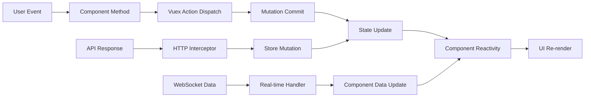

# Web Frontend State Management

This document describes the state management approach used in the Bizzan Exchange Web Frontend.

## State Management Architecture

The application uses **Vuex** as the primary state management pattern and library, providing a centralized store for all components with predictable state mutations. The architecture follows a unidirectional data flow pattern where components dispatch actions, which commit mutations to update the state, and components reactively update through computed properties and watchers.

**Key Principles:**
- Single source of truth through centralized store
- State mutations only through committed actions
- Predictable state changes with time-travel debugging
- Component reactivity through Vue's observation system

## Global State

### Store Structure

```js
// Vuex Store Configuration (src/config/store.js)
const store = {
  state: {
    member: null,           // User authentication and profile data
    activeNav: '',          // Current navigation state
    lang: '',              // Selected language preference
    exchangeSkin: 'night', // Trading interface theme
    loginTimes: null       // Login attempt tracking for security
  },
  mutations: {
    // State mutation methods
  },
  getters: {
    // Computed state accessors
  }
}
```

### State Properties Detail

**User Authentication State:**
- `member` - Complete user profile object with authentication status
- `loginTimes` - Security tracking for login attempts and fraud detection

**UI State Management:**
- `activeNav` - Currently active navigation item for visual feedback
- `lang` - Language preference ('简体中文' or 'English')
- `exchangeSkin` - Trading interface appearance ('night' or 'day')

**Persistence Strategy:**
- All critical state persists to localStorage for session continuity
- Automatic state recovery on application initialization
- Secure token storage with automatic cleanup on logout

### Key Actions and Reducers

#### Navigation Management
```js
mutations: {
  navigate(state, nav) {
    state.activeNav = nav;
  }
}
```
**Purpose:** Controls active navigation highlighting across the application

#### User Authentication
```js
mutations: {
  setMember(state, member) {
    state.member = member;
    localStorage.setItem('MEMBER', JSON.stringify(member));
  },
  recoveryMember(state) {
    state.member = JSON.parse(localStorage.getItem('MEMBER'));
  }
}
```
**Purpose:** Manages user session persistence and authentication state

#### Language Management
```js
mutations: {
  setlang(state, lang) {
    state.lang = lang;
    localStorage.setItem('LANGUAGE', JSON.stringify(lang));
  },
  initLang(state) {
    if (localStorage.getItem('LANGUAGE') == null) {
      state.lang = "简体中文";
    } else {
      state.lang = JSON.parse(localStorage.getItem('LANGUAGE'));
    }
  }
}
```
**Purpose:** Handles internationalization and language switching with persistence

#### Security Tracking
```js
mutations: {
  setLoginTimes(state, times) {
    state.loginTimes = times;
    localStorage.setItem('LOGINTIMES', JSON.stringify(times));
  },
  initLoginTimes(state) {
    if(localStorage.getItem("LOGINTIMES") == null) {
      state.loginTimes = 0;
    } else {
      state.loginTimes = JSON.parse(localStorage.getItem('LOGINTIMES'));
    }
  }
}
```
**Purpose:** Tracks login attempts for security monitoring and fraud prevention

## Local Component State

### Form State Management
Components manage local form state through Vue's reactive data properties:

```js
data() {
  return {
    formInline: {
      user: '',
      password: ''
    },
    ruleInline: {
      user: [{ required: true, message: 'Please enter username' }],
      password: [{ required: true, message: 'Please enter password' }]
    }
  }
}
```

### UI Component State
Local UI state for component-specific functionality:
- Modal visibility states
- Loading indicators
- Form validation errors
- Temporary data before submission
- Component-specific filters and sorting

### Real-time Data Management
Trading components maintain local state for:
- Market data buffers
- WebSocket connection status
- Order form inputs
- Chart display preferences
- Real-time price updates

## Data Flow

The application follows a unidirectional data flow pattern with clear separation between global and local state management:



### Component to Store Communication
1. **User Interactions:** Components dispatch actions to the store
2. **API Integration:** HTTP interceptors commit mutations based on responses
3. **State Access:** Components use computed properties to access store state
4. **Reactive Updates:** Components automatically re-render on state changes

### Store to Component Communication
1. **Getters:** Computed properties access store state reactively
2. **Watchers:** Components watch store state for complex reactions
3. **Computed Properties:** Derived state updates automatically
4. **Event Handling:** Store mutations trigger component method calls

## API Integration

### HTTP Interceptor Pattern
All API calls integrate with state management through Vue Resource interceptors:

```js
Vue.http.interceptors.push((request, next) => {
  // Add authentication token from store
  request.headers.set('x-auth-token', localStorage.getItem('TOKEN'));
  
  next((response) => {
    // Handle token updates
    var xAuthToken = response.headers.get('x-auth-token');
    if (xAuthToken != null && xAuthToken != '') {
      localStorage.setItem('TOKEN', xAuthToken);
    }
    
    // Handle authentication errors
    if (response.body.code == '4000' || response.body.code == '3000') {
      store.commit('setMember', null);
      router.push('/login');
      return false;
    }
    
    return response;
  });
});
```

### API Response State Updates
- **Authentication:** Automatic token refresh and user session management
- **Error Handling:** Global error states and user notification
- **Loading States:** Component-level loading indicators during API calls
- **Data Synchronization:** Real-time updates to cached data

### WebSocket State Integration
Real-time market data integrates with local component state rather than global store for performance:

```js
// Component-level WebSocket management
mounted() {
  this.websocket = new WebSocket(this.wsUrl);
  this.websocket.onmessage = (event) => {
    const data = JSON.parse(event.data);
    this.updateMarketData(data); // Local state update
  };
}
```

## Caching Strategy

### Browser Storage Utilization
The application employs a multi-tier caching strategy:

**localStorage (Persistent):**
- User authentication tokens
- Language preferences
- Theme settings
- Login attempt tracking
- User profile information

**sessionStorage (Session-based):**
- Temporary form data
- Navigation state
- Cache invalidation markers

**Memory (Runtime):**
- Real-time market data
- WebSocket connection pools
- Component-specific caches

### Cache Invalidation Patterns
1. **Time-based:** Market data expires after configured intervals
2. **Event-based:** User actions trigger cache updates
3. **Version-based:** API version changes invalidate related caches
4. **Manual:** User-initiated cache clearing through settings

### Performance Optimization
- **Selective Updates:** Only changed data triggers reactivity
- **Batched Mutations:** Multiple state changes grouped for efficiency
- **Lazy Loading:** Store modules loaded on demand
- **Memory Management:** Automatic cleanup of unused data

### State Persistence Strategy
```js
// Initialization pattern used across the application
created: function() {
  this.$store.commit('navigate', 'nav-index');
  this.$store.commit('recoveryMember');      // Restore user session
  this.$store.commit('initLang');           // Restore language setting
  this.$store.commit('initLoginTimes');     // Restore security state
  
  this.checkLogin(); // Validate current session
}
```

### Error Recovery and Fallbacks
- **Network Failures:** Graceful degradation with cached data
- **Storage Errors:** Fallback to default states
- **State Corruption:** Automatic state reset and user notification
- **Session Expiry:** Smooth transition to login flow with state preservation

The state management architecture provides a robust foundation for the complex requirements of a cryptocurrency trading platform, ensuring data consistency, security, and optimal user experience across all application features.
