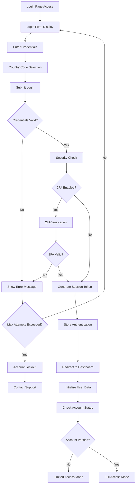
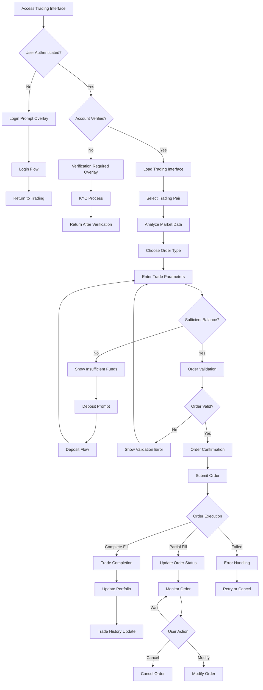
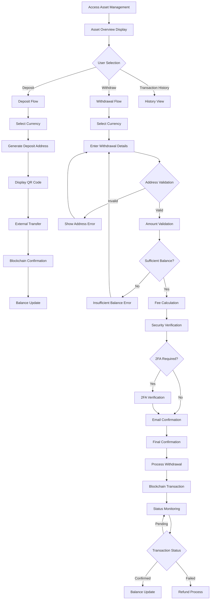
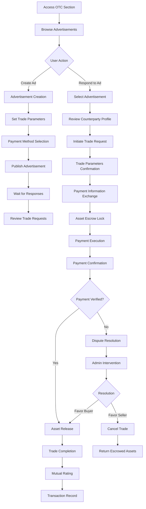
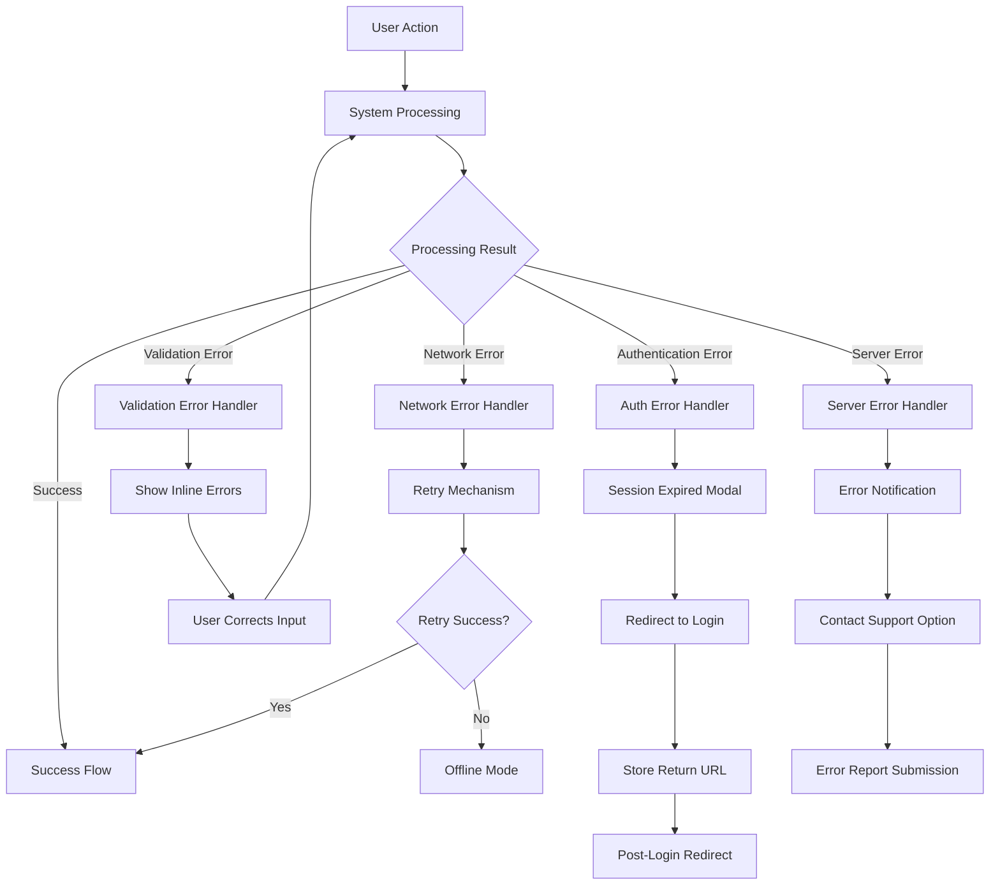

# Web Frontend User Flow Diagrams

This document illustrates the key user flows in the Bizzan Exchange Web Frontend.

## User Flow: New User Registration and Onboarding

```mermaid
flowchart TD
    A[Landing Page Visit] --> B{Device Detection}
    B -->|Desktop| C[Desktop Registration Flow]
    B -->|Mobile| D[Mobile Registration (/reg)]
    
    C --> E[Registration Form]
    E --> F{Form Validation}
    F -->|Invalid| G[Show Validation Errors]
    G --> E
    F -->|Valid| H[Country Code Selection]
    H --> I[Submit Registration]
    I --> J{Registration Success?}
    J -->|No| K[Show Error Message]
    K --> E
    J -->|Yes| L[Email Verification Sent]
    L --> M[Email Verification]
    M --> N[Account Activated]
    N --> O[Automatic Login]
    O --> P[User Dashboard]
    P --> Q[KYC Prompt]
    Q --> R{User Choice}
    R -->|Complete KYC| S[Identity Verification]
    R -->|Skip for Now| T[Basic Account Access]
    S --> U[Full Platform Access]
```

### Flow Description

**Entry Points:**
- Direct landing page access through marketing campaigns
- Referral links with invitation codes
- Organic search and social media discovery

**Key Decision Points:**
- Device type determines registration interface (desktop vs mobile)
- Form validation ensures data quality before submission
- KYC completion determines account privilege level

**Exit Points:**
- Full verification leads to trading access
- Basic account allows limited functionality
- Failed verification requires support intervention

## User Flow: Login and Authentication



### Flow Description

**Security Measures:**
- Failed login attempt tracking with progressive lockout
- Two-factor authentication integration
- Session token management and secure storage

**User Experience Considerations:**
- Clear error messaging for failed attempts
- Password reset flow integration
- Automatic redirection to intended destination

**System Responses:**
- Token-based session management
- Automatic session refresh
- Graceful handling of expired sessions

## User Flow: Cryptocurrency Trading



### Flow Description

**Prerequisites:**
- User authentication and session validation
- Account verification status check
- Sufficient account balance verification

**Trading Process:**
- Market data analysis and pair selection
- Order type selection (market, limit, stop-loss)
- Parameter validation and balance checking
- Order execution and status monitoring

**Error Handling:**
- Insufficient balance with deposit workflow
- Invalid parameters with clear error messages
- Network errors with retry mechanisms
- Order failures with alternative options

## User Flow: Asset Management (Deposit/Withdrawal)



### Flow Description

**Deposit Process:**
- Currency selection from supported assets
- Automatic address generation for deposits
- QR code display for mobile wallet scanning
- Real-time monitoring of blockchain confirmations

**Withdrawal Process:**
- Address validation to prevent loss of funds
- Balance verification and fee calculation
- Multi-factor security verification
- Blockchain transaction processing and monitoring

**Security Considerations:**
- Address whitelist checking
- Two-factor authentication requirements
- Email confirmation for large withdrawals
- Transaction limits and daily caps

## User Flow: OTC (Over-The-Counter) Trading



### Flow Description

**Advertisement Creation:**
- Trade parameter setup (amount, price, payment methods)
- Publication and visibility management
- Response monitoring and counterparty selection

**Trade Execution:**
- Counterparty verification and profile review
- Secure payment information exchange
- Automated escrow system for asset protection
- Real-time communication through integrated chat

**Dispute Resolution:**
- Automated evidence collection
- Admin intervention and manual review
- Fair resolution based on transaction evidence
- Rating system to maintain platform integrity

## Critical Path Analysis

### Most Critical User Flows

1. **User Registration (High Impact, High Frequency)**
   - Directly affects user acquisition and retention
   - Any friction significantly impacts conversion rates
   - Mobile optimization critical for global reach

2. **Login Authentication (High Impact, Very High Frequency)**
   - Daily user interaction requiring optimal performance
   - Security critical - any compromise affects trust
   - Session management affects user experience

3. **Trading Execution (Highest Impact, High Frequency)**
   - Core revenue-generating functionality
   - Real-time performance requirements
   - Error handling critical for user trust

4. **Asset Deposits (High Impact, Medium Frequency)**
   - Essential for platform liquidity and user engagement
   - Security and reliability paramount
   - Blockchain integration complexity

### Performance Requirements
- **Login Flow:** < 2 seconds response time
- **Trading Interface:** < 100ms real-time data updates
- **Asset Operations:** 99.9% reliability requirement
- **Mobile Experience:** 3G network compatibility

## Error Paths and Recovery Flows

### Common Error Scenarios



### Recovery Strategies

**Network Failures:**
- Automatic retry with exponential backoff
- Offline mode with cached data display
- User notification of connectivity issues
- Queue actions for when connection restores

**Validation Errors:**
- Immediate inline feedback
- Clear error messaging with resolution steps
- Form state preservation during corrections
- Progressive disclosure of complex requirements

**Authentication Failures:**
- Graceful session expiry handling
- Preservation of user context and return paths
- Clear re-authentication flows
- Security lockout protection with recovery options

**System Errors:**
- Comprehensive error logging and reporting
- User-friendly error messages
- Support contact integration
- Alternative workflow suggestions where possible

The user flow architecture ensures optimal user experience while maintaining security and reliability standards appropriate for a cryptocurrency trading platform.
