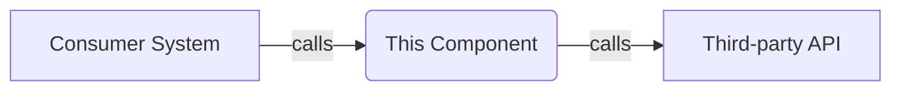
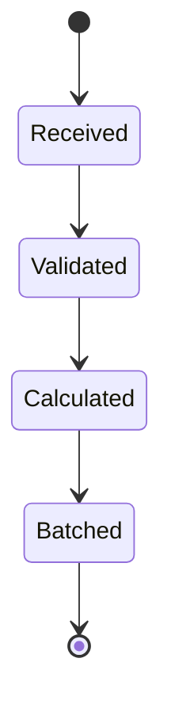

### Generic Prompt for Creating a Technical Overview for Enterprise Systems

**Objective:**  
Develop a detailed overview of the repository specified.

**Instructions:**

1. Review the template below
2. Review the assets in the repository (code, documentation, configuration)
3. Complete the template
4. Be sure to highlight any internal consistencies of the repository
5. Create the following additional artifacts:
   - **data-models.md**: Document core data models and their relationships
   - **api-contracts.yaml**: OpenAPI specification for external APIs
   - **entity-relationship-diagram.md**: Visual representation of data model relationships

---

# Business Overview

## What It Is

_Provide a brief description of what this repository or component does in business terms. If available, reference system-level documentation to explain how this component fits into the broader system._

## Domain Concepts

_Summarize the key domain concepts modeled by this component. Include links or references to overarching system-level documentation for deeper business context._

## Component Boundaries

_Summarize both the external and internal boundaries of this component. Explain what it provides to others and what it depends on. Note that Contract Interfaces and Contract Dependencies listed below refer exclusively to interactions and integrations that cross the component boundary. Internal dependencies, even if their separation is ambiguous, should be documented elsewhere in the Technical Overview._

> **Pointers for Functional Testing:**
> 
> - [Insert Pointer 1]
>     
> - [Insert Pointer 2]
>     


### Contract Interfaces Provided

_This section should list only those interfaces that are exposed externally (beyond the component boundary). Interfaces that serve primarily as internal implementation details should be detailed in the Technical Overview._

For each interface type provided, consider the following guidelines:

#### APIs

- **Business Functions:** What business functions does the API expose?
    
- **Endpoint Behavior:** Are endpoints read-only, state-changing, or both?
    
- **Audience:** What do we infer about the consumers (e.g., other internal services, external partners)?
    
- **Role:** Does the API serve as an orchestrator or merely expose local data/logic?
    

#### UIs

- **User Personas:** Which user personas interact with this UI?
    
- **Supported Workflows:** What workflows or actions does it support?
    
- **Purpose:** Is this a self-service tool, an internal admin panel, or a reporting interface?
    
- **Accessibility:** Any accessibility or device considerations (e.g., mobile-friendly)?
    

#### File/Data Exports

- **Formats:** What file formats are provided (e.g., CSV, JSON, XML)?
    
- **Consumers:** Who uses these files and how frequently?
    
- **Generation Triggers:** What triggers the export (scheduled, manual, event-driven)?
    

#### Messaging (e.g., Kafka, SQS)

- **Topics/Queues:** What topics or queues are written to or read from?
    
- **Message Specifications:** What message types or schemas are used?
    
- **Delivery Guarantees:** What delivery guarantees are assumed (e.g., at-least-once)?
    

#### Other Archetypes

- **Context-Specific Interfaces:** For mobile apps, CLI tools, admin portals, or SDKs, provide context-specific descriptions focusing on interactions that cross the component boundary.
    

> **Tip:** If an interface falls in a grey area—where it's not clear whether it's an internal implementation or an external contract—document your assumptions here and clarify in the Questions / Clarifications section.

### Contract Dependencies

_List external systems or services that this component depends on. These are interfaces or integrations external to the component's defined boundary. Note that dependencies which may be part of the broader implementation (but still used externally) should only appear here if they truly cross the boundary._

#### API Clients

- **Consumed APIs:** Which APIs are consumed?
    
- **Role & Considerations:** What is their role in the business logic? Are there authentication or rate-limiting considerations?
    
- **Failure Handling:** How are failures or timeouts managed?
    

#### External Databases

- **Data Interaction:** What data is read or written, and how tightly is the component coupled to the data schema?
    
- **Ownership & Consistency:** Note any cross-cutting ownership or consistency concerns.
    
- **Clarification:** If uncertain whether a given database is purely an external dependency or part of internal implementation, document the ambiguity and list it here only if it interacts as an integration point.
    

#### File/Data Inputs

- **Expected Formats:** What file formats are expected?
    
- **Delivery Method:** How are files received (SFTP, HTTP, manual upload)?
    
- **Cadence & Volume:** Expected frequency and volume.
    
- **Error Handling:** How are corrupt or malformed inputs managed?
    

#### Messaging Subscriptions

- **Topics/Queues:** What topics or queues are subscribed to?
    
- **Message Schemas:** What schemas or contracts are used?
    
- **Reliability Concerns:** Any issues such as ordering, duplication, or message replay.
    

#### Other Systems

- **Additional Dependencies:** List other external systems (e.g., secrets managers, feature flag services, third-party libraries) that are treated as external integration points.
    

> **Tip:** Use diagrams to visualize how external integrations interact with your component.


## Algorithms / Business Processes

_Describe any key business logic, algorithms, or processing flows implemented within the component. Use diagrams (e.g., with `mermaid`) where they help clarify flows._

For each process or algorithm, consider including:

#### Calculation or Pricing Logic

- **Business Rules:** Fee, tax, or discount computation algorithms.
    
- **Financial Handling:** FX rate application, rounding rules, etc.
    

#### Scoring or Ranking Algorithms

- **Metrics:** Risk scores, prioritization metrics, or match scoring systems.
    
- **Use Cases:** Algorithms used for fraud detection, routing, etc.
    

#### Matching or Grouping Logic

- **Batching:** Algorithms for grouping data (e.g., by settlement date, account).
    
- **Reconciliation:** Processes like record deduplication or transaction matching.
    

#### Transformation and Mapping

- **Data Handling:** Input normalization, output transformation logic, cross-field validation, and enrichment workflows.
    

#### State Machines or Workflow Coordination

- **Process Flow:** Define process stages, allowed transitions, manual overrides, or fallback logic if applicable.
    

Example state-based diagram:


> **Tip:** Focus on logic that is non-obvious but critical to understanding the component's behavior.

---

# Technical Overview

## Implementation Summary

_Provide a high-level summary of the implementation (e.g., "This is a Spring Boot project using Java, deployed on AWS Elastic Beanstalk")._

## Implementation Technologies

_List the main languages, frameworks, libraries, and tools used in this repository. Include a brief description of each (e.g., web framework, ORM, background job processor, test library). Optionally note significant patterns or conventions._

## Local Runtime Environment

_Provide instructions on running the component locally, including:_

- **Environment Setup:** Steps for setting up your development environment.
    
- **Commands/Scripts:** Necessary commands or scripts for starting the component.
    
- **Dependencies:** How to run with or configure external dependencies (e.g., databases, services), and details on using mocks or test fixtures if available.
    

## Deployment

_Describe the deployment process for this component, including:_

- **Deployment Targets:** E.g., AWS Lambda, Kubernetes, ECS, etc.
    
- **CI/CD Pipelines:** A brief overview of the CI/CD process.
    
- **Build Artifacts:** How artifacts are built (e.g., Docker images, JAR files).
    
- **Gating Processes:** Any deployment gating or change control mechanisms.
    

## Operability

_Detail how this component is monitored and operated in production._

### Logging

- **Framework:** What logging framework is used.
    
- **Log Levels & Routing:** Details on log levels and log destinations.
    
- **Structure:** Whether logs are structured (e.g., JSON), and if correlation IDs are used.
    

### Monitoring & Metrics

- **Metrics:** What custom or platform-native metrics are collected.
    
- **Tools:** Tools used (e.g., Prometheus, Datadog) to monitor metrics.
    

### Configuration Management

- **Settings:** How configuration settings are managed across environments.
    
- **Sources:** Details on configuration files or parameter stores used.
    

### Secrets Management

- **Storage:** How credentials or tokens are managed (e.g., Vault, AWS Secrets Manager).
    
- **Injection:** Whether secrets are injected through CI/CD pipelines or runtime tooling.
    

### Failure Handling

- **Dependency Outages:** What happens if external dependencies are unavailable.
    
- **Resilience:** Details on any retries, fallbacks, or circuit breakers in place.
    

## Repository Structure

_Provide an overview of the repository layout, emphasizing how folders and files map to business or technical layers. Include:_

- **Folder Responsibilities:** A list of top-level folders (e.g., `src/`, `infra/`, `docs/`) and their purposes.
    
- **Key Packages/Classes:** Highlight important packages and classes (e.g., `BillingCalculator`, `SettlementOrchestrator`) and describe their roles.
    
- **Testing Organization:** Explain how tests are structured (e.g., unit tests, integration tests, naming conventions).
    
- **Utility Code:** Note any utility or fixture code provided (e.g., mock servers, test data generators, local stubs).
    

---

# Additional Artifacts

## data-models.md

Create a separate `data-models.md` file that documents the core data models of the service and their relationships. Follow this structure:

```markdown
# [Service Name] Data Models

This document describes the core data models of the [Service Name] and their relationships.

## Core Entities

### 1. [Entity Name]

[Brief description of what this entity represents]

```java
public class [EntityName] {
    private [Type] [field];
    // Include all key fields with their types
}
```

[Repeat for each core entity]

## Relationships

1. **[Entity A] to [Entity B]**: [Relationship type]
   - [Description of relationship]

[Document all key relationships]

## Status Enumerations

### [EnumName]
- [VALUE]: [Description]

[Document all important enums and their values]

## Processing Flow

[Describe the typical processing flow involving these entities]
```

## api-contracts.yaml

Create a separate `api-contracts.yaml` file containing the OpenAPI 3.0 specification for all external APIs. Follow this structure:

```yaml
openapi: 3.0.3
info:
  title: [Service Name] API
  description: API for [service description]
  version: [version]
  contact:
    name: [Team Name]
servers:
  - url: /[service-name]
    description: Default API server

tags:
  - name: [TagName]
    description: Operations related to [description]

paths:
  /[endpoint]:
    [method]:
      tags:
        - [TagName]
      summary: [Brief summary]
      description: [Detailed description]
      parameters:
        - name: [paramName]
          in: [location]
          required: [boolean]
          schema:
            type: [type]
      responses:
        '200':
          description: [Success description]
          content:
            application/json:
              schema:
                $ref: '#/components/schemas/[SchemaName]'

components:
  schemas:
    [SchemaName]:
      type: object
      properties:
        [fieldName]:
          type: [type]
          description: [Description]
      required:
        - [requiredField]
```

## entity-relationship-diagram.md

Create a separate `entity-relationship-diagram.md` file containing a visual representation of the data model relationships using Mermaid class diagrams. Follow this structure:

```markdown
# [Service Name] Entity Relationship Diagram

```mermaid
classDiagram
    class [EntityName] {
        +[Type] [field]
        +[Type] [field]
    }

    [EntityA] "1" *-- "many" [EntityB] : contains
    [EntityB] "many" --> "1" [EntityA] : belongs to
```

## Entity Relationship Description

This class diagram illustrates the key entities in the [Service Name] and their relationships:

1. **Core Entities**:
   - **[Entity]**: [Description]

2. **Key Relationships**:
   - [Relationship description]

3. **Embedded Objects**:
   - **[EmbeddedObject]**: [Description]

4. **Status Enumerations**:
   - **[EnumName]**: [Values and descriptions]

This diagram provides a visual representation of the actual data model relationships in the codebase.
```

---