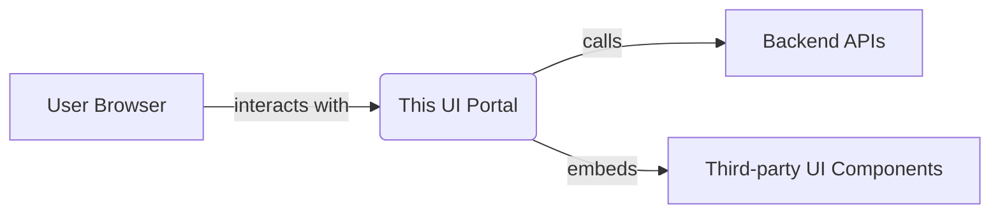
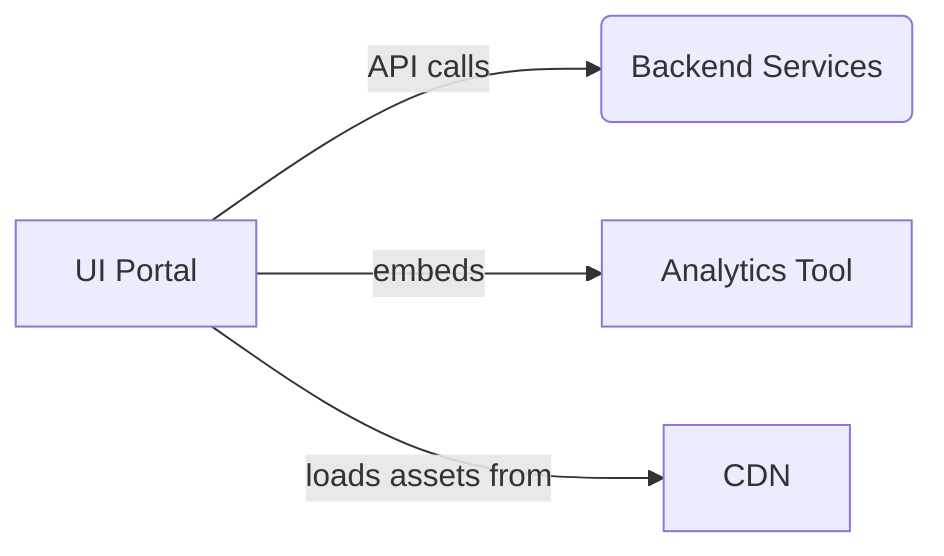
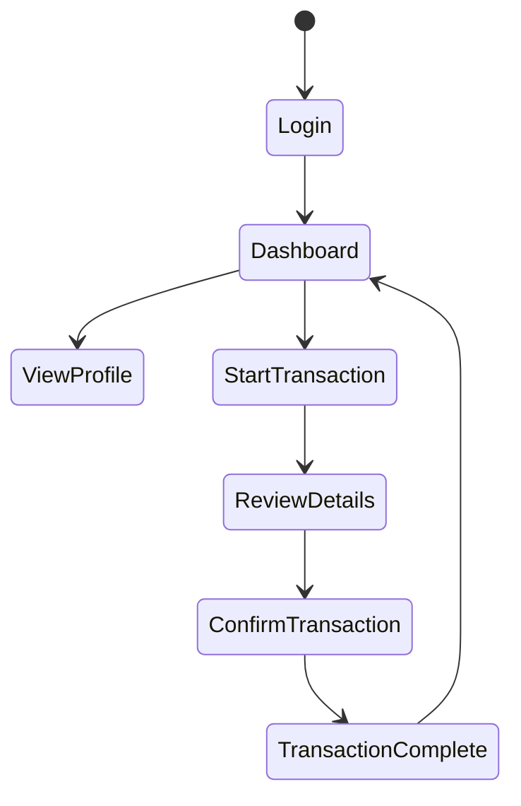
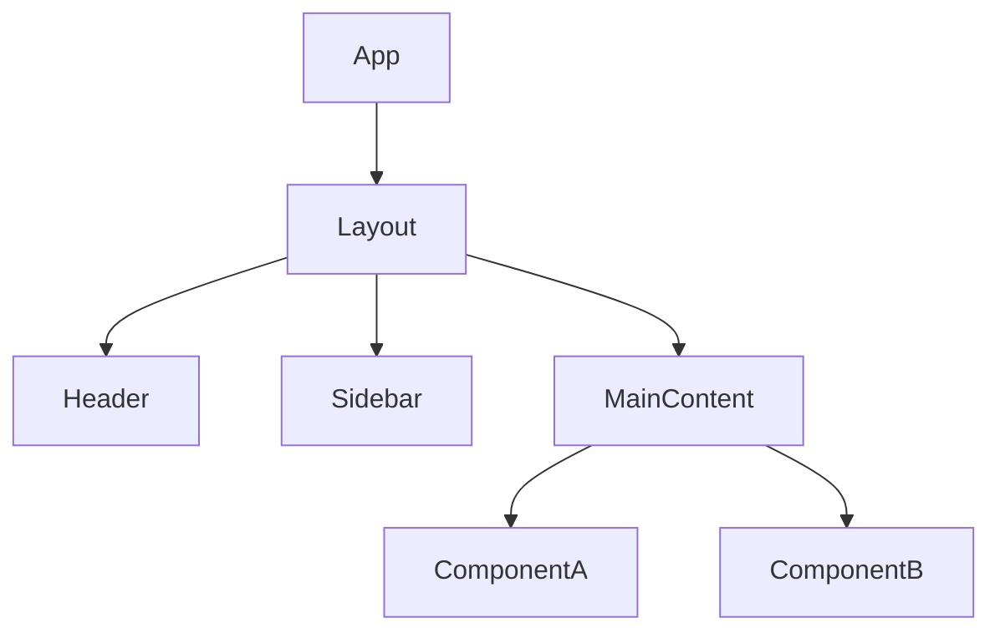
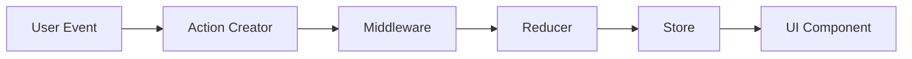
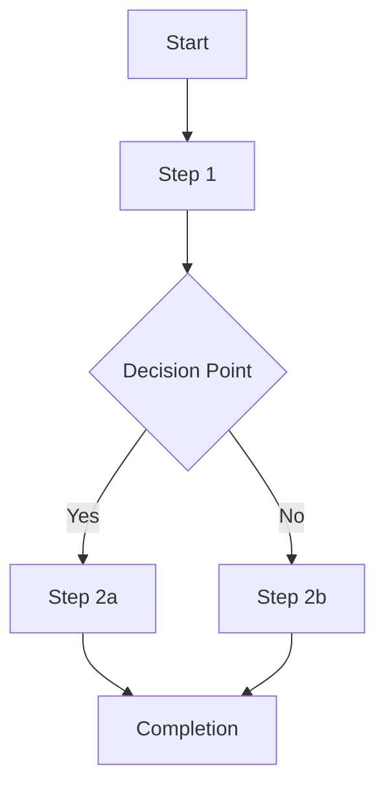
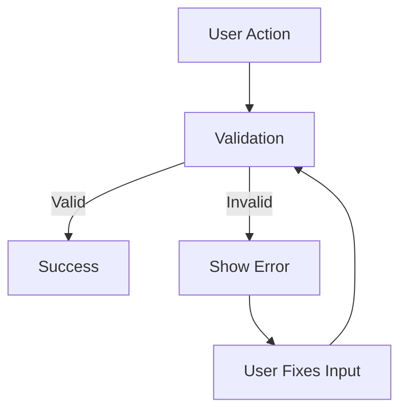

### Modified Prompt for Creating a Technical Overview for UI Portals

**Objective:**  
Develop a detailed overview of the UI portal repository specified.

**Instructions:**

1. Review the template below
2. Review the assets in the repository (code, documentation, configuration)
3. Complete the template
4. Be sure to highlight any internal consistencies of the repository
5. Create the following additional artifacts:
   - **component-architecture.md**: Document core UI components and their relationships
   - **ui-state-management.md**: Document state management approach and data flow
   - **user-flow-diagrams.md**: Visual representation of key user journeys
   - **design-system.md**: Document UI components, patterns, and visual language

---

# Business Overview

## What It Is

_Provide a brief description of what this UI portal does in business terms. Explain its purpose, target users, and how it fits into the broader system._

## User Personas

_Identify and describe the key user personas who interact with this portal. Include their goals, needs, and pain points that the UI addresses._

## User Journeys and Workflows

_Summarize the primary user journeys and workflows supported by the portal. Explain how users typically navigate through the application to achieve their goals._

## Component Boundaries

_Summarize both the external and internal boundaries of this UI portal. Explain what it provides to users, what backend services it integrates with, and any microfrontend architecture considerations._

> **Pointers for UI Testing:**
> 
> - [Insert Pointer 1]
>     
> - [Insert Pointer 2]
>     


### Frontend Interfaces

_This section should detail the various interfaces exposed by the UI portal._

#### UI Components and Views

- **Core Screens:** What are the main screens/pages in the application?
    
- **Navigation Structure:** How is navigation organized (tabs, menu, breadcrumbs)?
    
- **Responsive Design:** How does the UI adapt to different devices and screen sizes?
    
- **Accessibility:** What accessibility standards are followed (WCAG compliance level)?
    

#### User Interaction Patterns

- **Primary Actions:** What are the key actions users can take?
    
- **Form Patterns:** How are forms structured and validated?
    
- **Feedback Mechanisms:** How is feedback provided to users (notifications, alerts, etc.)?
    
- **Error Handling:** How are errors presented to users?
    

#### Visual Design

- **Design System:** What design system or UI framework is being used?
    
- **Themes:** Is theming supported (dark mode, white-labeling, etc.)?
    
- **Visual Hierarchy:** How is information prioritized visually?
    

### External Dependencies

_List external systems or services that this UI portal depends on._

#### API Dependencies

- **Backend Services:** Which backend APIs are consumed?
    
- **Authentication:** How is user authentication handled?
    
- **API Integration Patterns:** Are requests made directly or through a gateway/BFF?
    
- **Failure Handling:** How are API failures or timeouts managed in the UI?
    

#### Third-party Integrations

- **External Libraries:** What third-party UI libraries or services are integrated?
    
- **Analytics Tools:** What user analytics or monitoring tools are integrated?
    
- **External Widgets:** Are any third-party widgets or iframes embedded?
    

#### Asset Dependencies

- **CDN Usage:** Are assets served from a CDN?
    
- **Media Sources:** Where are images, videos, or other media sourced from?
    
- **Font Services:** Are custom fonts used, and how are they loaded?
    



## UI Business Logic

_Describe any key business logic or processing flows implemented within the frontend._

#### Form Validation and Processing

- **Client-side Validation:** What validation rules are applied?
    
- **Multi-step Processes:** How are multi-step or wizard-style forms managed?
    

#### State Management

- **Global State:** What data is managed globally vs. locally?
    
- **Caching Strategy:** How is data cached and refreshed?
    

#### UI Workflows

- **Conditional Flows:** How do workflows adapt based on user input or permissions?
    
- **Process Visualization:** How are complex processes visualized for users?
    

Example user flow diagram:


> **Tip:** Focus on UI logic that is non-obvious but critical to understanding the application's behavior.

---

# Technical Overview

## Implementation Summary

_Provide a high-level summary of the implementation (e.g., "This is a React application using TypeScript, Redux for state management, and Material-UI components")._

## Implementation Technologies

_List the main frontend frameworks, libraries, and tools used in this repository. Include a brief description of each._

#### Core Technologies

- **Framework/Library:** React, Angular, Vue, etc.
    
- **Language:** JavaScript, TypeScript, etc.
    
- **State Management:** Redux, MobX, Context API, etc.
    
- **Routing:** React Router, Vue Router, etc.
    

#### UI Component Libraries

- **Component Framework:** Material-UI, Ant Design, Chakra UI, etc.
    
- **Chart/Visualization:** D3, Chart.js, etc.
    
- **Form Handling:** Formik, React Hook Form, etc.
    

#### Build and Development Tools

- **Build System:** Webpack, Vite, etc.
    
- **Package Manager:** npm, yarn, pnpm, etc.
    
- **Testing Framework:** Jest, Testing Library, Cypress, etc.
    

## Local Runtime Environment

_Provide instructions on running the UI portal locally, including:_

- **Environment Setup:** Steps for setting up your development environment.
    
- **Commands/Scripts:** Necessary commands or scripts for starting the application.
    
- **Environment Variables:** Required environment variables and configuration.
    
- **Mocking Backend:** How to run with or configure mocked backend APIs.
    

## Deployment

_Describe the deployment process for this UI portal, including:_

- **Deployment Targets:** CDN, static hosting, container-based deployment, etc.
    
- **CI/CD Pipelines:** A brief overview of the CI/CD process.
    
- **Environment Configuration:** How environment-specific configuration is managed.
    
- **Build Artifacts:** How artifacts are built and deployed.
    

## Operability

_Detail how this UI portal is monitored and operated in production._

### Logging and Monitoring

- **Client-side Logging:** What logging framework or approach is used.
    
- **Error Tracking:** Tools used for tracking client-side errors (e.g., Sentry).
    
- **User Analytics:** Analytics tools for tracking user behavior (e.g., Google Analytics).
    
- **Performance Monitoring:** Tools or approaches for monitoring frontend performance.
    

### Configuration Management

- **Feature Flags:** How feature flags are managed.
    
- **Environment-specific Settings:** How configuration varies across environments.
    

### Performance Optimization

- **Bundling Strategy:** How code splitting and bundle optimization are handled.
    
- **Lazy Loading:** What components or routes are lazy-loaded.
    
- **Caching Strategy:** Browser caching approach for static assets.
    

### Browser Compatibility

- **Supported Browsers:** Which browsers and versions are officially supported.
    
- **Polyfills:** How legacy browser support is handled.
    
- **Responsive Breakpoints:** Key breakpoints for responsive design.
    

## Repository Structure

_Provide an overview of the repository layout, emphasizing how folders and files map to application features or technical layers. Include:_

- **Folder Structure:** A list of top-level folders and their purposes.
    
- **Key Components:** Highlight important components and their roles.
    
- **Shared Resources:** Note any shared components, hooks, or utilities.
    
- **Testing Organization:** Explain how tests are structured.
    

---

# Additional Artifacts

## component-architecture.md

Create a separate `component-architecture.md` file that documents the core UI components and their relationships. Follow this structure:

```markdown
# [Portal Name] Component Architecture

This document describes the core UI components of the [Portal Name] and their relationships.

## Core Components

### 1. [Component Name]

[Brief description of what this component does and when it's used]

```jsx
// Component structure example
const [ComponentName] = ({ prop1, prop2 }) => {
  // Key hooks or state management
  
  return (
    <div>
      {/* Example structure */}
    </div>
  );
};
```

[Repeat for each core component]

## Component Hierarchy



## Shared Components

### 1. [Shared Component Name]

[Brief description of what this shared component does and how it's used across the application]

## Composition Patterns

[Document key component composition patterns used in the application]

## State Management

[Overview of how state is managed within and between components]
```

## ui-state-management.md

Create a separate `ui-state-management.md` file that documents the state management approach. Follow this structure:

```markdown
# [Portal Name] State Management

This document describes the state management approach used in [Portal Name].

## State Management Architecture

[Overview of the state management architecture - Redux, Context API, etc.]

## Global State

### Store Structure

```js
// Example store structure
const store = {
  user: {
    profile: {},
    permissions: []
  },
  ui: {
    theme: 'light',
    sidebar: 'expanded'
  },
  data: {
    entities: [],
    loading: false,
    error: null
  }
}
```

### Key Actions and Reducers

[Document major actions/reducers and their purposes]

## Local Component State

[Document patterns for local component state management]

## Data Flow

[Describe how data flows through the application]



## API Integration

[Document how API calls are integrated with state management]

## Caching Strategy

[Document any caching strategies implemented]
```

## user-flow-diagrams.md

Create a separate `user-flow-diagrams.md` file containing visual representations of key user journeys. Follow this structure:

```markdown
# [Portal Name] User Flow Diagrams

This document illustrates the key user flows in [Portal Name].

## User Flow: [Flow Name]



### Flow Description

[Detailed description of the user flow, including:
- Entry points
- User decisions
- System responses
- Exit points or completion states]

[Repeat for each key user flow]

## Critical Path Analysis

[Identify and analyze the most critical user flows in terms of business impact and user frequency]

## Error Paths

[Document common error paths and recovery flows]


```

## design-system.md

Create a separate `design-system.md` file that documents the UI components and design patterns. Follow this structure:

```markdown
# [Portal Name] Design System

This document describes the design system used in [Portal Name].

## Visual Language

### Typography

- **Headers:** [Font family, sizes, weights for h1-h6]
- **Body Text:** [Font family, sizes, weights]
- **Special Text:** [Caption, label, etc. styles]

### Color Palette

- **Primary Colors:** [HEX codes and usage]
- **Secondary Colors:** [HEX codes and usage]
- **Semantic Colors:** [Success, warning, error, info colors]
- **Neutral Colors:** [Grays, blacks, whites]

### Spacing System

[Document the spacing scale and how it's applied]

### Iconography

[Document the icon system used]

## UI Component Library

### Base Components

#### Buttons

[Document button variants, states, and usage]

#### Inputs

[Document input types, states, and validation approaches]

[Continue for other base components]

### Composite Components

[Document more complex, composed components]

### Layout Components

[Document layout components and grid systems]

## Responsive Design

[Document responsive design approach and breakpoints]

## Accessibility Considerations

[Document accessibility features and compliance standards]
``` 